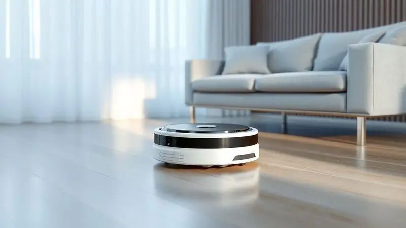

Imagine acordar e encontrar sua casa limpa, sem ter gasto um minuto da sua manhã com vassoura ou pano.

Essa promessa de praticidade tem levado cada vez mais brasileiros aos robôs aspiradores, e a Mondial entrou nesse mercado com uma proposta ousada: tecnologia de limpeza automatizada por um preço que não dói no bolso.

Com modelos que variam do básico ao mais completo, a marca oferece soluções para diferentes necessidades e orçamentos. Mas será que esses robôs realmente entregam o que prometem?

Vamos além das especificações técnicas para descobrir como cada modelo se comporta na vida real e qual deles pode se tornar seu melhor aliado na guerra contra a poeira.

<SummaryList products={frontmatter.top_products} />

## Robôs aspiradores Mondial: alternativas acessíveis para a limpeza doméstica

A verdade é que limpeza nunca foi um hobby pra ninguém. É daí que surge o apelo dos robôs aspiradores da Mondial: eles transformam uma tarefa repetitiva em algo que simplesmente acontece enquanto você vive sua vida.

Em vez de gastar centenas a mais por marcas premium, você encontra aqui a mesma essência de automação - navegação inteligente para cobrir o espaço, sensores para evitar tombos, e aquela praticidade de programar horários - mas com um preço que faz sentido para a realidade brasileira.

Seja num apartamento compacto ou numa casa com pets, existe um modelo que se encaixa no seu dia a dia sem exigir um investimento exagerado.

## Mondial RB-11: a opção avançada com retorno à base

<ProductBox 
  title={frontmatter.top_products[0].title} 
  image={frontmatter.top_products[0].image} 
  link={frontmatter.top_products[0].link} 
/>

Pense naquele dia corrido onde você mal tem tempo para respirar, quanto mais para aspirar a casa. O RB-11 chega como um parceiro discreto que trabalha nos bastidores. Sua função mais inteligente?

Ele volta sozinho para a base quando a bateria está acabando, garantindo que esteja sempre pronto para a próxima limpeza programada. Com seus 90 minutos de trabalho, ele dá conta da maioria dos ambientes sem pedir ajuda.

Sim, alguns usuários notam que essa autonomia pode variar dependendo do tipo de piso, mas para a rotina diária de manutenção, ele cumpre o papel com maestria. É para quem quer automação de verdade, não apenas um aspirador que anda sozinho.

<CaixaProsContras>

**Prós:**

- Design slim que permite acesso fácil sob móveis.

- Função mop para limpeza mais completa.

- Potente para limpezas em pisos frios e tapetes baixos.

- Sensores que evitam quedas.

**Contras:**

- Autonomia da bateria pode ser menor que os 90 minutos prometidos.

- Dificuldade em encontrar assistência técnica em alguns lugares.

</CaixaProsContras>

## Mondial RB-08: eficiência e simplicidade no dia a dia

<ProductBox 
  title={frontmatter.top_products[1].title} 
  image={frontmatter.top_products[1].image} 
  link={frontmatter.top_products[1].link} 
/>

Você já se pegou adiando a limpeza porque parecia uma tarefa monumental? O RB-08, ou Fast Clean Easy como é carinhosamente chamado, existe para acabar com essa procrastinação. Sua beleza está na simplicidade: ligue, programe e esqueça.

O filtro HEPA é um detalhe que faz toda diferença para famílias com alérgicos, capturando aquelas partículas invisíveis que tantos incômodos causam.

E sim, sua navegação é mais aleatória do que metódica, mas isso se traduz em cobertura completa do ambiente, sem deixar cantos de fora. É o assistente perfeito para quem tem animais de estimação e precisa de uma ajuda constante com pelos espalhados.

<CaixaProsContras>

**Prós:**

- Limpeza 3 em 1 (varre, aspira e passa pano).

- Design compacto para acesso a locais difíceis.

- Sensores para evitar quedas e obstáculos.

- Filtro HEPA que melhora a qualidade do ar.

**Contras:**

- Navegação pode ser considerada aleatória.

- Necessidade de programar as sessões de limpeza.

</CaixaProsContras>

## Mondial Multi Clean RB-09: O robô aspirador que é sucesso de vendas

<ProductBox 
  title={frontmatter.top_products[2].title} 
  image={frontmatter.top_products[2].image} 
  link={frontmatter.top_products[2].link} 
/>

Às vezes, a popularidade fala por si só. O RB-09 não é apenas um produto, é um fenômeno de vendas, e o motivo é simples: ele entrega uma experiência completa sem complicações.

Imagine um único dispositivo que varre a poeira solta, aspira a sujeira mais resistente, limpa superfícies e ainda dá aquele acabamento com pano. Tudo isso com apenas 7,5cm de altura, capaz de alcançar aqueles espaços sob o sofá que você sempre deixa para 'depois'.

A capacidade de 140ml do reservatório é suficiente para apartamentos médios, e quando ele avisa que está cheio, é só um rápido esvaziamento para voltar à ativa. A verdade é que quando um produto vende tanto, geralmente é porque acertou na fórmula.

<CaixaProsContras>

**Prós:**

- Limpeza 4 em 1: varre, aspira, limpa e passa pano.

- Design compacto que alcança áreas difíceis.

- Sensores que evitam quedas e colisões.

- Boa autonomia de até 90 minutos.

**Contras:**

- Alguns relatos de falhas após uso prolongado.

- Capacidade do reservatório pode ser pequena para ambientes maiores.

</CaixaProsContras>

### Características e Ficha Técnica do MultiClean Mondial RB-09

O que realmente importa quando você analisa as especificações? No caso do RB-09, a navegação inteligente significa menos preocupação com ele ficar preso em algum canto.

A potência ajustável é como ter diferentes velocidades para diferentes situações: mais força para o carpete da sala, menos para o piso frio da cozinha.

E aquela autonomia de 90 minutos não é apenas um número, é a garantia de que ele fará o serviço completo sem precisar de pausas intermediárias.

São detalhes técnicos que, no uso diário, se traduzem em uma única coisa: confiança de que sua casa estará limpa quando você chegar.

## Mondial RB-07 Fast Smart Clean: agilidade e design compacto

<ProductBox 
  title={frontmatter.top_products[3].title} 
  image={frontmatter.top_products[3].image} 
  link={frontmatter.top_products[3].link} 
/>

Para quem mora em espaços menores, cada centímetro conta. O RB-07 parece ter sido projetado com essa realidade em mente. Com seus 7,5cm de altura, ele desliza sob móveis baixos como se sempre tivesse pertencido àquele espaço.

A função mop integrada é um diferencial silencioso: enquanto aspira, já vai preparando o piso para uma limpeza mais profunda.

É verdade que o reservatório de 140ml pede atenção em casas maiores ou com muitos pets, mas para um apartamento de solteiro ou um casal sem animais, ele é mais do que suficiente. É a prova de que eficiência não precisa ocupar espaço.

<CaixaProsContras>

**Prós:**

- Função mop integrada para uma limpeza mais profunda.

- Design compacto que alcança locais difíceis.

- Sensores que evitam quedas e danos.

- Boa autonomia de bateria para longas sessões de limpeza.

**Contras:**

- Reservatório menor pode exigir mais esvaziamentos.

- Tempo de carregamento relativamente longo para uso contínuo.

</CaixaProsContras>

## Mondial RB-03: o modelo de entrada com bom custo-benefício

<ProductBox 
  title={frontmatter.top_products[4].title} 
  image={frontmatter.top_products[4].image} 
  link={frontmatter.top_products[4].link} 
/>

Todo mundo já passou pela experiência de comprar um eletrônico barato e se arrepender depois. O RB-03 existe para quebrar esse padrão. Como primeiro robô aspirador, ele é uma introdução perfeita ao mundo da automação doméstica.

Por um investimento acessível, você experimenta a sensação de chegar em casa e encontrar os pisos limpos, sem ter feito esforço algum. Sua eficiência na remoção de pelos de animais é particularmente notável para quem divide o lar com pets.

Sim, o reservatório de 200ml pode exigir esvaziamentos mais frequentes em áreas grandes, mas essa é uma pequena troca por ter um assistente de limpeza que funciona silenciosamente nos fundos.

<CaixaProsContras>

**Prós:**

- Excelente custo-benefício.

- Eficiência em pisos duros e na remoção de pelos.

- Silencioso durante o uso.

- Design compacto que alcança lugares baixos.

**Contras:**

- Reservatório pequeno que pode exigir esvaziamento frequente.

- Dificuldade em limpar cantos muito apertados.

</CaixaProsContras>

## Mondial RB-04: potência para diferentes tipos de piso

<ProductBox 
  title={frontmatter.top_products[5].title} 
  image={frontmatter.top_products[5].image} 
  link={frontmatter.top_products[5].link} 
/>

Casas raramente têm apenas um tipo de piso. Tem o piso frio da cozinha, o carpete da sala, a madeira do quarto. O RB-04 entende essa diversidade. Com sua potência ajustável e escovas adaptáveis, ele transita entre diferentes superfícies sem perder eficiência.

O controle remoto pode parecer um detalhe pequeno, mas faz toda diferença quando você está no sofá e percebe que esqueceu de programar a limpeza. Basta um clique e ele entra em ação.

O filtro HEPA lavável é outro acerto, mantendo o ar mais puro sem custos extras com substituições frequentes. É para quem busca versatilidade sem complicação.

<CaixaProsContras>

**Prós:**

- Funcionalidade 3 em 1: varre, aspira e passa pano.

- Design slim que alcança locais difíceis.

- Filtro HEPA para melhorar a qualidade do ar.

- Boa autonomia da bateria com até 90 minutos de uso.

**Contras:**

- Pode exigir preparação prévia do ambiente para melhor eficiência.

- Limpeza em ambientes muito bagunçados pode não ser tão eficaz.

</CaixaProsContras>

## Perguntas Frequentes (FAQ) sobre o Robô Aspirador Mondial

Algumas dúvidas são universais quando se pensa em comprar o primeiro robô aspirador. A autonomia realmente dura o suficiente? Na prática, os 60 a 120 minutos anunciados são reais para limpezas de manutenção diária. Ele vai se perder ou ficar preso?

Os sensores fazem um trabalho notável em evitar desastres, mas como qualquer tecnologia, funciona melhor em ambientes organizados. E a manutenção? Mais simples do que parece: limpar o filtro a cada duas semanas e as escovas mensalmente mantém o desempenho como novo.

São respostas para perguntas que todo mundo faz antes de dar o primeiro passo.

## Conclusão

Escolher um robô aspirador Mondial é, no fundo, decidir o que você valoriza mais no seu tempo.

Se você cansa de dedicar finais de semana à limpeza, se sente que a poeira sempre volta mais rápido do que sua disposição, ou simplesmente quer um aliado na rotina, existe um modelo que se encaixa na sua realidade.

Do RB-03, com seu custo-benefício imbatível para iniciantes, ao RB-11 com sua autonomia inteligente, cada opção entrega exatamente o que promete: liberdade. Liberdade para focar no que realmente importa enquanto um pequeno assistente cuida dos detalhes.

A verdadeira pergunta não é se os robôs Mondial são bons, mas qual deles vai começar a trabalhar para você amanhã.

---

Ainda em dúvida sobre o robô aspirador ideal? Confira nosso [ranking das melhores opções custo-benefício](/robo-aspirador-qual-o-melhor/) e encontre o perfeito para sua casa!
