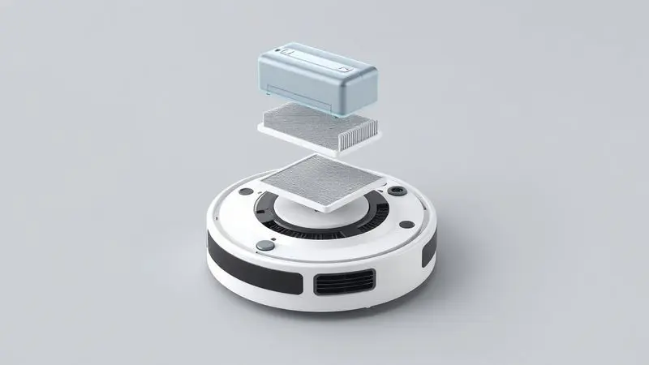
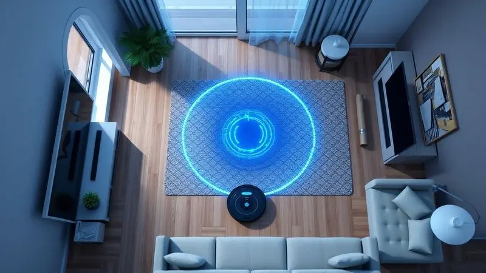
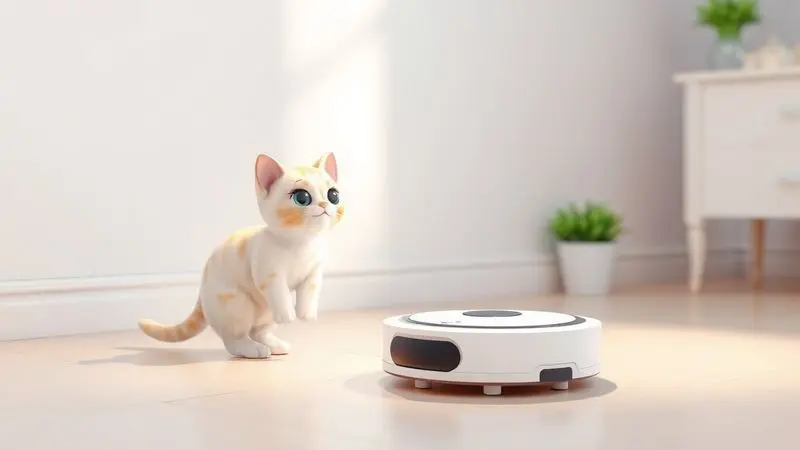
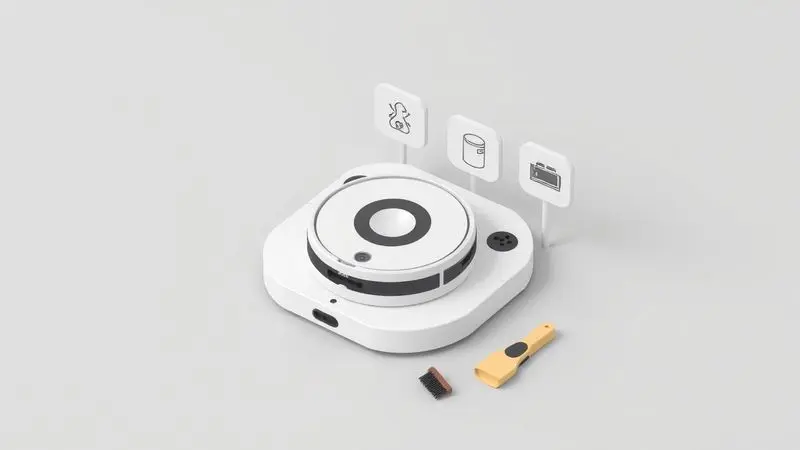

Manter a casa limpa parece uma tarefa sem fim, especialmente quando você tem pets que espalham pelos por todos os cantos ou uma agenda apertada que mal permite respirar.

É nesse momento que um assistente robótico pode fazer toda a diferença, e a marca Multi (antiga Multilaser) conquistou espaço no mercado brasileiro com modelos acessíveis que prometem fazer três trabalhos ao mesmo tempo.

Mas será que esses robôs aspiradores conseguem realmente aliviar seu dia a dia ou são apenas mais um eletrônico que fica encostado? Analisamos profundamente os modelos mais populares para descobrir se eles merecem entrar na sua casa.

<SummaryList products={frontmatter.top_products} />

## Sobre a Marca Multi (Multilaser): É Confiável?

A Multi, que muitos conhecem pelo nome comercial Multilaser, é uma marca brasileira que se tornou familiar nas prateleiras de eletrônicos. Ela começou com acessórios de informática e expandiu para um universo de produtos, incluindo eletrodomésticos inteligentes.

O que atrai tantos consumidores é justamente o equilíbrio que ela oferece: tecnologia que simplifica a vida sem cobrar preços exorbitantes.

Claro, como qualquer marca, há relatos de problemas em produtos específicos, mas a maioria dos usuários considera a Multi uma opção confiável para quem busca funcionalidade sem extravagâncias.

A empresa demonstra compromisso constante com melhorias e mantém um canal de atendimento ativo, o que traz segurança na hora da compra.

## Características Gerais dos Robôs Aspiradores Multi

Imagine acordar e encontrar sua sala livre de pelos e poeira sem que você precise mover um dedo. Essa é a promessa dos robôs aspiradores Multi, que combinam três funções essenciais em um único dispositivo.

Eles não apenas varrem e aspiram, mas também passam pano, criando uma solução completa para quem quer manter a casa impecável com o mínimo de esforço.

Essa versatilidade os torna especialmente valiosos para lares com animais de estimação, onde a limpeza precisa ser mais frequente e eficiente.

### Autonomia, Bateria e Ciclos de Limpeza

Nada pior do que um robô que desiste no meio do trabalho porque a bateria acabou. Os modelos Multi geralmente oferecem entre 90 minutos e 2 horas de autonomia, tempo suficiente para percorrer apartamentos inteiros enquanto você se dedica a outras atividades.

A bateria de lítio garante recargas rápidas e durabilidade, e a programação inteligente dos ciclos de limpeza significa que o dispositivo sabe exatamente quando mudar de uma função para outra.

Você pode programá-lo para varrer primeiro, depois aspirar profundamente e finalmente passar um pano úmido, criando uma sequência lógica que realmente limpa em vez de apenas remexer a sujeira.

### Capacidade do Reservatório e Sistema de Filtros

Você já pensou em quantas vezes precisaria esvaziar um reservatório minúsculo? Os modelos Multi foram pensados para reduzir essa necessidade ao máximo, com capacidades que variam entre 200ml e 350ml, dependendo do modelo.

Mas o verdadeiro diferencial está no sistema de filtros. Alguns modelos contam com filtros HEPA laváveis que capturam não apenas a poeira visível, mas também partículas microscópicas e alérgenos que podem afetar sua respiração.

Para quem tem alergias ou animais em casa, essa é uma funcionalidade que transforma um simples eletrodoméstico em um aliado da saúde.

## Análise dos Melhores Modelos de Aspirador Robô Multi

Cada modelo tem sua personalidade e conjunto de habilidades. Alguns são ideais para apartamentos compactos, outros para casas grandes com múltiplos cômodos.

Escolher o robô certo depende muito do seu espaço, da sua rotina e, principalmente, dos pelos que você precisa enfrentar diariamente.

### Multi Home Carbon (HO412) - O Ideal para Pets

<ProductBox 
  title={frontmatter.top_products[0].title} 
  image={frontmatter.top_products[0].image} 
  link={frontmatter.top_products[0].link} 
/>

Se você convive com gatos ou cachorros que soltam pêlo como se fosse confete, o Carbon HO412 foi feito para você. Sua potência de 400 a 500 Pa consegue sugar pelos que se acumulam nos cantos mais difíceis, enquanto as escovas laterais garantem que nada escape.

O sistema antiqueda significa que você pode deixá-lo trabalhar tranquilamente mesmo em apartamentos com varanda, sem medo de acidentes.

<CaixaProsContras>

**Prós:**

- Função 3 em 1: varre, aspira e passa pano

- Modos de limpeza programados para eficiência

- Sistema antiqueda para segurança

- Boa autonomia de bateria

**Contras:**

- Não aspira água

- Ausência de filtro HEPA

</CaixaProsContras>

### Multilaser HO041 - A Opção de Custo-Benefício

<ProductBox 
  title={frontmatter.top_products[1].title} 
  image={frontmatter.top_products[1].image} 
  link={frontmatter.top_products[1].link} 
/>

Para quem está começando no mundo da automação doméstica e não quer gastar uma fortuna, o HO041 é como um primeiro encontro perfeito. Ele faz tudo o que promete, varrendo, aspirando e passando pano com uma simplicidade que encanta.

Os sensores básicos evitam colisões com móveis e quedas de degraus, enquanto suas 2 horas de autonomia são generosas para espaços médios.

<CaixaProsContras>

**Prós:**

- Função 3 em 1: varre, aspira e passa pano.

- Sensores que evitam quedas e obstáculos.

- Boa autonomia de bateria com até 2 horas de uso.

- Design compacto e fácil de armazenar.

**Contras:**

- Reservatório pequeno que pode necessitar de esvaziamento frequente.

- Potência pode ser insuficiente para limpezas profundas.

</CaixaProsContras>

### Multilaser HO042

<ProductBox 
  title={frontmatter.top_products[2].title} 
  image={frontmatter.top_products[2].image} 
  link={frontmatter.top_products[2].link} 
/>

Quando você precisa de um aliado para áreas maiores, o HO042 entra em cena com sua capacidade de cobrir até 200m² em uma única carga. O filtro HEPA lavável é seu trunfo secreto, garantindo que o ar da sua casa fique mais puro enquanto o piso brilha.

Se você tem alergias ou simplesmente valoriza um ambiente mais saudável, essa é uma característica que faz toda a diferença no dia a dia.

<CaixaProsContras>

**Prós:**

- Funcionalidades de varre, aspira e passa pano.

- Filtro HEPA lavável que remove alérgenos.

- Boa autonomia para cobrir grandes áreas.

- Sensores que evitam quedas e colisões.

**Contras:**

- Duração da bateria pode variar em uso intenso.

- Problemas relatados na base de recarga.

</CaixaProsContras>

### Multilaser HO400

<ProductBox 
  title={frontmatter.top_products[3].title} 
  image={frontmatter.top_products[3].image} 
  link={frontmatter.top_products[3].link} 
/>

Também conhecido como Aspirador Robô Mars, o HO400 é aquele trabalhador incansável que não reclama do serviço. Com 30W de potência, ele enfrenta tapetes e pisos frios com igual determinação, e suas 2 horas de autonomia garantem que nenhum canto fique esquecido.

Para donos de pets, sua habilidade em capturar pelos é quase mágica, transformando um chão coberto em uma superfície lisa em minutos.

<CaixaProsContras>

**Prós:**

- Funcionalidade 3 em 1 (varre, aspira e passa pano).

- Adequado para superfícies variadas e eficaz na remoção de pelos.

- Sistema antiqueda e detector de obstáculos.

- Bateria com boa autonomia (até 2 horas).

**Contras:**

- Nível de ruído pode ser um pouco alto durante a operação.

- Tempo de recarga relativamente longo (cerca de 4 horas).

</CaixaProsContras>

### Multilaser HO410

<ProductBox 
  title={frontmatter.top_products[4].title} 
  image={frontmatter.top_products[4].image} 
  link={frontmatter.top_products[4].link} 
/>

Imagine um robô que entende os limites da sua casa. O HO410 é exatamente isso, com sensores que mapeam o ambiente e evitam colisões desnecessárias com seus móveis favoritos.

Sua autonomia de 1h30 é perfeita para limpezas rápidas durante o almoço ou antes de receber visitas, e o fato de ser bivolt significa que você pode levá-lo para qualquer lugar sem preocupações com voltagem.

<CaixaProsContras>

**Prós:**

- Varre, aspira e passa pano com eficiência.

- Bateria com autonomia de até 1h30.

- Sistema anti-queda e sensores anti-colisão.

- Lavável e fácil de manter.

**Contras:**

- Nível de ruído relativamente alto.

- Capacidade do reservatório pode ser pequena para grandes áreas.

</CaixaProsContras>

### Multilaser HO441

<ProductBox 
  title={frontmatter.top_products[5].title} 
  image={frontmatter.top_products[5].image} 
  link={frontmatter.top_products[5].link} 
/>

Para quem gosta de opções, o HO441 oferece três modos de limpeza que se adaptam ao seu humor e necessidades. No modo automático, ele percorre a casa com inteligência. No modo cantos, dedica atenção especial aos espaços mais difíceis.

E no modo espiral, faz uma limpeza concentrada em áreas específicas. É como ter três robôs em um, cada um especializado em uma tarefa diferente.

<CaixaProsContras>

**Prós:**

- Varre, aspira e passa pano em um único dispositivo.

- Ideal para lares com animais de estimação.

- Bivolt e versátil em diferentes superfícies.

- Três modos de limpeza disponíveis.

**Contras:**

- Não substitui completamente a limpeza manual.

- Eficiência pode variar em grandes espaços.

</CaixaProsContras>

## Diferenciais Técnicos: Sensores, Mapeamento e Conectividade

O verdadeiro charme dos robôs modernos está na forma como eles enxergam sua casa. Os sensores avançados dos modelos Multi funcionam como pequenos olhos que identificam obstáculos, evitam quedas e mapeam o ambiente.

Alguns modelos criam até mesmo um mapa virtual do seu espaço, memorizando onde estão os móveis, as portas e os cantos que precisam de atenção extra.

E com a conectividade Wi-Fi, você pode programar a limpeza pelo smartphone enquanto está no trabalho, chegando em casa com os pisos já brilhando.

## Uso em Casas com Pets: Eficácia na Remoção de Pelos

Quem tem pets sabe: os pelos são implacáveis. Eles aparecem no sofá, nos tapetes, nos cantos e até mesmo no ar. Os robôs Multi foram desenvolvidos com essa batalha em mente.

Suas escovas são projetadas para desalojar pelos embaraçados, enquanto a potência de sucção garante que nada escape. A função passa pano complementa o trabalho, removendo marcas de patinhas e respingos de água.

É como ter um tratador particular para sua casa, cuidando dos vestígios que seus animais deixam com tanto amor.

## Vale a Pena? Comparação de Custo-Benefício com Marcas Concorrentes

Quando você compara os modelos Multi com marcas premium, a diferença de preço pode chegar a três ou quatro vezes. A pergunta é: o que você realmente está sacrificando? Em muitos casos, são recursos como mapeamento 3D ou conectividade com assistentes de voz.

Mas se você busca um robô que simplesmente limpe bem, sem firulas tecnológicas desnecessárias, os Multi oferecem uma proposta difícil de recusar. Eles fazem o trabalho pesado pelo preço de um jantar em família, liberando seu tempo para o que realmente importa.

## Dicas de Manutenção e Cuidados para seu Robô Aspirador

Um robô aspirador é como um animal de estimação mecânico: ele precisa de cuidados para continuar trabalhando bem. Limpar os filtros regularmente mantém a sucção potente. Esvaziar o reservatório após cada uso evita odores e proliferação de bactérias.

Manter os sensores limpos garante que ele não se perca pela casa. E dar à bateria os ciclos de carga adequados prolonga sua vida útil por anos. Com apenas alguns minutos de manutenção semanal, seu investimento continuará valendo a pena por muito tempo.

## Perguntas Frequentes (FAQ)

### Qual o tempo de recarga do robô aspirador Multilaser?

A maioria dos modelos leva entre 4 e 6 horas para uma recarga completa, dependendo do estado da bateria e da potência da tomada.

É um tempo que permite programar a limpeza para horários específicos, como durante a noite ou enquanto você está no trabalho, garantindo que o robô esteja sempre pronto quando você mais precisa.

### Para quais pisos é indicado o robô aspirador Multi?

Madeira, cerâmica, laminado, porcelanato e até tapetes de pêlo baixo são terrenos familiares para esses robôs.

Os sensores ajustam automaticamente a potência e a velocidade conforme o piso, protegendo superfícies delicadas enquanto garantem uma limpeza eficiente em todas as áreas.

### O robô aspirador Multilaser desliga sozinho?

Sim, e essa é uma das características mais inteligentes. Após completar o ciclo programado ou quando a bateria está baixa, ele retorna automaticamente à base e se desliga, economizando energia e prevenindo desgaste desnecessário.

Você pode sair de casa tranquilo, sabendo que ele cuidará de tudo e depois descansará até a próxima tarefa.

### Quais são os problemas mais comuns nos modelos da Multi?

Alguns usuários relatam dificuldade com tapetes muito altos ou felpudos, onde as rodas podem ficar presas. Outros notam que a duração da bateria diminui com o tempo, especialmente em modelos mais antigos.

E em alguns casos, a conexão com o aplicativo pode apresentar instabilidades. A boa notícia é que a maioria desses problemas tem soluções simples ou é coberta pela garantia.

## Conclusão

Investir em um robô aspirador Multi é mais do que comprar um eletrodoméstico, é recuperar tempo precioso que você gastaria com vassoura e rodo. É acordar e encontrar a casa arrumada sem que você precise levantar um dedo.

É receber visitas inesperadas sem correr para esconder a poeira. Para quem tem pets, é especialmente transformador, como ter um ajudante dedicado que entende a guerra diária contra os pelos.

Cada modelo tem suas forças: alguns brilham em apartamentos compactos, outros em casas espaçosas, alguns são campeões no combate a alérgenos, outros na economia. O segerto está em identificar qual deles conversa com suas necessidades específicas.

Independente da escolha, você estará dando um passo em direção a uma rotina mais leve, onde a limpeza deixa de ser uma tarefa e se torna uma conquista automática do seu dia.

Agora imagine chegar em casa após um dia cansativo e encontrar os pisos impecáveis, sem que você precise pensar nisso. Essa é a promessa que os robôs Multi cumprem todos os dias, transformando uma obrigação doméstica em um luxo acessível.

Sua próxima tarefa pode ser apenas escolher qual deles vai começar a trabalhar para você.

---

Ainda na dúvida sobre qual aspirador robô escolher para sua casa com pets? Confira nosso [ranking dos Melhores Robôs Aspiradores para Quem Tem Pet](/melhor-robo-aspirador-para-quem-tem-pet/) e encontre a opção ideal para manter tudo limpinho!
