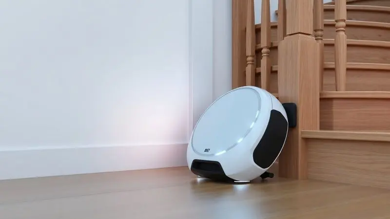
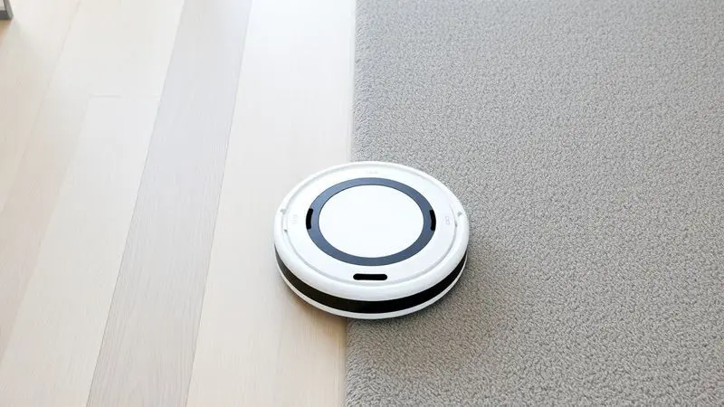
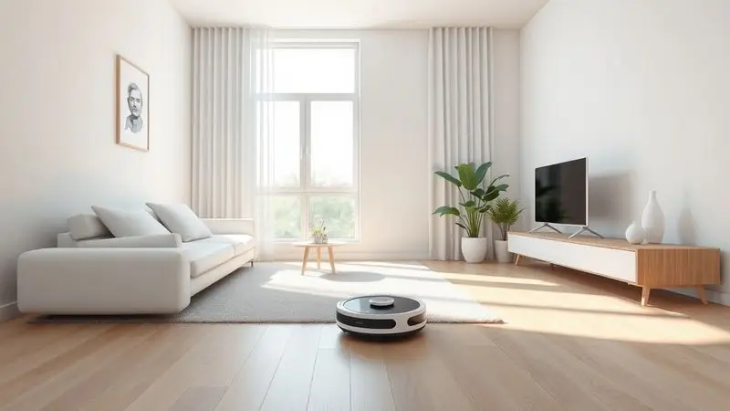

Imagine acordar e encontrar sua casa limpa, sem ter levantado um dedo. O Robô aspirador 3 em 1 da Obabox, conhecido como Obaduster OB010, promete exatamente isso: varrer, aspirar e passar pano de forma totalmente automática.

Com design compacto e foco em praticidade, ele surge como uma opção para quem busca automatizar a limpeza sem investir fortunas. Mas será que ele realmente entrega essa promessa de liberdade em diferentes tipos de piso?

Analisamos a fundo para descobrir se esse robô é o parceiro de limpeza ideal para sua rotina.

<SummaryList products={frontmatter.top_products} />

## O que é o Robô aspirador 3 em 1 da Obabox?

<ProductBox 
  title={frontmatter.top_products[0].title} 
  image={frontmatter.top_products[0].image} 
  link={frontmatter.top_products[0].link} 
/>

Mais do que um simples aspirador, o ObaDuster é um assistente completo de limpeza que funciona enquanto você se dedica ao que realmente importa.

Pense nele como aquela ajuda extra que sempre desejou: ele não apenas aspira o pó, mas também passa um pano de microfibra que captura aquelas partículas minúsculas que ficariam no ar. O resultado? Pisos que realmente brilham, não apenas parecem limpos.

O sistema inteligente oferece três modos de limpeza adaptáveis ao seu dia. Precisa de uma faxina mais profunda para receber visitas? Use o modo intensivo. Quer apenas manter a casa apresentável durante a semana? O modo padrão cuida disso.

E o melhor: ele opera por até 100 minutos antes de precisar voltar à base, tempo suficiente para cobrir áreas generosas da sua casa.

Sua navegação é guiada por sensores que detectam móveis e evitam quedas, então você pode confiar que ele não vai se aventurar pelas escadas. O aplicativo torna tudo ainda mais simples: programe a limpeza para quando estiver fora e volte para um ambiente renovado.

<CaixaProsContras>

**Prós:**

- Combina três funções em um único aparelho.

- Sistema de sucção eficiente que minimiza a poeira no ar.

- Sensores anti-queda garantem segurança durante a operação.

- Aplicativo intuitivo para programar limpezas.

**Contras:**

- Pode ter dificuldade em limpar tapetes altos.

- Tempo de recarga pode ser demorado para algumas pessoas.

</CaixaProsContras>

## Sensores inteligentes para evitar obstáculos e quedas

O que diferencia um robô inteligente de um simples brinquedo eletrônico? A capacidade de navegar sozinho pelo seu ambiente. Os sensores do Obaduster atuam como seus olhos, mapeando o espaço em tempo real.

Quando ele encontra uma cadeira ou um sofá, não bate e recua desorientado. Ele calcula uma rota alternativa, contornando o obstáculo com uma elegância que surpreende.

Para famílias com crianças ou animais, a segurança é ainda mais crucial. Os sensores anti-queda detectam mudanças bruscas de altura, como escadas ou desníveis, garantindo que seu investimento não termine em um acidente.

Essa tecnologia não apenas protege o aparelho, mas também lhe dá paz de espírito: você pode deixá-lo trabalhar enquanto prepara o jantar ou assiste um filme, sem precisar ficar de olho a cada minuto.

## Autonomia de bateria e desempenho em tapetes e pisos frios

Nada mais frustrante que um eletrônico que desiste no meio do serviço. A bateria do Obaduster foi pensada para completar a missão: com autonomia de 90 a 120 minutos, ele consegue limpar apartamentos médios completos em uma única carga.

Imagine sair para trabalhar pela manhã, programá-lo para começar às 10h e voltar para casa já limpa à noite.

Em pisos frios como cerâmica ou porcelanato, ele realmente brilha. O sistema de sucção ajusta automaticamente a potência para capturar eficientemente o pó sem espalhá-lo. Já em tapetes, ele aumenta a força para alcançar a sujeira incrustada.

A limitação em tapetes muito altos existe, mas para a maioria dos carpetes residenciais, ele performa consistentemente bem. A transição entre diferentes superfícies é suave, sem aquelas pausas irritantes que outros modelos mais básicos apresentam.

## Especificações Técnicas do Obaduster OB010

Por trás da simplicidade de uso estão detalhes cuidadosamente projetados. O Obaduster OB010 mede apenas 32cm de diâmetro e 8cm de altura, dimensionamento ideal para deslizar sob camas, sofás e outros móveis onde a sujeira costuma se acumular.

Seu motor oferece 2000Pa de potência de sucção, suficiente para capturar desde partículas de poeira até pelos de animais.

O tanque de água integrado ao sistema de pano molhado tem capacidade de 300ml, permitindo que ele passe pano em áreas consideráveis antes de precisar de recarga. A combinação de escovas principais e laterais garante que cantos e bordas não fiquem negligenciados.

E para quem tem agenda lotada, a função de programação permite agendar até sete sessões diferentes por semana, adaptando-se perfeitamente à sua rotina.

## Avaliações sobre o desempenho do robô aspirador Obabox

O verdadeiro teste de qualquer produto acontece nas casas reais. E o que os usuários dizem sobre o Obaduster? A palavra que mais aparece é 'tranquilidade'.

Pessoas com alergias respiratórias relatam melhora significativa na qualidade do ar, graças ao sistema que não levanta poeira. Donos de pets celebram a eficiência na captura de pelos, algo que antes exigia múltiplas passagens com aspiradores tradicionais.

'O silêncio é impressionante', comenta um usuário. 'Consigo trabalhar home office enquanto ele limpa a sala, sem distrações.' Outros destacam a economia de tempo: 'Ganho pelo menos 5 horas por semana que antes dedicava à limpeza manual'.

As críticas geralmente se concentram em expectativas realistas: ele não substitui uma limpeza profunda manual em cantos muito específicos, e em tapetes com fios muito altos pode precisar de ajuda.

Mas como solução para a manutenção diária e semanal, o consenso é positivo.

## Conclusão

O Robô aspirador 3 em 1 da Obabox não é um produto perfeito, mas cumpre admiravelmente bem sua proposta principal: devolver tempo e qualidade de vida.

Ele não vai transformar sua casa em um showroom imaculado sem nenhum esforço seu, mas vai reduzir drasticamente a carga de trabalho da limpeza rotineira.

Para quem busca praticidade sem abrir mão do orçamento, ele representa um equilíbrio inteligente entre funcionalidade e custo.

A combinação de aspiração e pano molhado em um único dispositivo elimina a necessidade de múltiplas etapas, enquanto os sensores garantem operação segura.

Se você está cansado de dedicar finais de semana inteiros à limpeza ou simplesmente quer respirar um ar mais puro em casa, o Obaduster OB010 merece sua consideração.

Ele não substitui completamente o cuidado humano, mas certamente se torna um aliado valioso na busca por uma casa mais limpa e uma vida menos atribulada.

---

Ainda indeciso sobre o Obaduster? Confira nosso ranking completo dos [melhores robôs aspiradores 3 em 1](/robo-aspirador-3-em-1-qual-o-melhor/) para varrer, aspirar e passar pano em 2025 e encontre a opção ideal para sua casa.
