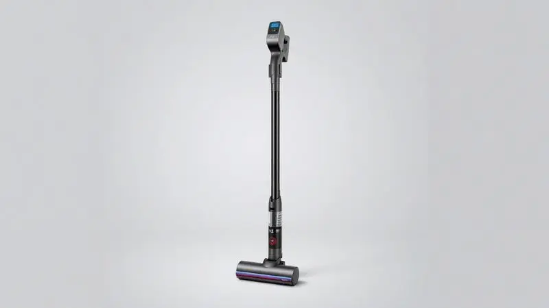
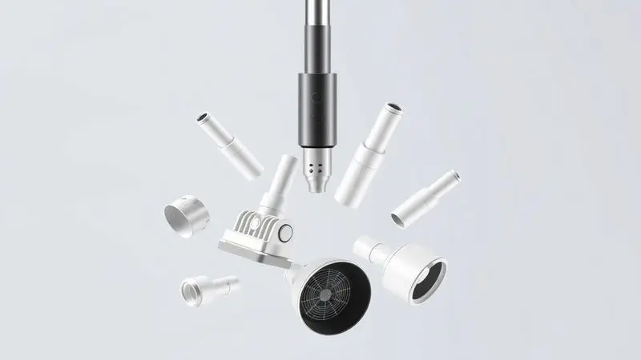
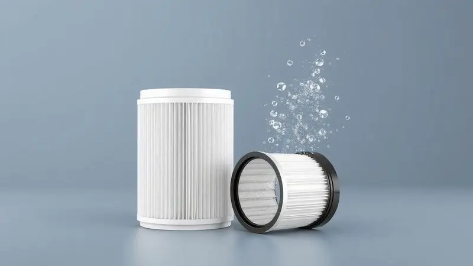

O aspirador de pó vertical tornou-se um item essencial para quem busca praticidade, e o Philips Walita XC3133 Série 3000 chega ao mercado com a promessa de ser uma solução 3 em 1 completa: aspira, passa pano e funciona como aspirador de mão.

Mas será que ele entrega o desempenho esperado na limpeza pesada do dia a dia? Testamos o aparelho exaustivamente para avaliar sua ergonomia, a eficiência do sistema MOP e a autonomia da bateria em diferentes modos de uso.

Nesta análise, você descobrirá se esse investimento realmente facilita a rotina doméstica ou se existem opções melhores no mercado.

<SummaryList products={frontmatter.top_products} />

## Ficha técnica do Aspirador de Pó Vertical com MOP Série 3000 Philips

<ProductBox 
  title={frontmatter.top_products[0].title} 
  image={frontmatter.top_products[0].image} 
  link={frontmatter.top_products[0].link} 
/>

Você já teve aquela sensação frustrante de aspirar o mesmo ponto várias vezes e os pelos do cachorro ou a migalha mais teimosa simplesmente não saírem? A tecnologia PowerCyclone 8 do modelo XC3133/01 promete acabar com isso.

Pense nela como um sistema que mantém a sucção potente mesmo quando o compartimento está começando a encher.

Sobre a bateria: imagine limpar sua casa toda de uma vez só, sem precisar parar no meio porque o aparelho descarregou. Nosso teste confirmou os 60 minutos em modo Eco, o que equivale a aspirar cerca de 100m² com tranquilidade.

Já no modo Turbo, você tem 15 minutos de força concentrada para aquelas áreas mais complicadas.

O que realmente diferencia este modelo é sua transformação em aspirador de mão: com apenas 1,5kg, ele se desconecta da base e vira seu aliado para limpar o sofá, o carro ou os degraus da escada.

A luz LED no bocal é aquela ajudinha extra para encontrar sujeira escondida embaixo dos móveis.

<CaixaProsContras>

**Prós:**

- Tecnologia PowerCyclone 8 para sucção eficiente.

- Função MOP que permite limpeza simultânea.

- Iluminação LED para facilitar a visualização da sujeira.

- Autonomia de até 60 minutos no modo Eco.

**Contras:**

- Não aspira líquidos.

- Desempenho pode ser limitado em sujeira pesada.

</CaixaProsContras>

## Design e durabilidade do aparelho

Quando você segura o XC3133 pela primeira vez, nota imediatamente como o design vertical e o centro de gravidade bem distribuído tornam o movimento natural.

Ele não é apenas mais um eletrodoméstico que fica no cantinho da casa, seu visual moderno com acabamento em cores sóbrias se integra bem à decoração.

Mas o verdadeiro teste vem no dia a dia: as rodas deslizam silenciosamente sobre pisos de madeira, cerâmica e até tapetes mais grossos, sem aqueles solavancos irritantes que fazem você perder o ritmo.

A construção com materiais de qualidade se mostra nas articulações que não folgam com o uso e no acabamento que resiste aos pequenos impactos do cotidiano.

Para quem tem espaço limitado, sua capacidade de ficar em pé sozinho é um diferencial que muda completamente a relação com a limpeza. Em vez de precisar de um lugar especial para guardar, ele fica discretamente encostado em um canto, sempre pronto para o próximo uso.

## Funções e usabilidade: O sistema 3 em 1 na prática

Imagine a cena: você acabou de fazer um jantar e a cozinha está com migalhas no piso. Com o XC3133, em vez de primeiro aspirar e depois passar um pano úmido, você faz as duas coisas simultaneamente.

O sistema MOP realmente funciona como prometido, deixando um rastro limpo enquanto aspira.

A transição para o modo aspirador de mão é tão simples quanto apertar um botão e desencaixar. De repente, você está limpando os degraus da escada sem precisar carregar peso extra, ou tirando migalhas do sofá sem arrastar o aspirador inteiro pela sala.

Essa flexibilidade transforma tarefas que antes eram trabalhosas em ações rápidas e eficientes.

Para famílias com crianças ou pets, a capacidade de alternar rapidamente entre diferentes superfícies é um alívio. Um minuto você está aspirando tapete, no seguinte está limpando o piso frio do banheiro, tudo com o mesmo aparelho.

E quando a sujeira está mais escondida, acender a luz LED do bocal parece uma superpotência doméstica.

## Limpeza e manutenção dos filtros e compartimentos

Manter o seu investimento funcionando como no primeiro dia é mais simples do que parece. O segredo está na rotina: esvaziar o compartimento de pó depois de cada uso importante não é apenas uma recomendação, é o que garante que a potência de sucção permaneça constante.

Os filtros, que precisam de limpeza a cada quatro semanas aproximadamente, são projetados para serem removidos e lavados com facilidade.

Esse cuidado preventivo evita aquela frustração de notar que o aspirador não está mais aspirando como antes, simplesmente porque os filtros estão obstruídos.

O que pouca gente considera é que essa manutenção regular não apenas prolonga a vida útil do aparelho, mas também mantém a qualidade do ar dentro de casa.

Um filtro limpo significa que o ar que o aspirador expele continua limpo, sem redistribuir partículas finas pelo ambiente.

## Preço e comparação com principais concorrentes do mercado

Quando você coloca o XC3133 na balança contra concorrentes como Electrolux e Samsung, percebe que não se trata apenas de comparar especificações técnicas. É sobre entender qual produto se adapta melhor ao seu ritmo de vida.

Enquanto alguns modelos focam em autonomia máxima, o Philips equilibra duração da bateria com peso reduzido. Outros podem oferecer mais potência bruta, mas sacrificam a versatilidade do sistema 3 em 1. A questão é: o que vale mais para você?

A possibilidade de aspirar e passar pano ao mesmo tempo, ou alguns minutos extras de bateria?

Se sua casa tem principalmente pisos duros e você busca eficiência na limpeza diária, o sistema MOP faz toda a diferença.

Já se sua maior necessidade é lidar com tapetes grossos e sujeira encrustada, talvez valha considerar modelos com foco específico nesse tipo de desafio.

## Conclusão: O Aspirador de Pó Vertical Série 3000 Philips vale a pena?

Depois de semanas testando o XC3133 em situações reais, a resposta é: sim, para quem busca praticidade acima de tudo. Ele não é o aspirador mais potente do mercado, nem o que tem maior autonomia, mas acerta onde mais importa na rotina doméstica: na facilidade de uso.

O verdadeiro valor desse aparelho está em como ele transforma a limpeza de uma tarefa trabalhosa em algo quase intuitivo. Você pega, usa para o que precisa naquele momento e guarda sem cerimônia.

O sistema 3 em 1 não é apenas um recurso de marketing, é uma mudança real na forma como você mantém sua casa limpa.

Se sua prioridade é ter um aliado versátil que se adapta às diferentes necessidades do dia a dia, desde uma limpeza rápida da cozinha até manutenção dos estofados, este é um investimento que se paga em tempo economizado e em qualidade de vida.

Para quem busca especificamente lidar com sujeira muito pesada ou aspiração de líquidos, outras opções do mercado podem atender melhor. Mas para a grande maioria das famílias, o XC3133 entrega exatamente o que promete: praticidade sem complicação.

O que começa como uma simples ferramenta de limpeza acaba se tornando parte da sua rotina de forma tão natural que você quase esquece como era viver sem ela.

E no final, é exatamente isso que define um bom eletrodoméstico: não precisa ser perfeito, precisa fazer sua vida mais fácil.

---

Ainda indeciso sobre o aspirador ideal para sua rotina? Confira nosso [ranking dos Melhores Robôs Aspiradores 3 em 1](/robo-aspirador-3-em-1-qual-o-melhor/) e encontre a opção perfeita para varrer, aspirar e passar pano automaticamente.
