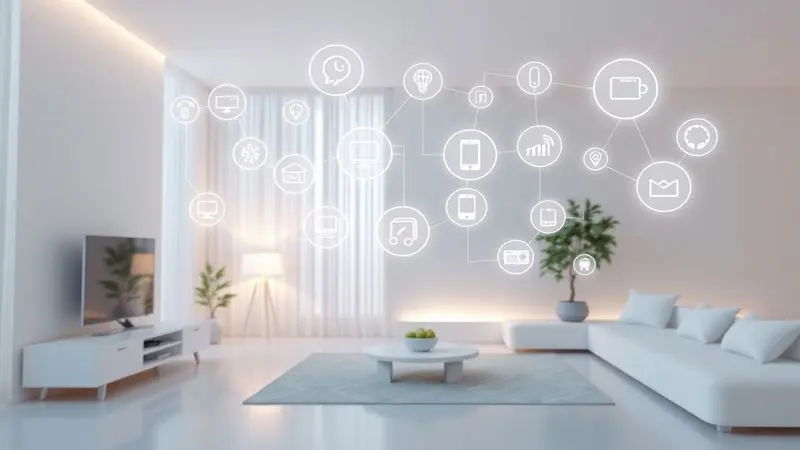
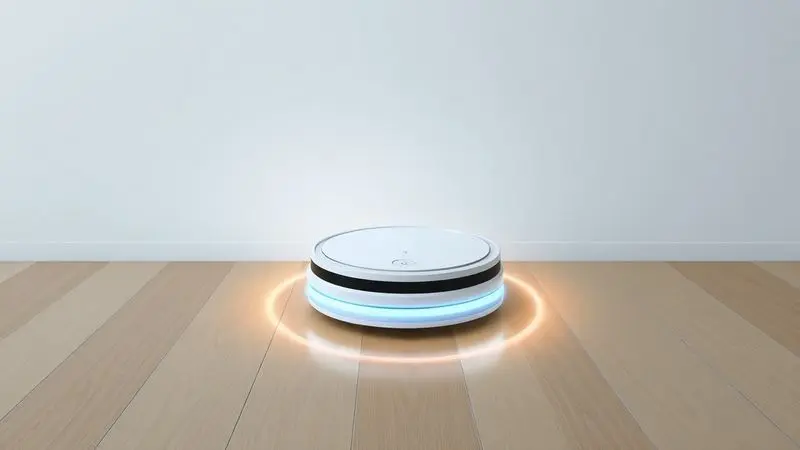
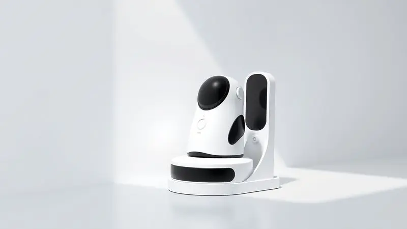

Imagine acordar com os raios de sol entrando pela janela, sem aquele pózinho no chão que sempre aparece do nada.

Essa é a promessa dos robôs aspiradores, e a Positivo Casa Inteligente chegou ao mercado brasileiro com uma linha completa que tenta transformar essa fantasia em rotina.

Do básico PRA100 ao avançado PRA2000 com função autolimpante, cada modelo promete devolver horas do seu dia. Mas será que eles entregam o que prometem, ou são apenas mais um gadget na prateleira?

Vamos além das especificações técnicas para descobrir como esses robôs realmente se comportam na sua casa.

<SummaryList products={frontmatter.top_products} />

## Entendendo a Linha Positivo Casa Inteligente: Características e Diferenciais

A linha de robôs aspiradores da Positivo Casa Inteligente não é apenas sobre limpar, é sobre redefinir seu relacionamento com as tarefas domésticas. Esses dispositivos são pensados para quem cansou de arrastar o aspirador tradicional nos fins de semana.

Eles conversam com você através de comandos de voz, aprendem o layout da sua casa com mapeamento inteligente e trabalham silenciosamente enquanto você faz coisas que realmente importam.

A verdadeira diferença está na integração: um ecossistema onde o aplicativo se torna seu controle remoto, os sensores são seus olhos e a bateria é sua garantia de que, quando você chegar em casa, o chão estará impecável.

## Principais características dos robôs aspiradores Positivo

Esses robôs são mais que máquinas, são assistentes domésticos que transformam características técnicas em benefícios tangíveis para seu dia a dia.

### Visual e especificações técnicas: O que esperar?

Ao tirar o robô da caixa, o primeiro impacto é o design: compacto, discreto e com linhas que se camuflam perfeitamente na sua decoração. Mas a magia está no que você não vê.

A potência de sucção ajustável significa que, com um toque no aplicativo, você decide se quer uma limpeza rápida ou uma varredura profunda para aquela festa que deixou migalhas pelo chão.

Os sensores anti-queda não são apenas tecnologia, são a tranquilidade de saber que seu investimento não vai despencar pelas escadas.

E quando falamos em 90 a 120 minutos de autonomia, estamos falando de tempo suficiente para limpar seu apartamento inteiro enquanto você toma um banho relaxante.

### Usabilidade e desempenho: Como os robôs se comportam na prática?

Aqui é onde a teoria encontra a realidade. Você configura o aplicativo uma única vez e, a partir daí, esquece que existe um robô trabalhando na sua casa.

Ele se torna parte da mobília, saindo discretamente da base no horário programado, navegando pelos móveis como se tivesse memória fotográfica do ambiente.

A experiência é tão orgânica que, depois de algumas semanas, você só percebe sua presença pelos resultados: menos poeira nos móveis, menos pelos de pet acumulados nos cantos, mais tempo livre nos finais de semana.

A eficácia varia, é verdade, mas não pela tecnologia, e sim pela forma como você integra esse assistente à sua rotina.

#### O Aplicativo: Funções, Mapeamento e Experiência de Uso

O aplicativo é onde a mágica acontece. Ele transforma seu smartphone no controle central da limpeza da casa.

Visualizar o robô em tempo real mapeando cada canto da sala não é apenas prático, é quase terapêutico: você vê áreas sendo cobertas de forma sistemática, sem repetições desnecessárias.

Criar zonas de exclusão para que ele evite o tapete da vovó ou o cantinho do gato mostra que a personalização chegou à limpeza doméstica.

As notificações são discretas, mas suficientes para manter você informado: "Limpeza concluída, retornando à base" é a mensagem que substitui horas de trabalho manual.

#### Poder de Limpeza e Eficiência na Aspiração

Esqueça os números técnicos por um momento. O verdadeiro teste é acordar depois de uma reunião com amigos e encontrar o chão da cozinha sem aquelas migalhas de pão que sempre escapam.

Ou ter um cachorro que solta pelo o ano inteiro e, mesmo assim, conseguir usar meias brancas em casa.

Os robôs da Positivo são projetados para esses micro-momentos: quando você derruba açúcar ao fazer bolo, quando as crianças trazem areia do parque, quando o vento traz poeira pela janela aberta.

A potência ajustável significa que, para o dia a dia, um modo silencioso basta, mas para o sábado de faxina pesada, ele tem força reservada.

#### Sensores, Carregamento e Retorno à Base

A autonomia desses robôs vai além da bateria. É a autonomia de não precisar ficar vigiando se ele vai cair da escada ou ficar preso atrás do sofá. Os sensores são como um sexto sentido que prevê obstáculos antes mesmo do contato.

E o retorno automático à base é o detalhe que transforma um gadget em um eletrodoméstico: você programa para limpar às 14h, sai para trabalhar, e quando volta, ele está quietinho na base, recarregado e pronto para o próximo ciclo.

É essa independência que realmente libera seu tempo.

## Análise dos Modelos de Smart Robô Aspirador Positivo

Cada modelo da Positivo tem uma personalidade própria, projetada para diferentes necessidades, espaços e orçamentos. Do entry-level ao topo de linha, a escolha não é sobre qual é melhor, mas sobre qual se encaixa na sua vida.

### Smart Robô Aspirador Wi-Fi Autolimpante PRA2000

<ProductBox 
  title={frontmatter.top_products[0].title} 
  image={frontmatter.top_products[0].image} 
  link={frontmatter.top_products[0].link} 
/>

Se você sonha com um robô que não apenas limpa sua casa, mas também cuida de si mesmo, o PRA2000 é sua resposta. A função autolimpante é o equivalente doméstico a ter um assistente que, depois de trabalhar, arruma sua própria mesa.

Com apenas 8,3 cm de altura, ele se esgueira debaixo da sua cama como um gato discreto, alcançando aqueles cantos que seu aspirador tradicional nunca viu.

O mapeamento a laser não é apenas uma tecnologia, é a memória do seu lar: ele salva até 5 mapas diferentes, perfeito para quem tem casa com vários níveis ou apartamento com divisões específicas.

O controle por voz transforma a limpeza em um comando casual: "Alexa, limpa a sala" enquanto você prepara o jantar. O ruído de 61 dB existe, mas é o som da praticidade trabalhando, menos intrusivo que uma conversa normal.

Este não é apenas um aspirador, é um investimento em tempo livre que se paga a cada semana que você não precisa dedicar horas à limpeza manual.

<CaixaProsContras>

**Prós:**

- Mapeamento inteligente para personalização da limpeza.

- Função autolimpante que economiza tempo.

- Controle via aplicativo e compatibilidade com assistentes de voz.

- Design fino que alcança áreas difíceis.

**Contras:**

- Nível de ruído pode ser perceptível em ambientes silenciosos.

- Tempo de carregamento relativamente longo (5 a 6 horas).

</CaixaProsContras>

### Smart Robô Aspirador Wi-Fi Laser PRA1000

<ProductBox 
  title={frontmatter.top_products[1].title} 
  image={frontmatter.top_products[1].image} 
  link={frontmatter.top_products[1].link} 
/>

Para quem quer tudo em um só pacote, o PRA1000 é o canivete suíço da limpeza. Varre, aspira e passa pano com uma fluidez que parece mágica.

Os 3000 Pa de sucção não são apenas um número, são a garantia de que aqueles grãos de areia teimosos do tapete da entrada vão desaparecer. Com autonomia que chega a 150 minutos, ele limpa um apartamento de 3 quartos sem precisar recarregar no meio do caminho.

O tanque de água de 250ml pode parecer modesto, mas é suficiente para dar aquele brilho nos pisos frios depois da aspiração. E o reservatório de 900ml para pó significa que você só precisa esvaziá-lo uma vez por semana, mesmo com pets em casa.

Este é o robô para quem não quer fazer concessões: potência, duração e multifuncionalidade em um único dispositivo.

<CaixaProsContras>

**Prós:**

- Mapeamento inteligente dos ambientes.

- Controle via aplicativo e assistentes de voz.

- Potência de sucção ajustável.

- Boa capacidade de reservatórios.

**Contras:**

- Autonomia varia entre 120 e 150 minutos.

- Tanque para passar pano é relativamente pequeno.

</CaixaProsContras>

### Smart Robô Aspirador Wi-Fi Laser PRA800

<ProductBox 
  title={frontmatter.top_products[2].title} 
  image={frontmatter.top_products[2].image} 
  link={frontmatter.top_products[2].link} 
/>

O PRA800 é para os alérgicos que encontraram um aliado tecnológico. O filtro HEPA que retém 99,9% dos alérgenos transforma a limpeza da casa em uma terapia para o sistema respiratório.

Imagine acordar sem aquela coceira no nariz, mesmo durante a primavera, porque durante a noite o robô removeu os ácaros e pólens que se acumularam.

A função 3 em 1 significa que, com um único dispositivo, você tem o equivalente a três eletrodomésticos trabalhando em harmonia.

O preço pode ser premium, mas quando você calcula o custo de um aspirador tradicional mais uma lavadora de pisos, mais o tempo que economizará não alternando entre diferentes máquinas, o investimento começa a fazer sentido diferente.

<CaixaProsContras>

**Prós:**

- Função 3 em 1 (varre, aspira e passa pano)

- Mapeamento a laser para limpeza personalizada

- Controle via aplicativo e comandos de voz

- Filtro HEPA que retém alérgenos 

**Contras:**

- Custo elevado em relação a outros modelos

- Pode ter dificuldades em tapetes muito espessos

</CaixaProsContras>

### Smart Robô Aspirador Wi-Fi PRA600

<ProductBox 
  title={frontmatter.top_products[3].title} 
  image={frontmatter.top_products[3].image} 
  link={frontmatter.top_products[3].link} 
/>

O PRA600 é o ponto ideal para quem está migrando do aspirador tradicional para a automação doméstica. Com potência de 2300 Pa, ele tem força suficiente para lidar com a sujeira do dia a dia sem ser exagerado.

Os três níveis de aspiração são como ter engrenagens no seu carro: você escolhe a intensidade conforme a necessidade.

A manutenção regular é necessária, mas pense nela como trocar a escova do seu aspirador tradicional, só que com menos frequência.

E a navegação inteligente significa que você pode confiar que ele não vai derrubar seu vaso preferido ou ficar preso no fio do carregador que você esqueceu no chão.

<CaixaProsContras>

**Prós:**

- Multifuncional: varre, aspira e passa pano.

- Controle fácil via aplicativo e assistentes de voz.

- Alta potência de sucção (2300 Pa).

- Retorno automático à base quando a bateria está baixa.

**Contras:**

- A manutenção regular dos componentes é necessária.

- O preço pode ser um pouco mais elevado em comparação a opções básicas.

</CaixaProsContras>

### Smart Robô Aspirador Wi-Fi+ PRA500

<ProductBox 
  title={frontmatter.top_products[4].title} 
  image={frontmatter.top_products[4].image} 
  link={frontmatter.top_products[4].link} 
/>

Se você tem animais de estimação, o PRA500 foi feito pensando em você. Os 2000Pa de sucção são especialistas em capturar aqueles pelos que parecem se multiplicar misteriosamente nos cantos.

A função 3 em 1 significa que, depois de aspirar, ele ainda pode dar um trato no piso, removendo as marcas de patinhas.

A identificação da base pode ter seus momentos de hesitação, mas é como ensinar um cachorro novo onde ficar: com paciência e repetição, ele aprende.

E para quem divide a casa com pets, a praticidade de programar a limpeza para quando você está no trabalho significa voltar para um lar livre dos pelos que seus companheiros inevitavelmente soltam.

<CaixaProsContras>

**Prós:**

- Funcionalidade 3 em 1 (varre, aspira e passa pano)

- Poder de sucção forte (2000Pa)

- Conexão com assistentes de voz

- Ideal para ambientes com pets

**Contras:**

- Identificação da base de carregamento pode ser imprecisa

- Campo de visão dos sensores um pouco limitado

</CaixaProsContras>

### Smart Robô Aspirador Wi-Fi PRA100

<ProductBox 
  title={frontmatter.top_products[5].title} 
  image={frontmatter.top_products[5].image} 
  link={frontmatter.top_products[5].link} 
/>

Para quem quer experimentar o mundo dos robôs aspiradores sem comprometer o orçamento, o PRA100 é a porta de entrada perfeita. Com 1600 Pa de sucção, ele lida com a sujeira cotidiana enquanto você descobre como é ter um assistente automático.

A necessidade de comprar o reservatório de água separadamente para a função de passar pano é uma escolha inteligente: você paga apenas pelo que realmente vai usar.

Este é o robô para o primeiro apartamento, para o quarto dos filhos que sempre tem migalhas de biscoito, ou para quem quer presentear alguém com um gostinho da automação doméstica. É simples, eficaz e prova que tecnologia inteligente não precisa custar uma fortuna.

<CaixaProsContras>

**Prós:**

- Função 3 em 1 (varre, aspira e passa pano)

- Controle via aplicativo ou comando de voz

- Sensores inteligentes para navegação segura

- Bom poder de sucção, ideal para donos de pets

**Contras:**

- Necessita de compra adicional para função de passar pano

- Tempo de carregamento relativamente alto (4 a 5 horas)

</CaixaProsContras>

### Smart Robô Aspirador Wi-Fi PRA90

<ProductBox 
  title={frontmatter.top_products[6].title} 
  image={frontmatter.top_products[6].image} 
  link={frontmatter.top_products[6].link} 
/>

O PRA90 é a prova de que compacto não significa limitado. Com apenas 8.5cm de altura, ele alcança debaixo do seu guarda-roupa, da cama box, da estante baixa - todos aqueles lugares onde a poeira adora se esconder.

Os quatro modos de limpeza são como ter um especialista para cada tipo de sujeira: rápido para a cozinha após o café, intenso para a sala depois da visita das crianças.

O pano que precisa ser umedecido manualmente pode parecer um retrocesso, mas na prática é uma oportunidade: você controla exatamente quanto produto de limpeza usa, adaptando às necessidades específicas de cada cômodo.

Para apartamentos pequenos ou como segundo robô para áreas específicas, ele entrega muito pelo seu tamanho modesto.

<CaixaProsContras>

**Prós:**

- Limpeza 3 em 1: varre, aspira e passa pano seco.

- Controle via aplicativo e compatibilidade com assistentes de voz.

- Sensores antiqueda e anticolisão para segurança.

- Design compacto que permite acessar áreas difíceis.

**Contras:**

- Não possui reservatório para água, requer umedecimento manual do pano.

- Mapeamento pode ser menos eficiente em alguns casos.

</CaixaProsContras>

## Positivo vs. Concorrência: Vale a pena investir?

Comparar a Positivo com marcas premium é como comparar um carro completo de entrada com um luxuoso: ambos te levam ao destino, mas a experiência e os acabamentos são diferentes.

A Positivo não tenta competir nos 10% mais avançados da tecnologia, mas domina os 90% do que realmente importa no dia a dia.

Enquanto marcas premium podem ter sensores mais sofisticados ou aplicativos com mais recursos gráficos, os robôs da Positivo focam no essencial: limpar bem, ser confiável e não exigir um empréstimo para comprar.

Para quem está entrando no mundo da automação doméstica ou quer uma solução prática sem complicações excessivas, essa linha oferece o equilíbrio perfeito entre tecnologia e acessibilidade. É a escolha inteligente para quem prefere funcionalidade a status.

## Veredito Final: Robô aspirador de pó inteligente da Positivo vale a pena?

Os robôs aspiradores da Positivo Casa Inteligente representam mais que um produto, representam uma mudança de mentalidade sobre como cuidamos de nossas casas.

Eles não são perfeitos - nenhuma tecnologia doméstica é - mas entregam consistentemente o que prometem: tempo de volta para sua vida.

Se você valoriza acordar com o chão limpo sem ter pensado nisso na noite anterior, se cansou de dedicar horas de sábado a uma tarefa que poderia ser automatizada, ou simplesmente quer experimentar como a tecnologia pode suavizar as arestas da rotina doméstica, então sim, vale cada centavo.

Do básico PRA100 ao avançado PRA2000, há um modelo que se encaixa no seu espaço, no seu orçamento e, mais importante, no seu estilo de vida.

A verdadeira pergunta não é se eles valem a pena, mas quanto vale para você recuperar aquelas horas que passaria aspirando, varrendo e limpando pisos? Esses robôs não vendem apenas limpeza, vendem tempo - e tempo, como sabemos, é o recurso mais valioso que temos.

## Conclusão

Depois de explorar cada modelo, analisar desempenho e comparar com a concorrência, fica claro que a linha Positivo Casa Inteligente não busca ser a mais tecnológica do mercado, mas a mais humana.

Ela entende que, no fim do dia, o que importa não são os Pa de sucção ou os minutos de autonomia, mas a sensação de chegar em casa e encontrar tudo em ordem sem ter se esforçado para isso.

Esses robôs são como bons assistentes: trabalham silenciosamente nos bastidores, aprendem com seu ambiente e tornam sua vida mais leve.

Seja o PRA2000 com sua função autolimpante para quem quer o máximo de automatização, o PRA100 como porta de entrada acessível, ou qualquer modelo entre eles, há uma solução Positivo esperando para transformar sua rotina de limpeza de obrigação para opção.

A decisão final é sua, mas lembre-se: você não está comprando apenas um eletrodoméstico, está investindo em mais tempo livre, menos estresse doméstico e a liberdade de focar no que realmente importa para você.

E nesse aspecto, os robôs aspiradores Positivo não apenas valem a pena - eles podem ser a melhor aquisição para sua casa neste ano.

---

Ainda indeciso sobre qual modelo escolher? Confira nosso [ranking completo dos melhores robôs aspiradores de 2025](/melhores-robo-aspirador-2024/) e encontre a opção perfeita para sua casa.
