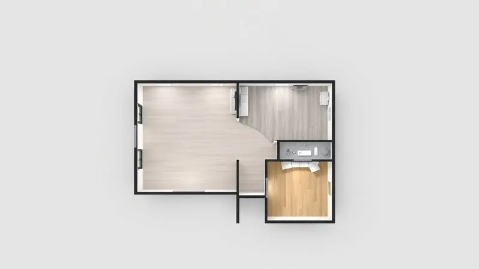
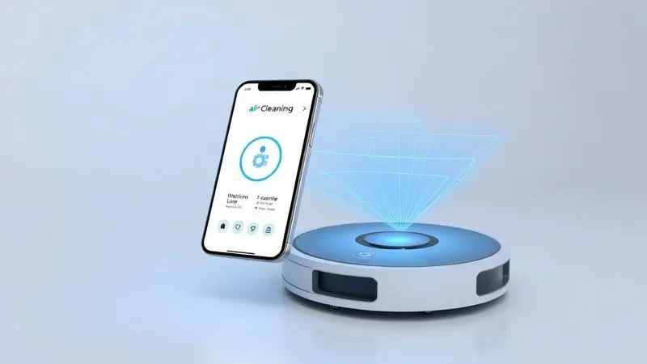
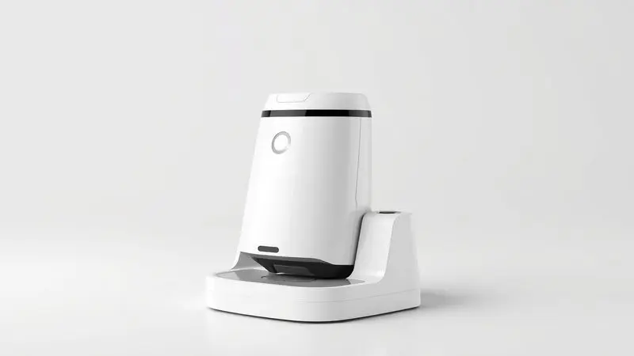

Cansado de gastar horas varrendo e passando pano na casa? Encontrar o melhor robô-aspirador custo-benefício pode ser o segredo para transformar sua rotina, garantindo pisos sempre limpos com o mínimo de esforço.

Com o avanço da tecnologia, os modelos atuais não apenas aspiram pó e pelos de pets com maestria, mas também mapeiam ambientes e até passam pano simultaneamente.

No entanto, com tantas opções disponíveis no mercado, escolher o equipamento certo exige atenção a detalhes como potência de sucção, autonomia de bateria e funções inteligentes.

Neste guia completo, selecionamos os 9 melhores modelos de 2025 e respondemos às principais dúvidas para facilitar sua decisão e otimizar seu tempo.

<SummaryList products={frontmatter.top_products} />

## Melhores robôs aspiradores custo-benefício de 2025

Você já imaginou acordar com os pisos impecáveis, sem ter levantado um dedo? Essa é a promessa que se concretiza nos robôs aspiradores de 2025, onde tecnologia e praticidade se encontram num equilíbrio perfeito entre investimento e resultados.

### 1. Philco PAS22P

<ProductBox 
  title={frontmatter.top_products[0].title} 
  image={frontmatter.top_products[0].image} 
  link={frontmatter.top_products[0].link} 
/>

Para quem sonha com uma limpeza simultânea, o Philco PAS22P oferece essa dupla funcionalidade em um único movimento suave. Imagine o alívio de ver poeira e sujeira desaparecerem enquanto um pano seco dá o acabamento final, tudo ao mesmo tempo.

Com seus 35W de potência, ele trabalha discretamente por 100 a 120 minutos, tempo suficiente para cuidar de apartamentos completos sem interrupções.

O segredo da sua eficiência está no filtro HEPA que retém 99,9% das impurezas, uma benção para quem sofre com alergias e busca respirar um ar mais puro em casa. Seus sensores funcionam como olhos extras, protegendo móveis e evitando quedas inesperadas.

Importante lembrar que ele não lida com líquidos, mas para a maioria dos lares brasileiros, onde a poeira seca reina, essa característica passa quase despercebida.

<CaixaProsContras>

**Prós:**

- Aspira e passa pano ao mesmo tempo.

- Filtro HEPA eficaz para alergias.

- Boa autonomia de bateria (100 a 120 minutos).

- Sensores que evitam quedas e colisões.

**Contras:**

- Não aspira líquidos.

- O reservatório pode ser menor para limpezas grandes.

</CaixaProsContras>

### 2. WAP ROBOT W400

<ProductBox 
  title={frontmatter.top_products[1].title} 
  image={frontmatter.top_products[1].image} 
  link={frontmatter.top_products[1].link} 
/>

Quando espaço é precioso, cada centímetro conta. O WAP ROBOT W400 mede apenas 7,5cm de altura, uma façanha de engenharia que permite alcançar aqueles lugares esquecidos embaixo de estantes e sofás.

Mas sua magia vai além do tamanho compacto, ele integra três ações em uma: varre, aspira e passa pano.

O controle é onde a modernidade brilha. Com o aplicativo WAP Connect, você programa a limpeza enquanto trabalha ou assiste a um filme. Se preferir o comando por voz, Alexa e Google Assistente estão à disposição.

A autonomia de 1 hora e 40 minutos cobre bem o dia a dia, ainda que seu investimento inicial possa fazer você considerar outras opções no mercado.

<CaixaProsContras>

**Prós:**

- Limpeza 3 em 1 (varre, aspira e passa pano).

- Controle via aplicativo e assistentes de voz.

- Design slim que alcança lugares difíceis.

- Sistema de filtragem tripla com filtro HEPA.

**Contras:**

- Não realiza mapeamento de ambientes.

- O preço pode ser considerado elevado em relação a modelos similares.

</CaixaProsContras>

### 3. Ropo Glass 3

<ProductBox 
  title={frontmatter.top_products[2].title} 
  image={frontmatter.top_products[2].image} 
  link={frontmatter.top_products[2].link} 
/>

Para famílias com crianças ou animais, a limpeza vai além da aparência. O Ropo Glass 3 entende isso e oferece um quarteto de funções que inclui a esterilização com luz UV.

Enquanto aspira e passa pano com eficiência, ele emite luz ultravioleta que elimina vírus e bactérias invisíveis a olho nu.

Com potência de sucção de 2500Pa e três níveis ajustáveis, ele se adapta desde uma poeira fina até pelos mais teimosos.

O mapeamento inteligente garante que nenhum cantinho fique esquecido, e os 150 minutos de autonomia permitem que ele cuide de casas maiores com uma única carga.

Sim, não substitui aquela faxina profunda de fim de semana, mas para o cotidiano, ele é um parceiro excepcional.

<CaixaProsContras>

**Prós:**

- Multifuncional: varre, aspira, passa pano e esteriliza.

- Luz UV para eliminação de germes.

- Boa autonomia de bateria, até 180 minutos.

- Controle via aplicativo e compatibilidade com assistentes virtuais.

**Contras:**

- Não substitui limpezas profundas regulares.

- O design em acrílico pode riscar com o tempo.

</CaixaProsContras>

### 4. Xiaomi Robot Vacuum S40C

<ProductBox 
  title={frontmatter.top_products[3].title} 
  image={frontmatter.top_products[3].image} 
  link={frontmatter.top_products[3].link} 
/>

A precisão é o cartão de visita do Xiaomi S40C. Com navegação a laser LDS, ele não apenas limpa, mas memoriza cada detalhe do seu ambiente, criando rotas inteligentes que economizam tempo e energia.

Os 5.000 Pa de potência de sucção transformam a tarefa de aspirar em uma experiência quase cirúrgica, removendo até os menores resíduos.

A função mop integrada é como ter um ajudante discreto que regula a umidade em três níveis, perfeito para quem deseja um piso não apenas limpo, mas com aquele brilho saudável.

Os 120 minutos de trabalho ininterrupto são suficientes para áreas generosas, embora a ausência de auto-esvaziamento signifique que você precisará esvaziar o coletor manualmente após algumas sessões.

<CaixaProsContras>

**Prós:**

- Navegação inteligente com mapeamento a laser.

- Potência de sucção adequada para ambientes diários.

- Função mop integrada com controle de umidade.

- Boa autonomia para áreas maiores.

**Contras:**

- Sistema de mop passivo que pode molhar tapetes.

- Não possui função de auto-esvaziamento do coletor.

</CaixaProsContras>

### 5. Liectroux XR500 Pro

<ProductBox 
  title={frontmatter.top_products[4].title} 
  image={frontmatter.top_products[4].image} 
  link={frontmatter.top_products[4].link} 
/>

Imagine poder dividir sua casa em zonas e dizer exatamente onde quer mais atenção na limpeza. O Liectroux XR500 Pro torna isso possível com seu sistema de mapeamento a laser que salva até cinco configurações diferentes de ambientes.

Com uma potência impressionante de 4 kPa, ele enfrenta sem hesitação os desafios de lares com pets.

O aplicativo transforma seu smartphone em um centro de controle completo, onde você programa horários, monitora o progresso e ajusta configurações sem precisar se levantar.

A única pequena ressalva é seu peso um pouco acima da média, mas isso se traduz em robustez e durabilidade que compensam o leve esforço na movimentação.

<CaixaProsContras>

**Prós:**

- Funções de varre, aspira e passa pano em um só dispositivo.

- Navegação precisa com mapeamento a laser.

- Controle por aplicativo e compatibilidade com assistentes de voz.

- Alta potência de sucção e autonomia prolongada da bateria.

**Contras:**

- Pode ser um pouco mais pesado em comparação com outros modelos.

- A configuração inicial pode demandar um pouco mais de tempo.

</CaixaProsContras>

### 6. Xiaomi Robot Vacuum X10

<ProductBox 
  title={frontmatter.top_products[5].title} 
  image={frontmatter.top_products[5].image} 
  link={frontmatter.top_products[5].link} 
/>

Para quem precisa de resistência e durabilidade, o Xiaomi X10 oferece uma experiência de limpeza que dura. Com bateria de 5200mAh, ele trabalha por mais de 180 minutos consecutivos, tempo suficiente para cobrir residências amplas sem pausas.

Os 4000Pa de força de sucção garantem que nenhum pelo ou partícula escape.

O mapeamento a laser LDS funciona mesmo em condições de pouca luminosidade, um detalhe valioso para quem tem cantinhos mais escuros em casa.

O reservatório eletrônico da função mop mantém a limpeza úmida por até 80 minutos, embora alguns possam desejar uma capacidade um pouco maior para ambientes extensos.

<CaixaProsContras>

**Prós:**

- Excelente potência de sucção.

- Navegação precisa com tecnologia a laser.

- Função de mop com controle de fluxo de água.

- Bateria duradoura para longos períodos de limpeza.

**Contras:**

- O modelo padrão pode carecer de algumas funcionalidades da versão X10+.

- A capacidade do reservatório de água poderia ser maior.

</CaixaProsContras>

### 7. Electrolux Home-E Ultra Experience ERB40

<ProductBox 
  title={frontmatter.top_products[6].title} 
  image={frontmatter.top_products[6].image} 
  link={frontmatter.top_products[6].link} 
/>

A magia da limpeza 4 em 1 se materializa no Electrolux ERB40, que aspira, varre e passa pano seco ou úmido conforme sua necessidade. Com apenas 8cm de altura, ele é um verdadeiro especialista em penetrar nos espaços que nossos aspiradores manuais nunca alcançariam.

Os sensores anti-impacto e anti-queda funcionam como um sexto sentido, protegendo tanto o robô quanto seus móveis.

Os 140 minutos de autonomia são mais que suficientes para a maioria dos apartamentos, mas é importante entender que seu modo mop é feito para manutenção, não para substituir aquela esfregada mais profunda ocasional.

<CaixaProsContras>

**Prós:**

- Limpeza versátil com múltiplas funções.

- Sensores eficazes contra quedas e impactos.

- Design compacto que facilita o acesso a locais baixos.

- Filtro HEPA que melhora a qualidade do ar.

**Contras:**

- Modo mop não substitui uma limpeza profunda.

- Falta de controle via aplicativo.

</CaixaProsContras>

### 8. KABUM! Smart 900

<ProductBox 
  title={frontmatter.top_products[7].title} 
  image={frontmatter.top_products[7].image} 
  link={frontmatter.top_products[7].link} 
/>

A tecnologia ToF 360° do KABUM! Smart 900 é como dar visão 3D ao seu robô aspirador. Ele não apenas evita obstáculos, mas mapea até cinco ambientes diferentes, permitindo que você crie zonas restritas diretamente pelo aplicativo.

São cinco modos de limpeza à sua escolha, incluindo o zigue-zague que otimiza a cobertura.

Com bateria de 5200mAh, ele alcança impressionantes 180 minutos de funcionamento, cobrindo áreas de até 200m². A compatibilidade com assistentes de voz integra perfeitamente a limpeza à sua rotina inteligente.

Apenas lembre-se de verificar a voltagem, pois ele não é bivolt, e alguns usuários relatam que a configuração inicial do aplicativo pode exigir um pouco de paciência.

<CaixaProsContras>

**Prós:**

- Tecnologia avançada com mapeamento 3D.

- Vários modos de limpeza, incluindo função umedecida.

- Boa autonomia com bateria de longa duração.

- Compatível com assistentes de voz para maior praticidade.

**Contras:**

- Não é bivolt, exigindo atenção à voltagem.

- Algumas dificuldades relatadas na configuração do aplicativo.

</CaixaProsContras>

### 9. Xiaomi Robot Vacuum S10

<ProductBox 
  title={frontmatter.top_products[8].title} 
  image={frontmatter.top_products[8].image} 
  link={frontmatter.top_products[8].link} 
/>

O equilíbrio perfeito entre tecnologia acessível e desempenho robusto se encontra no Xiaomi S10. Com sistema de navegação a laser LDS, ele aprende o layout da sua casa, criando rotas eficientes que economizam bateria e tempo.

Os 4000Pa de potência de sucção lidam sem esforço com os desafios diários de sujeira.

A função 2 em 1 é particularmente inteligente, com um tanque de água que ajusta automaticamente o fluxo conforme a necessidade.

Os 130 minutos de autonomia são ideais para a maioria dos espaços urbanos, embora em residências muito amplas ele possa necessitar de pausas estratégicas para recarregar.

<CaixaProsContras>

**Prós:**

- Navegação a laser para mapeamento preciso

- Potência de sucção de 4000Pa

- Função 2 em 1: aspiração e mopagem

- Boa autonomia de bateria

**Contras:**

- Pode ser mais eficiente em ambientes menores

- A interação com o aplicativo pode ser um pouco complexa para novos usuários

</CaixaProsContras>

## Como escolhemos os robôs aspiradores desta lista?

Nosso critério foi simples, mas rigoroso: buscamos modelos que realmente transformem seu dia a dia, não apenas pelas especificações técnicas, mas pelo impacto prático na rotina.

Avaliamos como cada robô lida com os desafios reais - pelos de pets, transições entre pisos, cantos esquecidos. Consideramos a autonomia não como um número, mas como confiança de que o trabalho será completo sem sua supervisão.

Analisamos dezenas de avaliações de usuários para entender onde cada modelo brilha e onde pode exigir um pouco de paciência.

O resultado é esta seleção diversificada que serve desde apartamentos compactos até casas amplas, sempre com o olhar no melhor equilíbrio entre investimento e qualidade de vida.

## Como escolher o melhor robô aspirador custo-benefício?

A escolha certa vai além das especificações técnicas, é sobre encontrar o parceiro que se adapta ao seu ritmo de vida. Pense nisso como contratar um assistente pessoal para a limpeza, alguém que precisa entender seus horários, seus espaços e suas prioridades.

### Tipo de piso e ambiente

Seus pisos contam uma história que o robô precisa entender. Madeira, porcelanato, carpete ou uma mistura de tudo isso? Cada superfície pede uma abordagem diferente.

Em ambientes com muitos móveis, tapetes e objetos decorativos, a navegação inteligente se torna não um luxo, mas uma necessidade.

Imagine o alívio de não precisar reorganizar a sala toda vez que for limpar, porque seu aspirador conhece cada obstáculo e contorna com elegância.

### Potência de sucção e capacidade de bateria

A potência de sucção é o coração do seu robô aspirador. Não se trata apenas de números, mas da tranquilidade em saber que cada partícula de poeira, cada pelo de pet, será capturado na primeira passada.

Em lares com animais ou crianças, essa eficiência se traduz em um ambiente mais saudável.

Já a bateria determina sua liberdade - quanto mais duradoura, menos você pensa em recargas e mais pode confiar que, ao retornar para casa, encontrará tudo limpo, independentemente do tamanho do espaço.

### Funções inteligentes e conectividade

Controlar seu robô com a voz enquanto prepara o café da manhã não é apenas conveniência, é tempo que você ganha para si mesmo. Aplicativos que permitem programar horários específicos transformam a limpeza em uma rotina silenciosa que acontece quando você está fora.

Sensores de mapeamento são como dar um GPS para seu aspirador, garantindo que nenhum cantinho fique esquecido. Essa inteligência não substitui sua presença, mas otimiza tanto o processo que você quase esquece que a limpeza está acontecendo.

### Capacidade do reservatório e manutenção

O tamanho do reservatório determina quantas vezes você precisará interromper sua rotina para esvaziá-lo. Em casas maiores ou com pets que soltam muitos pelos, um reservatório generoso significa passar semanas sem precisar tocar no compartimento de sujeira.

A manutenção fácil é igualmente crucial, filtros e escovas que podem ser limpos em segundos transformam o cuidado do equipamento de uma tarefa chata em uma ação rápida que preserva o desempenho por anos.

### Eficiência do MOP

A função mop vai além de umedecer o piso, é sobre entregar aquele acabamento que faz os pisos brilharem de verdade.

Panos de microfibra de qualidade se conectam às partículas de sujeira de forma quase magnética, enquanto sistemas que controlam a umidade evitam excessos que poderiam danificar superfícies delicadas.

Para quem deseja não apenas limpar, mas também dar aquele toque final que transforma um ambiente, a eficiência do mop faz toda diferença.

### Orçamento e custo-benefício

Investir em um robô aspirador é como comprar tempo de qualidade para você mesmo. O custo-benefício não se mede apenas pelo preço, mas pelo valor das horas que você recupera.

Um modelo mais básico pode ser perfeito se sua necessidade é a manutenção diária de um espaço pequeno, enquanto tecnologias avançadas se justificam em ambientes complexos ou quando a conectividade com outros dispositivos inteligentes faz parte do seu estilo de vida.

O equilíbrio está em identificar quais funcionalidades realmente importam para sua rotina específica.

## 📋Quais são os tipos de aspirador-robô?

Entender as categorias é como aprender um novo idioma da limpeza inteligente. Cada tipo tem seu vocabulário próprio, seu ritmo e sua forma de se relacionar com seu espaço.

### Robô Aspirador Básico

Pense no robô básico como aquele amigo confiável que chega sem complicações, faz seu trabalho com eficiência e não exige manuais complexos.

Ele não vai mapear sua casa em 3D ou responder aos seus comandos de voz, mas entrega o essencial: pisos limpos com o mínimo de intervenção sua. Perfeito para quem busca praticidade pura, sem firulas tecnológicas.

### Robô Aspirador com Mapeamento de Ambientes

Este é o estrategista da limpeza. Ele não apenas limpa, mas estuda o terreno, cria mapas mentais da sua casa e planeja rotas que maximizam a eficiência.

Sensores e câmeras funcionam como seus olhos, identificando onde a sujeira se concentra e quais áreas precisam de atenção especial.

Para ambientes com muitos cômodos ou mobiliário complexo, essa inteligência transforma a limpeza de uma tarefa aleatória em uma operação meticulosa.

### Robô Aspirador com Função de Passar Pano

Aqui, a limpeza ganha uma dimensão extra. Enquanto aspira, um sistema paralelo aplica a umidade perfeita para remover manchas e dar aquele acabamento que faz diferença visual.

É como ter dois assistentes em um, trabalhando em sincronia para entregar um resultado completo. Importante lembrar que ele é um parceiro para a manutenção diária, não um substituto para aquela limpeza profunda ocasional que toda casa merece.

### Robô Aspirador com Autoesvaziamento

Este modelo entende que seu tempo é precioso. Após cada sessão de limpeza, ele retorna à sua estação e transfere automaticamente a sujeira coletada para um reservatório maior.

Isso significa que você pode passar semanas, até meses, sem precisar esvaziar manualmente o compartimento. Para quem tem uma rotina intensa ou simplesmente deseja maximizar a automatização, essa função representa o próximo nível na liberdade doméstica.

## Dicas para usar seu robô aspirador que passa pano

Comece criando o ambiente ideal, removendo objetos soltos como brinquedos ou cabos que poderiam criar obstruções. Programar a limpeza para horários em que você está fora transforma a tarefa em algo que acontece naturalmente, sem interrupções.

Mantenha o reservatório de água sempre com o nível adequado e substitua regularmente os panos, pois eles são a conexão direta com seus pisos.

A manutenção periódica dos filtros e sensores não é apenas cuidado, é garantir que seu parceiro de limpeza mantenha a precisão e eficiência que conquistaram sua confiança.

## Quais produtos usar no pano do robô aspirador?

Panos de microfibra são os aliados ideais, capturando sujeira com uma eficiência quase magnética. Para ambientes com crianças ou animais, versões com propriedades antibacterianas acrescentam uma camada extra de proteção.

A lavagem regular seguindo as orientações do fabricante preserva não apenas a eficácia, mas também a durabilidade do material. Evite produtos químicos agressivos, pois eles podem prejudicar tanto o desempenho do pano quanto a integridade do seu equipamento.

A escolha certa transforma cada passada em um investimento na saúde do seu ambiente.

## Qual é o robô aspirador de melhor custo-benefício?

O melhor custo-benefício não é o mais barato, mas sim aquele que equilibra perfeitamente o que você investe com o que recebe em qualidade de vida.

Procure modelos cujas funcionalidades correspondam às suas necessidades reais - mapeamento inteligente se você tem muitos obstáculos, potência extra se convive com pets, autonomia ampliada se sua casa é espaçosa.

A facilidade de manutenção e a durabilidade são investimentos silenciosos que se pagam ao longo dos anos. No final, o melhor custo-benefício é aquele que você esquece que comprou, porque simplesmente funciona como uma extensão natural da sua rotina.

## 🧰 O que um aspirador-robô pode fazer?

Imagine um assistente discreto que conhece cada centímetro da sua casa e trabalha enquanto você vive.

Ele navega entre móveis com a elegância de quem conhece o caminho, aspira diferentes superfícies adaptando sua potência conforme a necessidade, e pode até integrar-se à sua voz através de assistentes virtuais.

Sua magia está na capacidade de alcançar os lugares que nossos aspiradores manuais nunca conseguiriam, transformando a limpeza de uma tarefa para algo que simplesmente acontece no background da sua vida.

## 🔌 Como o aspirador-robô funciona?

Sensores funcionam como seus sentidos, detectando obstáculos e mudanças de superfície. Um sistema de navegação cria rotas inteligentes que cobrem todo o espaço sem repetições desnecessárias.

Escovas giram para desalojar a sujeira enquanto a sucção a captura em um reservatório selado. Após concluir sua missão, ele retorna autonomamente à base para recarregar, pronto para o próximo ciclo.

Todo esse processo acontece com uma autonomia que permite que você saia de casa e retorne encontrando tudo limpo, sem ter participado ativamente de nenhuma etapa.

## 🪜O aspirador-robô sobe degraus? Ele pode cair?

A maioria dos modelos modernos é equipada com sensores que detectam desníveis e bordas, parando ou mudando de direção antes de qualquer risco de queda. Essa tecnologia funciona como um sistema de prevenção que protege tanto o equipamento quanto sua tranquilidade.

No entanto, subir degraus é um desafio diferente, que poucos modelos conseguem superar. Se sua casa tem muitos níveis diferentes, verificar essa capacidade nas especificações garante que o robô será um parceiro eficaz em todos os espaços.

## 🛏️ O aspirador-robô entra debaixo dos móveis?

Sim, e essa é uma de suas maiores virtudes. Com alturas que variam entre 7,5 e 10cm, eles deslizam sob sofás, camas e estantes, alcançando os recantos onde a sujeira mais gosta de se esconder.

Para quem tem animais de estimação, essa capacidade é particularmente valiosa, já que pelos tendem a se acumular justamente nesses espaços de difícil acesso.

Verificar as dimensões do modelo em relação à altura dos seus móveis garante que nenhum cantinho ficará sem a atenção que merece.

## 🐕 Dá para usar tendo pets em casa?

Absolutamente. Muitos robôs são projetados especificamente para lidar com os desafios dos lares com animais.

Escovas que não embaraçam com pelos longos, potência de sucção que captura até os fios mais teimosos, e filtros HEPA que retêm alérgenos são características pensadas para essa realidade.

O mapeamento inteligente permite focar nas áreas onde os pets mais circulam, enquanto reservatórios de maior capacidade lidam com a produção extra de sujeira. É uma parceria que não apenas mantém a casa limpa, mas contribui para um ambiente mais saudável para todos.

## 🧹 Precisa limpar o aspirador-robô?

Sim, e essa manutenção é simples, mas essencial. Após cada uso, esvaziar o compartimento de coleta garante que a sucção permaneça potente. Filtros devem ser verificados e limpos regularmente, geralmente mensalmente, para manter a eficiência do sistema.

As escovas merecem atenção especial, removendo fios ou pelos que possam se acumular e prejudicar o giro. Limpar os sensores com um pano seco mantém a navegação precisa.

Esses pequenos cuidados são o segredo para prolongar a vida do seu equipamento e garantir que ele continue sendo um parceiro eficiente por anos.

## Robô aspirador ou aspirador vertical?

A escolha depende do que você valoriza mais: automação ou poder bruto. O robô aspirador é o mestre da conveniência, trabalhando sozinho em horários programados, ideal para quem deseja que a limpeza aconteça sem demandar seu tempo ativo.

Já o aspirador vertical oferece mais potência e controle direto, perfeito para limpezas profundas em carpetes ou áreas específicas que precisam de atenção especial.

Muitos lares descobrem que a combinação dos dois oferece o melhor dos dois mundos: a automação diária do robô e a precisão sob demanda do vertical.

## Vale a pena comprar um robô aspirador que passa pano?

Se você busca maximizar a eficiência na rotina doméstica, sim. Essa combinação transforma duas tarefas em uma única operação automatizada, reduzindo significativamente o tempo que você dedica à limpeza.

O resultado é um piso não apenas livre de sujeira, mas com aquele acabamento que só a passagem de pano consegue oferecer.

É importante ter expectativas realistas - ele não substitui completamente a limpeza manual em todas as situações - mas para a manutenção diária que mantém sua casa sempre apresentável, ele é um investimento que se paga em tempo recuperado e qualidade de vida.

## Conclusão

Escolher o robô aspirador ideal é como encontrar o parceiro perfeito para suas tarefas domésticas.

Não se trata apenas de tecnologia, mas de como esse equipamento se encaixa no ritmo da sua vida, compreende os desafios do seu espaço e devolve horas preciosas que você pode dedicar ao que realmente importa.

Desde o modelo básico que cuida da manutenção diária até as versões com mapeamento 3D e autoesvaziamento, cada opção oferece um caminho diferente para a mesma conquista: mais liberdade e menos preocupação com a limpeza.

Os 9 modelos que apresentamos representam o melhor equilíbrio entre investimento e resultados em 2025, mas a escolha final sempre será pessoal. Considere não apenas as especificações técnicas, mas como cada funcionalidade se traduz no seu dia a dia.

Pense nos pelos do seu pet, nos tipos de piso da sua casa, no tempo que deseja recuperar.

Porque no final, um bom robô aspirador não limpa apenas o chão, ele limpa sua agenda, dando a você o presente do tempo bem investido naquilo que realmente faz sua vida valer a pena. Qual será o parceiro que começará essa transformação na sua rotina?