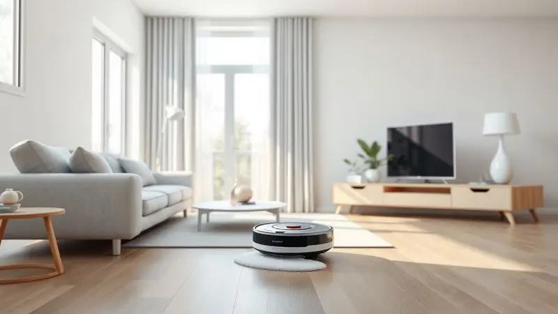
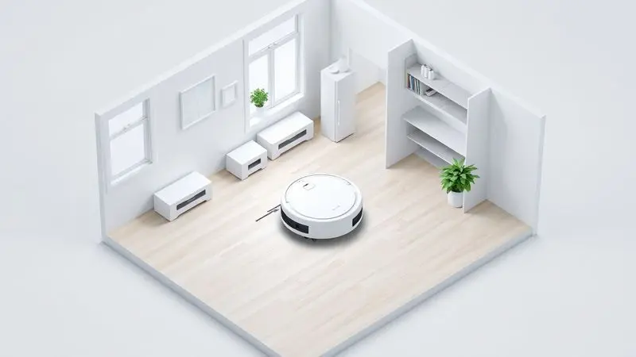
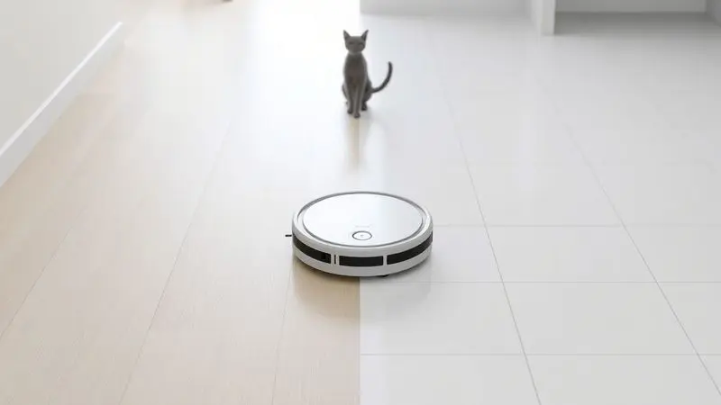
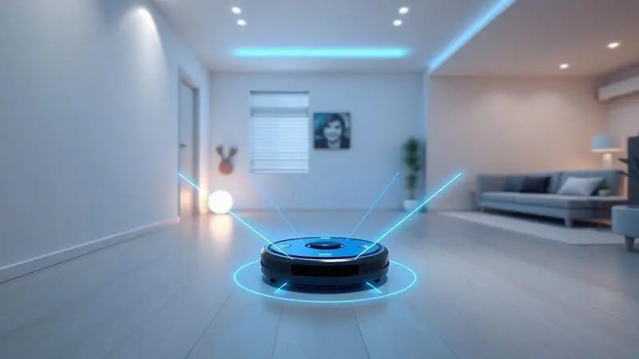

Imagine acordar em um sábado de manhã e, em vez de pegar o aspirador, poder aproveitar o café da manhã enquanto um assistente silencioso cuida da limpeza. É essa liberdade do trabalho doméstico repetitivo que os robôs aspiradores Ropo prometem trazer para sua rotina.

Mas em meio a tantas opções no mercado, surge a dúvida: a marca brasileira realmente entrega o que promete?

Vamos além das especificações técnicas para entender como cada modelo pode transformar seu dia a dia, desde o econômico Easy até o inteligente Glass 4, descobrindo qual deles se encaixa na sua realidade e se o investimento traz a paz que você busca.

<SummaryList products={frontmatter.top_products} />

## A Marca Ropo é Boa? Análise de Reputação e Confiabilidade

Quando você confia a limpeza da sua casa a uma máquina, mais do que tecnologia, busca confiança. A Ropo chegou ao mercado com uma proposta ousada: oferecer inovação acessível.

O que os usuários descobriram foi uma marca que aprende rápido - os modelos mais recentes já corrigem pontos fracos identificados nas primeiras gerações.

A experiência comum entre donos de produtos Ropo é de surpresa positiva: esperavam um produto básico e encontraram robustez e eficiência que rivalizam com marcas mais caras.

O suporte ao cliente, frequentemente elogiado, completa essa imagem de uma empresa que não apenas vende, mas acompanha.

Claro, como qualquer marca em crescimento, ainda constrói sua história, mas os relatos de durabilidade e atendimento sugerem que a Ropo está no caminho certo para se tornar uma referência.

## Por Que Investir em um Robô Aspirador Ropo? Vantagens da Marca

Se a confiança já está estabelecida, o que realmente muda na sua vida com um Ropo? Pense naquela sensação de voltar para casa após um dia cansativo e encontrar os pisos impecáveis, sem que você tenha levantado um dedo.

Os robôs da marca transformam a limpeza de uma tarefa para um resultado.

A tecnologia de navegação inteligente não é apenas um jargão técnico, é a garantia de que o dispositivo vai aprender os cantos da sua casa, evitar seus móveis favoritos e limpar de forma sistemática, como se tivesse um mapa mental do ambiente.

E quando você pode controlar tudo pelo smartphone, agendando limpezas enquanto está no trabalho ou ajustando a potência conforme a sujeira do dia, a praticidade deixa de ser um luxo para se tornar parte da sua rotina.

O tempo que você recupera - aquele que antes gastava passando o aspirador - agora pode ser investido no que realmente importa.

## Tipos de Robôs Aspiradores Ropo e Suas Tecnologias

A variedade de modelos Ropo reflete uma compreensão simples: cada casa tem necessidades diferentes. De apartamentos compactos a residências espaçosas, da convivência com pets à prioridade por desinfecção, existe um robô pensado para sua realidade.

A evolução tecnológica dentro da própria linha é notável - enquanto alguns focam na simplicidade eficiente, outros incorporam inteligência artificial que faz você questionar como vivia sem isso.

### 1. Robô Aspirador Ropo Easy (O Melhor Custo-Benefício)

<ProductBox 
  title={frontmatter.top_products[0].title} 
  image={frontmatter.top_products[0].image} 
  link={frontmatter.top_products[0].link} 
/>

Para quem busca um aliado na limpeza sem complicações nem investimentos exorbitantes, o Easy é a resposta. Ele entende que nem todo mundo precisa de mapas em 3D ou controle por voz, mas sim de um companheiro que acorda, limpa e recarrega sozinho.

Com seus 120 minutos de autonomia, ele cuida de apartamentos inteiros enquanto você se dedica a outras coisas, e o sistema de filtragem que retém 99,9% das impurezas significa que você respira um ar mais puro sem esforço.

A função 3 em 1 (varrer, aspirar e passar pano) resolve a maioria das situações do dia a dia com uma simplicidade que encanta: um toque e ele assume o trabalho.

<CaixaProsContras>

**Prós:**

- Ótimo custo-benefício em comparação a modelos similares.

- Facilidade de uso com operação simples de um botão.

- Boa autonomia de bateria para longas sessões de limpeza.

- Sistema de filtragem eficiente que melhora a qualidade do ar.

**Contras:**

- A durabilidade das escovas laterais pode ser uma preocupação.

- O reservatório para passar pano precisa ser adquirido separadamente.

</CaixaProsContras>

#### Ficha Técnica e Destaques do Ropo Easy

O segredo do Easy está na combinação certa: navegação inteligente que evita quedas sem complicações desnecessárias, potência de sucção ajustável para lidar desde migalhas até poeira acumulada, e um design compacto que alcança embaixo dos móveis onde a vassoura nunca chega.

Seu funcionamento é tão silencioso que você pode programá-lo para a madrugada e acordar com a casa limpa, sem nem perceber que ele trabalhou. A bateria de longa duração é a garantia de que, mesmo nas limpezas mais extensas, ele não vai desistir no meio do caminho.

### 2. Robô Aspirador Ropo Way (O Modelo de Entrada Versátil)

<ProductBox 
  title={frontmatter.top_products[1].title} 
  image={frontmatter.top_products[1].image} 
  link={frontmatter.top_products[1].link} 
/>

Imagine um assistente que não apenas limpa, mas escolhe a estratégia certa para cada cômodo. O Way chega com quatro modos de limpeza diferentes, adaptando-se automaticamente ao que encontra pela frente.

Sua navegação por giroscópio é como ter um senso de direção aprimorado, garantindo que nenhum cantinho seja esquecido.

Com 1500 Pa de força de sucção, ele lida com a poeira do dia a dia de forma eficiente, e os 70 minutos de autonomia são mais que suficientes para apartamentos médios.

A recarga automática é a cereja do bolo: quando a energia está baixa, ele encontra o caminho de volta sozinho, pronto para continuar depois.

<CaixaProsContras>

**Prós:**

- Navegação por giroscópio para limpeza eficaz.

- Quatro modos de limpeza disponíveis.

- Autonomia de até 70 minutos.

- Sistema de filtragem com filtro HEPA.

**Contras:**

- Não pode ser usado em superfícies úmidas.

- O tempo de carga é relativamente longo (cerca de 5 horas).

</CaixaProsContras>

### 3. Robô Aspirador Ropo Smart 2 (O Intermediário Inteligente)

<ProductBox 
  title={frontmatter.top_products[2].title} 
  image={frontmatter.top_products[2].image} 
  link={frontmatter.top_products[2].link} 
/>

Para lares com pets, onde pelos são uma constante e a limpeza precisa ser mais frequente, o Smart 2 chega como um especialista.

Sua função 3 em 1 trabalha de forma integrada, e a potência extra de aspiração foi pensada justamente para capturar aqueles pelos que parecem se multiplicar magicamente.

Controlar tudo pelo aplicativo adiciona uma camada de conveniência: você pode iniciar uma limpeza extra enquanto está no trabalho porque viu que o gato brincou com sua bola de pelo.

A compatibilidade com Alexa e Google Assistente significa que, às vezes, basta um comando de voz para que a casa comece a se limpar sozinha.

<CaixaProsContras>

**Prós:**

- Boa capacidade de aspiração, especialmente eficaz na remoção de pelos de animais.

- Interface intuitiva e fácil de usar, tanto pelo aplicativo quanto pelo controle remoto.

- Função 3 em 1 versátil, ideal para uma limpeza completa.

- Longa duração da bateria que cobre áreas maiores sem interrupções.

**Contras:**

- Ausência de mapeamento a laser pode resultar em uma navegação menos eficiente.

- O encaixe do reservatório de água pode ser frágil e difícil de manusear.

</CaixaProsContras>

### 4. Robô Aspirador Ropo Glass 3 (O Mais Popular da Linha)

<ProductBox 
  title={frontmatter.top_products[3].title} 
  image={frontmatter.top_products[3].image} 
  link={frontmatter.top_products[3].link} 
/>

Quando limpar não é suficiente e você busca verdadeira higienização, o Glass 3 apresenta seu trunfo: a esterilização por luz UV.

Enquanto aspira e passa pano, ele emite luz ultravioleta que elimina bactérias e vírus, ideal para famílias com crianças pequenas ou alérgicos.

Os 2500 Pa de sucção são impressionantes, lidando até com sujeiras mais incrustadas, e os 180 minutos de autonomia significam que ele pode limpar uma casa grande inteira em uma única sessão.

O controle remoto físico oferece uma alternativa prática para quem prefere não depender do smartphone.

<CaixaProsContras>

**Prós:**

- Funcionalidade 4 em 1: varre, aspira, passa pano e esteriliza.

- Potência de sucção de 2500Pa.

- Bateria com autonomia de até 180 minutos.

- Controle remoto físico para maior praticidade.

**Contras:**

- Navegação giroscópica pode falhar no mapeamento.

- Aplicativo com funcionalidade limitada e avaliações negativas.

</CaixaProsContras>

### 5. Robô Aspirador Ropo Glass 4 (Alto Desempenho e Mapeamento)

<ProductBox 
  title={frontmatter.top_products[4].title} 
  image={frontmatter.top_products[4].image} 
  link={frontmatter.top_products[4].link} 
/>

Este é o gênio da limpeza. O Glass 4 não apenas trabalha, mas estuda sua casa com seu mapeamento a laser 4.0, criando um mapa tão preciso que você pode, pelo aplicativo, determinar exatamente quais cômodos limpar e quando.

Os 4000 Pa de sucção são uma força da natureza contra a sujeira, e a função que simula o esfregar humano ao passar pano faz você questionar se realmente precisa esfregar o chão novamente.

A esterilização UV adiciona camadas de proteção à saúde, e o sistema de retorno automático à base garante que, mesmo em limpezas maratonas, ele nunca fique sem energia no meio do serviço.

<CaixaProsContras>

**Prós:**

- Mapeamento a laser para limpeza precisa.

- Potência de sucção ajustável em três níveis.

- Esterilização UV para maior higiene.

- Controle via aplicativo facilita o agendamento.

**Contras:**

- Configuração inicial do aplicativo pode ser confusa para alguns usuários.

- O pano de limpeza pode não ter a mesma qualidade em todos os casos.

</CaixaProsContras>

## Guia de Compra: Como Escolher o Robô Aspirador Ropo Ideal

Depois de conhecer a família Ropo, como decidir qual membro vai morar na sua casa? A resposta está menos nas especificações técnicas e mais no seu dia a dia. Estas perguntas vão guiar sua escolha de forma mais assertiva.

### Avalie o Tamanho e o Layout da Sua Casa

Seu robô vai conviver com o espaço que ele limpa. Apartamentos compactos podem ser perfeitamente atendidos pelo Easy ou Way, enquanto casas maiores ou com vários níveis exigem a autonomia prolongada do Glass 3 ou a inteligência de mapeamento do Glass 4.

Observe também a 'personalidade' da sua decoração: muitos móveis baixos, tapetes espalhados e cantos difíceis pedem por sensores mais avançados e navegação precisa.

O robô ideal é aquele que se move pela sua casa como se a conhecesse há anos, não como um visitante perdido.

### Considere os Tipos de Pisos e a Presença de Pets

Cada piso conta uma história diferente para o robô. Madeira e porcelanato pedem por panos de microfibra que não riscam, enquanto carpetes exigem escovas específicas e mais potência de sucção.

E se você divide a casa com pets, a equação muda: pelos exigem filtros HEPA que realmente os capturam (não apenas os espalham) e potência extra para aqueles que se entranham nos tecidos.

Alguns modelos Ropo têm modos específicos para pets, reconhecendo que essa convivência traz necessidades especiais de limpeza.

### Verifique os Recursos de Conectividade e Mapeamento

Quantas vezes você pensou 'queria poder começar a limpeza agora' enquanto estava fora de casa? A conectividade transforma desejo em realidade.

Aplicativos bem desenvolvidos não são apenas controles remotos, são centros de comando onde você agenda rotinas, define áreas proibidas (como o canto do cachorro) e acompanha o progresso.

O mapeamento, por sua vez, é a diferença entre limpar aleatoriamente e limpar com estratégia. Se valoriza organização e controle detalhado, invista em modelos com essas tecnologias.

## Perguntas Frequentes sobre os Robôs Aspiradores Ropo (FAQ)

As dúvidas mais comuns revelam exatamente o que importa na experiência prática com esses assistentes robóticos.

### Os robôs Ropo aspiram e passam pano simultaneamente?

Sim, e essa é uma das magias mais práticas. Enquanto o compartimento traseiro aspira a sujeira, o dianteiro já vai umedecendo e limpando com o pano. É como ter duas pessoas trabalhando em sincronia perfeita.

Essa funcionalidade dupla é especialmente valiosa na cozinha ou em áreas de circulação intensa, onde você quer eliminar tanto resíduos sólidos quanto manchas superficiais em uma única passada.

### Qual a vida útil média da bateria dos modelos Ropo?

Pense em autonomia como confiança. Os modelos variam de 70 a 180 minutos por carga, mas o número mais importante é outro: a capacidade de retornar sozinho para recarregar e continuar de onde parou.

É essa inteligência que transforma minutos de bateria em horas efetivas de limpeza. Em uso diário, a maioria dos usuários nem precisa pensar na bateria, apenas no resultado final.

### O Ropo Easy é indicado para quem tem tapetes e pelos de animais?

Perfeitamente. O Easy foi projetado com a realidade brasileira em mente, onde tapetes são comuns e pets são membros da família. Sua sucção potente desaloja pelos mesmo dos fios mais apertados, e o sistema de filtragem evita que eles retornem ao ar.

O formato compacto ainda permite que ele navegue sob móveis baixos e pelos cantos onde a sujeira - e os pelos - adoram se acumular.

## Conclusão

Escolher um robô aspirador Ropo é decidir recuperar tempo. Tempo que você gastaria esfregando pisos, tempo que perderia procurando a vassoura, tempo que dedicaria a uma tarefa que, agora, pode ser automatizada.

Dos modelos mais simples aos mais inteligentes, o que une a linha é essa promessa de liberdade.

O Easy para quem busca simplicidade eficiente, o Glass 4 para quem quer o estado da arte em limpeza inteligente, e todos os outros preenchendo os espaços entre esses extremos.

A verdadeira pergunta não é se um Ropo vale a pena, mas quanto vale para você acordar com a casa limpa sem ter se levantado do sofá? Quanto vale poder receber visitas inesperadas sem correr para esconder a poeira?

Quanto vale a tranquilidade de saber que, mesmo nos dias mais corridos, seu lar estará cuidado? Se essas questões ressoam com sua rotina, então sim, o investimento não apenas vale a pena, mas se paga diariamente em minutos recuperados e paz de espírito conquistada.

A tecnologia já está aqui, pronta para trabalhar enquanto você vive.

---

Ainda em dúvida sobre o melhor robô aspirador para sua casa? Confira nosso [ranking dos 11 melhores de 2025](/melhores-robos-aspiradores-2023/) e encontre a opção perfeita.
