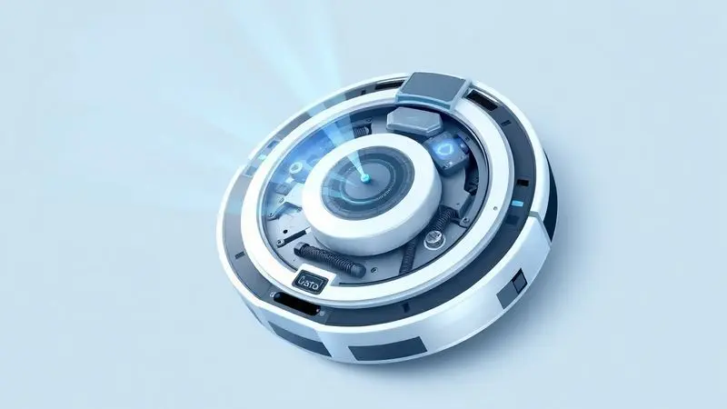
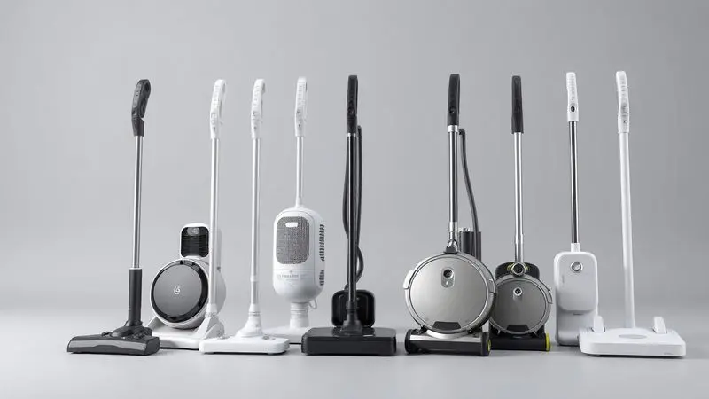
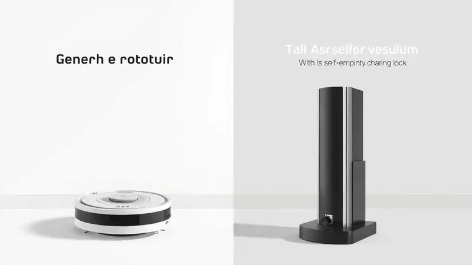

Imagine terminar seu expediente de home office e, em vez de se levantar para varrer o chão, dar um sorriso ao ver que sua casa já está impecável.

Essa é promessa que os robôs aspiradores Ropo trazem para o dia a dia brasileiro, desafiando gigantes internacionais com tecnologia inteligente por um preço que cabe no bolso.

Mas entre tantas opções na prateleira digital, qual modelo realmente se adequa à sua rotina e à realidade da sua casa?

Preparei um guia prático para você navegar pelas características técnicas sem se perder em números, focando no que realmente importa: ter mais tempo livre e menos preocupação com limpeza.

<SummaryList products={frontmatter.top_products} />

## O que olhar em um aspirador robô?

Antes de mergulhar nos modelos específicos, vamos entender o que transforma um simples eletrodoméstico em seu aliado na conquista do tempo livre.

A potência de sucção, medida em Pascal (Pa), vai além de um número técnico - ela define se o robô vai apenas passar pelo chão ou realmente engolir aqueles pelos de pet que se escondem nos cantos.

A autonomia da bateria não é apenas sobre minutos, mas sobre liberdade: você quer um parceiro que complete o trabalho ou que desista no meio do caminho?

A capacidade do reservatório fala sobre sua rotina quanto menos você precisar parar para esvaziar, mais tranquilo será seu dia.

Por fim, sensores inteligentes e controle via aplicativo não são luxos, são sua garantia de que o robô vai navegar pela casa sem engolir seus fones de ouvido ou tomar banho na piscina do cachorro.

## 1. Robô aspirador Ropo Easy — a opção custo-benefício

<ProductBox 
  title={frontmatter.top_products[0].title} 
  image={frontmatter.top_products[0].image} 
  link={frontmatter.top_products[0].link} 
/>

Se você está começando sua jornada na automação doméstica e quer testar as águas sem comprometer o orçamento, o Easy é seu ponto de partida perfeito.

Ele faz exatamente o que promete: passa pelos três estágios básicos da limpeza (varrer, aspirar e passar pano) com uma simplicidade que desafia sua aversão inicial à tecnologia.

Imagine ligá-lo antes de sair para o trabalho e voltar para um chão limpo, sem precisar programar complexidades ou sincronizar com apps.

Com 120 minutos de autonomia, ele não vai desistir no meio do seu apartamento e, quando a bateria começar a fraquejar, ele mesmo encontra o caminho de volta para a base de carregamento.

Seu sistema de filtragem duplo com HEPA captura até 99,9% das impurezas, criando um ambiente mais saudável especialmente importante para quem sofre com alergias.

O design compacto é a chave para alcançar aqueles espaços embaixo da cama ou do sofá que sempre procrastinamos para limpar.

Sim, ele não é herói de sujeiras intensas ou derramamentos líquidos, mas para a rotina diária de quem mora sozinho ou em casal, ele é mais que suficiente.

<CaixaProsContras>

**Prós:**

- Função 3 em 1 que limpa de forma versátil.

- Boa autonomia de bateria para limpezas rápidas.

- Sistema de filtragem eficiente com filtro HEPA.

- Design compacto que alcança áreas difíceis.

**Contras:**

- Não é ideal para recolher líquidos ou sujeira intensa.

- O filtro HEPA não é lavável, o que exige substituição periódica.

</CaixaProsContras>

## 2. Robô aspirador Ropo Way — equilíbrio para o dia a dia

<ProductBox 
  title={frontmatter.top_products[1].title} 
  image={frontmatter.top_products[1].image} 
  link={frontmatter.top_products[1].link} 
/>

Enquanto o Easy é o iniciante simpático, o Way é o amigo confiável que já conhece todos os seus problemas.

Com uma sucção três vezes mais potente que muitos concorrentes (1500 Pa), ele não apenas passa pelo tapete, ele realmente o limpa, capturando aquela areia que sempre volta da praia.

É a diferença entre "parece limpo" e "está limpo", especialmente se você tem animais de estimação ou crianças que trazem o parquinho para dentro de casa.

O controle remoto e a integração com Alexa e Google Home transformam a limpeza em uma conversa: "Alexa, peça para o Way limpar a sala" se torna tão natural quanto pedir a previsão do tempo.

Sua bateria de 70 a 100 minutos é ideal para quem tem apartamentos médios ou quer fazer limpezas rápidas entre reuniões online. A lixeira lavável com maior capacidade significa menos interrupções, mais continuidade naquela série que você finalmente começou a maratonar.

<CaixaProsContras>

**Prós:**

- Potência de sucção superior em comparação com concorrentes.

- Diversidade de modos de limpeza para diferentes necessidades.

- Conectividade com aplicativos e assistentes virtuais.

- Lixeira lavável com maior capacidade da categoria.

**Contras:**

- Não é recomendado para sujeira pesada ou úmida.

- Tempo de carga de aproximadamente 5 horas.

</CaixaProsContras>

## 3. Robô aspirador Ropo Smart 2 — conectividade e controle

<ProductBox 
  title={frontmatter.top_products[2].title} 
  image={frontmatter.top_products[2].image} 
  link={frontmatter.top_products[2].link} 
/>

Aqui começamos a transição para o mundo verdadeiramente inteligente. O Smart 2 não é apenas um robô que você liga, é um parceiro que você programa. Enquanto dirige para o trabalho, abre o app no celular e agenda a limpeza para as 15h, quando ninguém está em casa.

Chega do escritório e encontra não apenas o chão limpo, mas um relatório confirmando que todas as áreas foram cobertas.

Os sensores antiqueda e anticolisão são seus olhos digitais, garantindo que seu investimento não termine em uma queda dramática da escada. Os 120 minutos de autonomia cobrem até 130m², espaço generoso para a maioria dos apartamentos brasileiros.

A função 3 em 1 mantém a praticidade, mas agora com a inteligência de quem sabe exatamente onde está e para onde vai.

<CaixaProsContras>

**Prós:**

- Limpeza 3 em 1 (varre, aspira e passa pano)

- Controle via aplicativo com programação de limpeza

- Sensores inteligentes para evitar quedas

- Boa autonomia de bateria (até 120 minutos)

**Contras:**

- Não é adequado para áreas externas

- Não deve ser usado em ambientes com muita sujeira

</CaixaProsContras>

## 4. Robô aspirador Ropo Glass 3 — tecnologia avançada de limpeza

<ProductBox 
  title={frontmatter.top_products[3].title} 
  image={frontmatter.top_products[3].image} 
  link={frontmatter.top_products[3].link} 
/>

Se o Smart 2 é inteligente, o Glass 3 é quase um cientista da limpeza. A quarta função, esterilização UV, transforma o simples ato de aspirar em um protocolo de saúde.

Enquanto sua família dorme, a luz ultravioleta trabalha eliminando vírus e bactérias invisíveis, especialmente valioso se alguém em casa tem sistema imunológico sensível ou se você simplesmente valoriza a tranquilidade de saber que o chão onde seu bebê engatinha está verdadeiramente limpo.

Os três níveis de sucção (2500 Pa no máximo) permitem que você escolha entre o modo discreto para não interromper uma reunião importante e o modo turbinado para quando os amigos trouxeram a festa para sua casa.

O sistema giroscópico mapeia o ambiente em tempo real, criando uma rota lógica que evita desperdício de energia e tempo. Sim, ele não memoriza o mapa, mas para a maioria das casas com layout consistente, essa navegação ativa é mais que suficiente.

<CaixaProsContras>

**Prós:**

- Esterilização UV que elimina vírus e bactérias.

 - Potência de sucção ajustável em três níveis.

- Controle via aplicativo e assistentes virtuais.

- Design moderno e elegante, com tampa de acrílico.

**Contras:**

- Não salva o mapa das limpezas realizadas.

- O nível de ruído pode ser perceptível em uso máximo.

</CaixaProsContras>

## 5. Robô aspirador Ropo Glass 4 — o topo de linha inteligente

<ProductBox 
  title={frontmatter.top_products[4].title} 
  image={frontmatter.top_products[4].image} 
  link={frontmatter.top_products[4].link} 
/>

Chegamos ao maestro da orquestra de limpeza. O Glass 4 não apenas executa as quatro funções (incluindo a esterilização), ele cria um mapa detalhado da sua casa através do mapeamento a laser 4.0.

Imagine abrir o aplicativo e ver um layout fiel dos seus cômodos, poder desenhar zonas proibidas ("não entre no escritório durante minhas reuniões") e áreas prioritárias ("limpe a cozinha todos os dias após o almoço").

É personalização pura, adaptação absoluta à sua rotina.

Com 4000 Pa de sucção, ele é o Hulk dos aspiradores robôs, capaz de lidar com situações que fariam modelos mais simples desistir. A operação abaixo de 55dB significa que você pode continuar sua videochamama ou seu cochilo da tarde sem ser perturbado.

Este é o investimento para quem não quer apenas automatizar a limpeza, mas elevá-la a um novo patamar de eficiência e inteligência.

<CaixaProsContras>

**Prós:**

- Funcionalidade 4 em 1 (varre, aspira, passa pano e esteriliza).

- Mapeamento a laser para navegação precisa.

- Alta potência de sucção com níveis ajustáveis.

- Operação silenciosa, abaixo de 55dB.

**Contras:**

- Preço mais alto em comparação a modelos básicos.

- Pode exigir um tempo para entender todas as funcionalidades.

</CaixaProsContras>

## 6. Robô Aspirador Ropo Smart Pet — ideal para pelos de animais

<ProductBox 
  title={frontmatter.top_products[5].title} 
  image={frontmatter.top_products[5].image} 
  link={frontmatter.top_products[5].link} 
/>

Para aqueles que compartilham a casa com amigos peludos, o Smart Pet foi desenvolvido como resposta específica a um problema específico.

A escova V Shaped Hybrid não é apenas um nome bonito, é um sistema projetado para evitar que pelos se enrolem, mantendo a eficiência mesmo após meses de convivência com gatos de pelo longo ou cachorros que trocam de pelagem sazonalmente.

Os quatro níveis de sucção permitem que você ajuste a potência conforme a superfície, desde o laminado delicado até o tapete felpudo onde seu pet adora dormir.

A programação automática via app significa que você pode garantir uma limpeza diária enquanto seu amigo de quatro patas faz sua habitual troca de pelo pela casa.

A limitação em pisos muito escuros ou reflexivos é um pequeno preço a pagar pela especialização em resolver o que realmente importa: manter a convivência com animais limpa e sem alergias.

<CaixaProsContras>

**Prós:**

- Ideal para lares com animais, removendo eficientemente pelos.

- Tecnologia de navegação inteligente com sensores avançados.

- Compatibilidade com assistentes de voz para maior praticidade.

- Programação via aplicativo para limpeza automática.

**Contras:**

- Pode apresentar dificuldades em pisos escuros ou reflexivos.

- Preço superior a modelos básicos do mercado.

</CaixaProsContras>

## Ficha Técnica e Destaques da Linha Ropo

O que une toda essa família tecnológica é uma filosofia clara: democratizar a automação doméstica sem abrir mão da qualidade. Dos 1200 Pa do Easy aos 4000 Pa do Glass 4, há uma progressão lógica de potência que acompanha a complexidade das necessidades.

As baterias variam, mas todas compartilham a inteligência de retorno automático à base, garantindo que você nunca precise resgatar um robô desmaiado no meio da sala.

A evolução dos sensores conta uma história de aprendizado: dos básicos do Easy aos mapeadores a laser do Glass 4, cada geração incorpora lições da anterior.

O design moderno, muitas vezes com acabamento em acrílico, mostra que esses não são apenas ferramentas, são objetos que você não precisa esconder quando recebe visitas.

A manutenção simplificada, com filtros e lixeiras de fácil acesso, prova que a Ropo entende que tecnologia deve simplificar, não complicar a vida.

## Comprar um aspirador de entrada ou um de última geração?

Essa pergunta se resume a uma reflexão sobre como você quer se relacionar com a tecnologia em sua casa. Um modelo básico como o Easy é como ter um assistente dedicado que faz bem uma tarefa específica.

Um topo de linha como o Glass 4 é como contratar um gerente de limpeza pessoal que analisa suas necessidades, cria estratégias e se adapta às mudanças da sua rotina.

Considere não apenas seu orçamento hoje, mas quanto tempo você quer continuar investindo manualmente na limpeza.

Um modelo mais sofisticado pode parecer caro inicialmente, mas quando você percebe que ganhou de volta horas preciosas que antes gastava com vassoura e rodo, o cálculo muda completamente.

Para quem tem animais, crianças ou simplesmente valoriza seu tempo livre, o investimento em tecnologia mais avançada frequentemente se paga em qualidade de vida antes mesmo do fim da garantia.

## Conclusão

Escolher entre os robôs aspiradores Ropo é menos sobre comparar especificações técnicas e mais sobre reconhecer qual modelo se alinha com seu estilo de vida e suas prioridades.

Se você busca apenas experimentar a automação sem compromisso, o Easy é seu passaporte de entrada. Se a conectividade e o controle remoto são essenciais, o Way ou Smart 2 oferecem essa ponte digital.

Para quem precisa de esterilização extra ou lida com muitas superfícies diferentes, a linha Glass apresenta soluções poderosas. E se os pelos dos pets são sua batalha diária, o Smart Pet foi literalmente feito para você.

O verdadeiro valor desses assistentes robóticos vai além do preço ou das funcionalidades. Está no tempo que você recupera, na tranquilidade de saber que sua casa está recebendo cuidados constantes, e na energia que sobra para o que realmente importa.

Independente do modelo que escolher, você estará investindo não apenas em um eletrodoméstico, mas em mais qualidade de vida. Agora imagine sua próxima semana: menos tempo com a vassoura, mais momentos relaxando no sofá ou saindo com quem você ama.

Qual dos Ropo vai te ajudar a transformar essa visão em realidade?

---

Ainda na dúvi­da sobre o robô aspirador ideal? Confira nosso [ranking dos 11 Melhores Aspiradores Robô de 2025](/melhores-robos-aspiradores-2023/) para encontrar a opção perfeita para sua casa.
