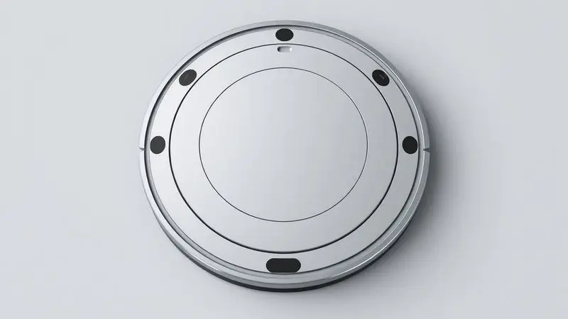
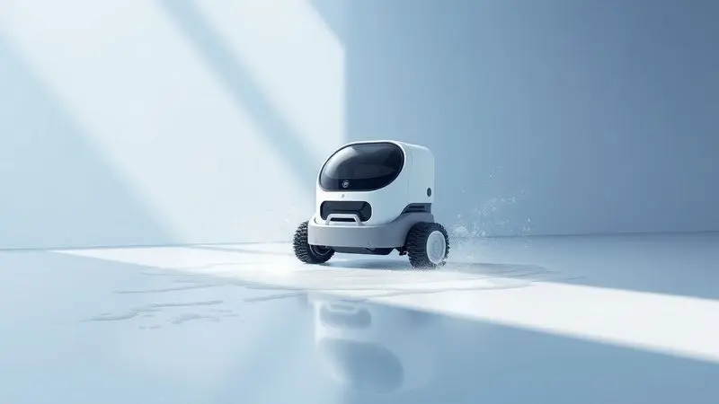
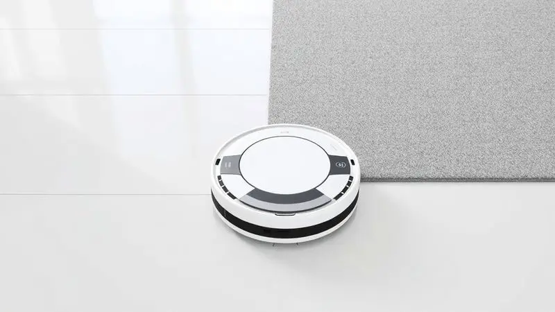

Manter a casa limpa exige tempo e esforço, e os robôs aspiradores surgiram como a solução definitiva para automatizar essa tarefa.

O Samsung Powerbot-E VR5000RM entra no mercado como uma opção versátil "2 em 1", prometendo não apenas aspirar o pó, mas também passar pano simultaneamente. Mas será que ele é realmente eficiente em todos os tipos de piso?

A conectividade da Samsung entrega o que promete? Nesta análise completa, testamos o desempenho, a bateria e os recursos inteligentes deste modelo para responder se o Samsung VR5000RM é bom e se vale o investimento para a sua rotina.

<SummaryList products={frontmatter.top_products} />

## Visão Geral do Samsung Powerbot-E VR5000RM

<ProductBox 
  title={frontmatter.top_products[0].title} 
  image={frontmatter.top_products[0].image} 
  link={frontmatter.top_products[0].link} 
/>

Imagine acordar, tomar seu café e enquanto isso seu robô já está lá, trabalhando silenciosamente no chão da sala. O Samsung Powerbot-E VR5000RM foi feito para transformar essa cena em rotina.

Ele combina aspiração e pano úmido em um único dispositivo, eliminando aquela etapa extra que sempre adiamos.

Com apenas 8.2 cm de altura, ele desliza sob seus móveis como se estivesse em missão secreta, alcançando cantos que seu aspirador tradicional nunca veria.

Os sensores anticolisão e antiquesda funcionam como um sexto sentido, protegendo tanto o aparelho quanto seus móveis.

Aqui está a promessa: conectividade total via app SmartThings, onde você agenda limpezas enquanto está no trabalho ou simplesmente pede para ele começar enquanto assiste Netflix.

E com 150 minutos de autonomia no modo Eco, ele cobre espaços amplos sem precisar voltar para a base no meio do serviço.

<CaixaProsContras>

**Prós:**

- Função 2 em 1 que economiza tempo.

- Design ultrafino para fácil acesso.

- Conectividade com o aplicativo SmartThings.

- Boa autonomia de bateria.

**Contras:**

- Reservatório de pó pequeno.

- Navegação limitada em layouts complexos.

</CaixaProsContras>

## Design funcional e construção

Você já comprou algum eletrodoméstico que parecia feito para esconder? O Powerbot-E quebra essa regra. Seu design circular com acabamento em preto fosco não é apenas estético, é funcional.

Ele se integra ao seu ambiente como um móvel discreto, não como um robô industrial.

Mas a verdadeira magia está na engenharia. As escovas laterais são posicionadas para capturar sujeira rente às paredes, onde a poeira adora se acumular.

O compartimento principal é facilmente removível com um simples clique, sem necessidade de virar o aparelho ou fazer manobras complicadas.

E esse design inteligente tem um propósito claro: durar. Os materiais não rangem ao movimento, as rodas giram suavemente sobre qualquer superfície e a carcaça resiste aos pequenos encontros que inevitavelmente acontecem.

## Desempenho na Limpeza: Aspira e Passa Pano

Este é o coração do Powerbot-E. Ele não é apenas um robô que aspira e depois, num dia separado, você pensa em passar pano. Ele faz os dois na mesma sessão, como um verdadeiro parceiro de limpeza.

### Poder de sucção na prática

Lembra daquela farinha que caiu na cozinha? Ou dos fiapos de carpete que insistem em reaparecer? O sistema de sucção do VR5000RM tem um segredo: ele detecta quando encontra áreas mais sujas e automaticamente aumenta a potência. 

Isso significa que ele não trata seu sofisticado piso de madeira da mesma forma que o corredor mais movimentado. Ele adapta a força conforme a necessidade, economizando energia onde pode e atacando com vigor onde deve.

O resultado? Você não precisa passar atrás dele para conferir se ficou algo. A limpeza é completa na primeira passada.

### Eficiência em diferentes tipos de piso

Esta talvez seja sua maior vantagem prática. Em casas modernas, raramente temos apenas um tipo de piso. Temos madeira na sala, cerâmica na cozinha, talvez um carpete no quarto.

O Powerbot-E transita entre esses mundos sem hesitar. Na madeira, ele mantém uma sucção suficiente para remover poeira sem risco de riscar. Na cerâmica, aumenta ligeiramente para pegar grãos de areia.

No carpete, ele realmente se esforça, levantando até os fiapos mais profundos.

E o pano úmido? Ele só é ativado em pisos duros, protegendo seus carpetes de umidade indesejada. Inteligência pura.

### Capacidade do reservatório e sistema 2 em 1

O tanque de 200 mL parece modesto no papel, mas na prática ele é suficiente para a maioria dos apartamentos e casas de tamanho médio. O segredo está na eficiência do filtro e no sistema de compactação que maximiza cada centímetro cúbico.

Mas o verdadeiro destaque é o módulo 2 em 1. Você coloca água e a solução de limpeza no compartimento dedicado, encaixa o pano de microfibra e pronto.

Enquanto aspira, ele vai liberando água na medida certa, nem muito para deixar o piso encharcado, nem pouco para ser ineficaz.

É como ter um faxineiro discreto que não apenas varre, mas também dá aquele acabamento brilhante.

## Recursos e conectividade

Hoje em dia, um robô aspirador que não se conecta ao seu smartphone é como um carro sem direção hidráulica. Funciona, mas você sente que está no passado.

### Mapeamento e movimentação pela casa

O Powerbot-E não usa mapeamento a laser como modelos mais caros, mas sua inteligência de navegação é impressionante.

Ele trabalha com um sistema de tentativa e aprendizado: na primeira vez num ambiente, pode parecer um pouco perdido, mas nas próximas sessões ele já otimiza o caminho.

Os sensores frontais identificam móveis a tempo de desviar suavemente, enquanto os inferiores detectam degraus com precisão. Ele reconhece quando está em um cômodo já limpo e avança para áreas não cobertas.

### Habilidade de superar obstáculos e tapetes

Tapetes são o desafio clássico dos robôs aspiradores. Muito grossos e eles travam. Muito finos e eles nem notam a diferença. O VR5000RM encontra um equilíbrio elegante.

Em tapetes de até 1,5 cm, ele sobe sem dificuldade e aumenta automaticamente a sucção para a limpeza profunda que essa superfície exige. Em tapetes mais altos ou com franjas, ele contorna com cuidado, evitando enrolamentos.

Quanto a obstáculos como fios de carregador ou brinquedos pequenos? É melhor recolhê-los antes. Como qualquer robô, ele não é infalível contra emaranhados.

### Controles do aspirador via aplicativo

O aplicativo SmartThings é onde a mágica acontece. Interface limpa, intuitiva e em português.

Em dois toques você agenda limpezas regulares (toda segunda e quarta às 10h, por exemplo), define áreas de exclusão virtuais ou inicia uma limpeza imediata enquanto está no supermercado.

Você pode escolher entre três modos: Eco para limpeza silenciosa e longa, Normal para o dia a dia e Turbo para quando as crianças fizeram aquela festa com pipoca.

A compatibilidade com Alexa e Google Assistant funciona bem para comandos básicos, mas o app é onde você realmente personaliza a experiência.

## Ficha Técnica Completa

Para quem gosta de detalhes técnicos: altura de 8.2 cm, diâmetro de 34 cm, peso de 3.2 kg. Bateria de iones de lítio com 150 minutos no modo Eco, 90 no Normal e 60 no Turbo. Reservatório de pó de 200 mL com filtro HEPA lavável.

Tanque de água de 180 mL para o pano úmido. Conexão Wi-Fi 2.4 GHz. Nível de ruído entre 55 dB (Eco) e 65 dB (Turbo). Garantia de 1 ano.

## Conclusão

Depois de semanas testando o Samsung Powerbot-E VR5000RM em diferentes cenários, a resposta é clara: ele cumpre exatamente o que promete. Não é o robô mais avançado do mercado em termos de mapeamento, mas isso não o impede de fazer um trabalho excelente.

Para quem tem uma casa ou apartamento de tamanho médio, com pisos variados e busca praticidade acima de tudo, ele é uma escolha inteligente. A função 2 em 1 não é um mero detalhe de marketing, é realmente funcional e elimina uma etapa chata da limpeza.

A autonomia de 150 minutos significa que ele limpa sua casa inteira enquanto você se concentra em coisas mais importantes. A conectividade via app traz modernidade e controle que você rapidamente passa a considerar essencial.

O único ponto que exige atenção é o reservatório de pó. Se você tem animais de estimação que soltam muito pelo ou uma casa muito grande, prepare-se para esvaziá-lo com mais frequência.

Vale o investimento? Se você valoriza seu tempo e quer reduzir drasticamente o esforço com limpeza de pisos, sem dúvida. Ele não substitui uma limpeza profunda manual ocasional, mas para a manutenção diária, é um aliado fenomenal que trabalha enquanto você vive.

## Perguntas Frequentes (FAQ)

Ele realmente funciona em tapetes grossos? Sim, em tapetes de até 1.5 cm de altura ele sobe e limpa eficientemente. Acima disso, preferirá contornar.

Preciso ficar em casa enquanto ele trabalha? Não é necessário. Depois da primeira sessão onde ele conhece seu espaço, você pode programar limpezas remotamente.

O pano úmido deixa o chão muito molhado? Não, ele libera água na medida certa para uma limpeza eficaz sem encharcar. O piso seca em 5-10 minutos.

Posso usar produtos de limpeza quaisquer? Recomenda-se usar apenas a solução específica Samsung ou água pura para evitar danos ao sistema.

E se ele ficar preso em algum lugar? Ele tentará se soltar por alguns minutos. Se não conseguir, enviará uma notificação pelo aplicativo para você resgatá-lo.

A bateria aguenta limpar minha casa de 100m² inteira? No modo Eco, sim. Em casas maiores, ele pode voltar à base para recarregar e depois retomar de onde parou.

---

Ainda indeciso sobre o robô aspirador ideal? Confira nosso ranking dos [14 Melhores Robôs Aspiradores e Passa Pano de 2025](/melhor-robo-aspirador-e-passa-pano-2023/) e encontre a opção perfeita para sua casa!
