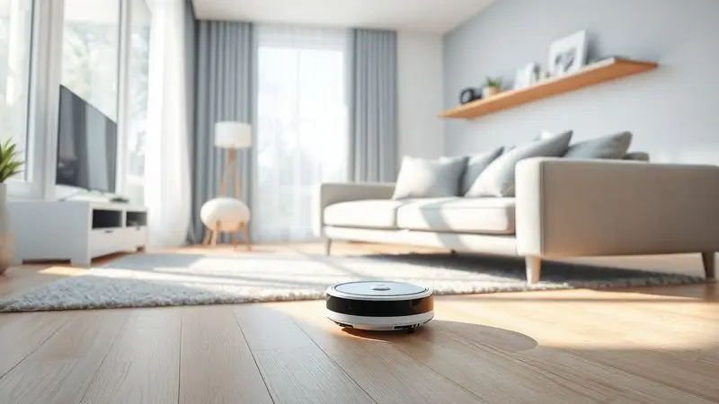

Imagine chegar em casa depois de um dia cansativo e encontrar o chão livre daquela camada quase invisível de poeira que se acumula todos os dias.

Por menos de 60 reais, o robô aspirador Sweeping Robot promete exatamente isso: transformar uma tarefa chata em algo automático. Mas será que um dispositivo tão barato realmente funciona ou é só mais um produto viral que decepciona depois de uma semana?

Vamos descobrir juntos o que realmente esperar desse fenômeno das vendas online.

<SummaryList products={frontmatter.top_products} />

## O que o fabricante diz sobre este aspirador robô?

<ProductBox 
  title={frontmatter.top_products[0].title} 
  image={frontmatter.top_products[0].image} 
  link={frontmatter.top_products[0].link} 
/>

Segundo as especificações técnicas, o Sweeping Robot se apresenta como seu aliado invisível de limpeza. Com um perfil tão baixo que desliza sob móveis como camas e sofás, ele promete alcançar aqueles cantos esquecidos que o aspirador comum não alcança.

O funcionamento é propositalmente simples: um único botão liga o sistema que combina varredura e sucção para capturar cabelos, migalhas e poeira fina.

Alguns modelos ainda oferecem um bônus: uma função de pano úmido para dar aquela finalização nos pisos lisos. Se você tem uma rotina previsível, pode programar ele para trabalhar sozinho enquanto você está fora, voltando para casa já com o chão limpo.

A energia vem de uma bateria que dura o suficiente para percorrer um apartamento médio antes de precisar voltar para a base - geralmente entre 60 e 90 minutos de ação, após cerca de 4 horas de recarga.

É importante entender desde o início que você está comprando um assistente básico, não um robô de última geração com mapeamento a laser.

<CaixaProsContras>

**Prós:**

- Design compacto que alcança áreas difíceis.

- Operação simples com botão único.

- Possibilidade de agendamento de limpezas.

- Baixo nível de ruído durante o funcionamento.

**Contras:**

- Considerado um modelo básico, com funcionalidades limitadas.

- Tempo de recarga relativamente longo para o uso disponível.

</CaixaProsContras>

## O que diz quem comprou?

Promessas de catálogo são uma coisa; realidade de uso é outra. A verdadeira prova do Sweeping Robot está nas mãos de quem já levou ele pra casa. Os primeiros relatos trazem uma mistura de surpresa positiva e ajuste de expectativas.

### A surpresa positiva dos primeiros dias

A maioria dos compradores admite: pela faixa de preço, o desempenho supera as expectativas iniciais. 'Ele realmente pega poeira e cabelo que eu nem via no chão', comenta um usuário.

Em apartamentos pequenos e ambientes com piso liso, ele se sai particularmente bem, criando aquela sensação de chão 'lambido' sem esforço manual.

O baixo nível de ruído é outro ponto elogiado - ele trabalha discretamente enquanto você assiste TV ou trabalha em casa. Para quem vive sozinho ou tem rotina agitada, essa automação básica representa um alívio real na lista de tarefas domésticas.

### Os obstáculos da realidade

Mas nem tudo são flores. Os sensores básicos significam que ele pode ficar preso em fios soltos ou tapetes com franjas mais altas. Em carpetes, a sucção mostra suas limitações.

E quase todos os usuários destacam: você precisará limpar manualmente o compartimento de poeira com frequência, especialmente se tem pets ou cabelo comprido em casa.

A bateria realmente cumpre o prometido para áreas pequenas, mas em ambientes maiores ele pode não concluir o trabalho antes de precisar recarregar.

E aqui está o ponto crucial do ajuste de expectativas: o Sweeping Robot é um complemento, não uma substituição completa da faxina tradicional. Ele lida com a manutenção diária, mas não fará aquela limpeza profunda de final de semana.

## Conclusão

O Sweeping Robot é como aquele ajudante modesto que faz bem o trabalho básico sem alarde. Se suas expectativas estão alinhadas com a realidade, ele pode sim valer cada centavo dos 60 reais.

Pense nele como um controlador diário de poeira, não como um produto milagroso que resolve todos os seus problemas de limpeza.

Para quem mora em apartamento pequeno, tem piso liso e busca apenas reduzir a frequência das varreduras manuais, ele é uma aquisição inteligente.

Já se você tem uma casa grande com vários cômodos, muitos obstáculos ou carpetes grossos, talvez precise considerar que essa economia inicial pode não atender completamente suas necessidades.

A verdadeira pergunta não é se o Sweeping Robot funciona, mas se o tipo de funcionamento que ele oferece se encaixa no seu estilo de vida.

Para milhares de brasileiros, essa pequena máquina representa a praticidade acessível que transforma uma tarefa chata em um processo automático - e às vezes, no dia a dia corrido, isso já é vitória suficiente.

---

Ainda em dúvida sobre qual robô aspirador escolher? Confira nosso [ranking dos 10 melhores até R$ 1.000 em 2025](/melhor-robo-aspirador-ate-1000-reais/) e encontre a opção ideal para o seu espaço.
