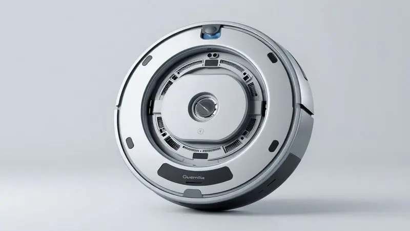
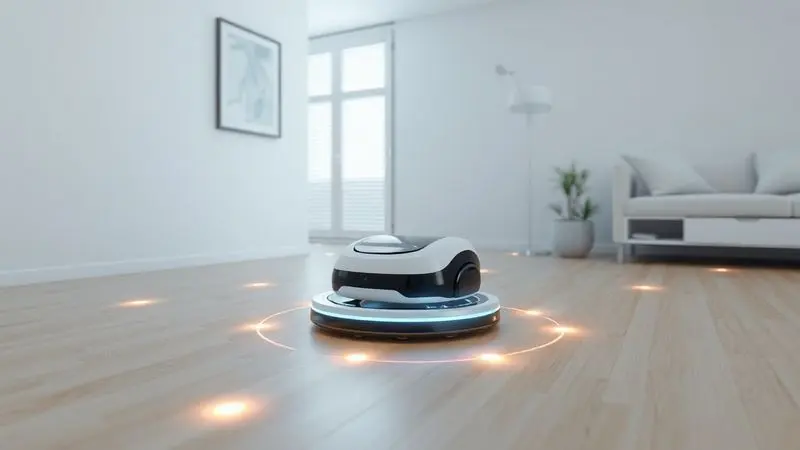
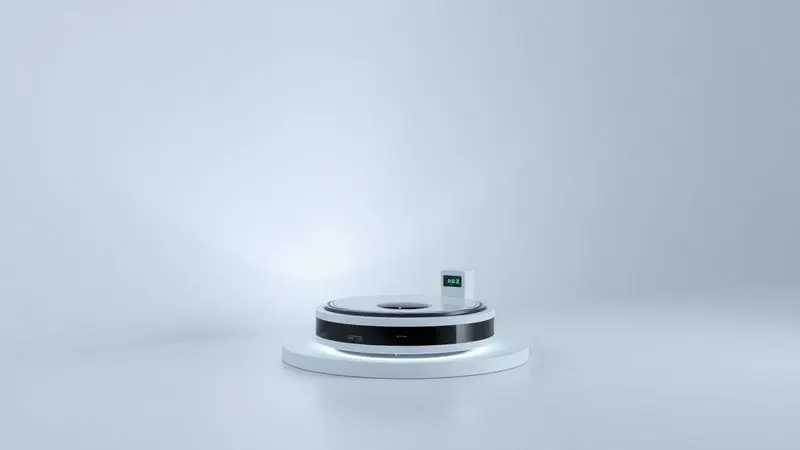

Manter a casa limpa diariamente pode ser um desafio, e é por isso que os robôs aspiradores se tornaram o sonho de consumo de muita gente. Entre as opções mais buscadas no Brasil, o WAP Robot W300 se destaca pela promessa de eficiência com um preço mais acessível.

Mas, diante de tantos modelos tecnológicos, será que o robô aspirador WAP Robot W300 é bom mesmo? Ele realmente consegue limpar pelos de animais e carpetes?

Nesta análise, vamos explorar desde a ficha técnica até o desempenho da bateria para que você tome a melhor decisão de compra.

<SummaryList products={frontmatter.top_products} />

## 1. Ficha técnica

<ProductBox 
  title={frontmatter.top_products[0].title} 
  image={frontmatter.top_products[0].image} 
  link={frontmatter.top_products[0].link} 
/>

Quando você está avaliando um robô aspirador, os números técnicos podem parecer confusos. Vamos traduzir o que realmente importa no W300. O que chama atenção primeiro são os cinco modos de limpeza.

Em vez de ser apenas um número no papel, isso significa que você pode escolher entre uma limpeza cuidadosa nas bordas dos móveis ou padrões inteligentes em zigue-zague para cobertura completa.

Imagine chegar em casa depois de um dia cansativo. Os sensores infravermelhos trabalham nos bastidores para evitar que o robô colida com seus móveis favoritos ou caia escadas abaixo. Essa é a tranquilidade que você compra junto com o aparelho. 

A autonomia, que varia de 45 minutos a 1 hora e 15 minutos, pode parecer uma especificação técnica, mas pense nisso como sua liberdade. É tempo suficiente para o W300 percorrer sua sala e quartos enquanto você trabalha ou descansa.

Quando a energia acaba, ele encontra sozinho o caminho de volta à base, onde recarrega em 3 a 5 horas, pronto para o próximo ciclo.

O coletor de 300 ml pode não parecer muito, mas sendo lavável, você elimina aquele momento desagradável de ter contato direto com a poeira. Já o sistema de filtragem HEPA, que retém 99,9% dos ácaros, transforma-se em respiração mais leve para quem tem alergias.

Com potência de 18W e ruído de 74 dB (equivalente a uma conversa normal), ele trabalha discretamente sem atrapalhar seu dia.

<CaixaProsContras>

**Prós:**

- Diversos modos de limpeza adaptáveis.

- Sensores que evitam quedas e colisões.

- Sistema de filtragem HEPA benéfico para alérgicos.

- Compacto, alcançando áreas difíceis.

**Contras:**

- Aumentar a força de sucção pode reduzir a autonomia da bateria.

- O tempo de recarga pode ser longo em comparação com outras opções.

</CaixaProsContras>

## 2. Design e construção do aparelho

A primeira impressão que você tem ao abrir a caixa é aquele formato compacto que parece feito para se esgueirar por debaixo dos seus móveis. Com diâmetro reduzido e altura otimizada, ele alcança espaços onde nem mesmo o aspirador comum chega.

E essa não é apenas uma questão estética. A leveza tem propósito prático: facilita você pegar o robô para mudá-lo de cômodo ou para fazer aquela limpeza rápida no filtro.

O plástico resistente garante que ele sobreviva aos encontros ocasionais com pés de mesa ou rodapés. As escovas rotativas, estrategicamente posicionadas, são as verdadeiras heroínas para capturar a sujeira presa nos cantos.

A base de carregamento minimalista cumpre sua função sem ocupar espaço desnecessário, mantendo aquele visual clean que combina com qualquer decoração.

## 3. Funcionamento e modos de limpeza

Aqui é onde a mágica realmente acontece. Você liga o W300 e ele começa a mapear sua sala como um pequeno explorador tecnológico.

Essa navegação inteligente é o cérebro por trás da limpeza eficiente, garantindo que cada centímetro quadrado seja coberto sem repetições desnecessárias.

Os diferentes modos não são apenas botões no controle remoto, são soluções para problemas específicos da sua casa. A limpeza em espiral concentra poder de sucção em áreas particularmente sujas, perfeita para aquele cantinho onde seus pets costumam ficar.

Já o modo linear é ideal para manutenção diária em áreas abertas, mantendo a poeira sob controle sem esforço da sua parte.

O verdadeiro diferencial está nos sensores de sujeira. Quando o W300 detecta uma área mais comprometida, ele automaticamente intensifica o trabalho ali. É como ter um limpador que observa, analisa e adapta sua abordagem, tudo enquanto você segue com sua vida.

## 4. Cobertura e autonomia da bateria

Pense na última vez que você precisou interromper o que estava fazendo para recarregar um aparelho no meio do trabalho. Com o W300, essa frustração fica para trás.

Os 120 minutos de autonomia máxima significam que, mesmo em casas de tamanho médio, uma única carga é suficiente para cobrir todos os cômodos.

Mas a inteligência vai além do tempo de bateria. O sistema de navegação otimiza as rotas para evitar áreas já limpas, garantindo que cada minuto de energia seja usado com eficiência máxima.

Essa economia de movimento não apenas preserva a bateria, mas também garante que o robô complete o trabalho em um tempo menor.

E quando o nível de energia atinge o limite crítico? Em vez de parar no meio do caminho e deixar a limpeza pela metade, ele inicia automaticamente a jornada de volta à base.

Você chega em casa e encontra tanto o chão limpo quanto o robô já carregando, pronto para a próxima sessão.

## 5. Recursos e acessórios inclusos

A programação semanal transforma o W300 de um simples eletrodoméstico em um parceiro de limpeza que conhece sua rotina. Você define os horários uma única vez e esquece que precisa lembrar de ligá-lo.

Segunda-feira às 10h, quando você já está no trabalho, ele inicia sua missão silenciosa. Quarta-feira às 14h, enquanto você assiste seu programa favorito, ele mantém os ambientes impecáveis.

A versatilidade para diferentes tipos de piso significa que você não precisa se preocupar com transições entre cerâmica, madeira e carpetes baixos. O robô adapta-se automaticamente.

Os acessórios inclusos vão além do básico: as escovas extras garantem que você tenha reposição quando necessário, enquanto o filtro HEPA substituível mantém a qualidade do ar ano após ano.

## 6. Aplicativo e conectividade

O controle remoto físico é útil, mas o verdadeiro salto tecnológico acontece quando você baixa o aplicativo. De repente, você está no escritório e lembra que esqueceu de programar a limpeza. Dois toques no smartphone resolvem o problema.

Ou talvez você queira apenas verificar se o robô terminou seu trabalho, tudo em tempo real na tela do seu celular.

A compatibilidade com assistentes de voz adiciona uma camada de conveniência que parece saída de um filme de ficção. "Alexa, peça ao robô para limpar a sala" se torna parte natural da sua rotina.

Essa integração não é apenas um recurso técnico, é a materialização da promessa de uma casa realmente inteligente, onde as tarefas domésticas acontecem no background da sua vida.

## 7. Preço e onde comprar mais barato

O equilíbrio entre custo e benefício é onde o W300 realmente brilha. Você encontra modelos com preços exorbitantes que prometem mundos e fundos, mas o W300 oferece a essência do que você realmente precisa em um aspirador robótico, sem fazer seu orçamento tremer.

Para garantir o melhor negócio, a estratégia é simples: acompanhe as principais plataformas de e-commerce especializadas em eletrônicos. Grandes varejistas online costumam rodar promoções sazonais, especialmente em datas como Black Friday ou Natal.

Mas atenção: o preço mais baixo nem sempre significa a melhor compra. Verifique sempre a reputação do vendedor, condições de garantia e política de trocas.

Uma dica valiosa é configurar alertas de preço. Várias ferramentas online notificam você quando o produto atinge uma faixa de valor desejada. Paciência aqui pode significar uma economia considerável.

## 8. Principal concorrente e modelos similares

No universo dos robôs aspiradores acessíveis, o W300 não está sozinho. O iRobot Roomba 670, por exemplo, é um veterano respeitado no mercado, especialmente reconhecido por sua eficiência na detecção de sujeira.

No entanto, esse renome tem um preço que pode ser até 50% superior ao do W300.

Do outro lado, temos o Roborock E4, que compete diretamente na faixa de autonomia e potência. Ele oferece uma experiência robusta, mas novamente com um investimento inicial mais elevado.

Marcas como Xiongmao e Multilaser apresentam alternativas ainda mais econômicas, mas frequentemente com concessões na durabilidade ou recursos avançados.

A escolha, no final, resume-se a uma questão: você valoriza mais ter um nome consagrado pagando um prêmio por isso, ou prefere uma opção que entrega funcionalidades essenciais com bom desempenho por um valor mais acessível?

O W300 posiciona-se precisamente nesse ponto de equilíbrio.

## Conclusão

O WAP Robot W300 representa mais do que um simples eletrodoméstico. Ele é a materialização de um desejo antigo: recuperar tempo e qualidade de vida.

Os números técnicos impressionam, mas o que realmente conta é a experiência de acordar com a casa limpa sem ter levantado um dedo, ou de chegar do trabalho e encontrar todos os ambientes impecáveis.

Para quem vive com animais de estimação, o filtro HEPA transforma o ar da casa. Para quem tem alergias, significa noites de sono mais tranquilas. Para famílias ocupadas, é a garantia de que a limpeza não será mais um item pesando na lista de tarefas.

O investimento no W300 não se paga apenas em economia de tempo, mas naquela sensação sutil de bem-estar que vem de viver em um ambiente realmente cuidado.

Se você busca uma solução que combine inteligência, eficiência e preço justo, sem precisar vender um rim por tecnologia de ponta, este robô oferece exatamente o equilíbrio que sua rotia merece.

---

Ainda em dúvida sobre o WAP Robot W300? Confira nosso ranking completo dos [Melhores Robôs Aspiradores WAP de 2025](/robo-aspirador-wap-qual-o-melhor/).
