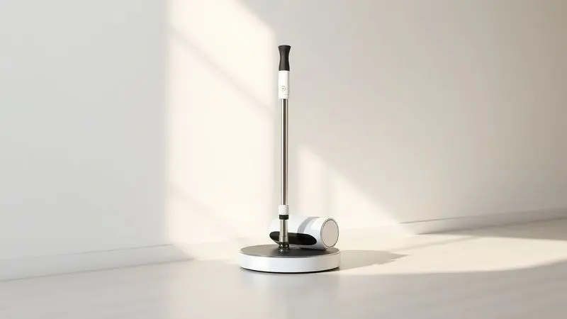
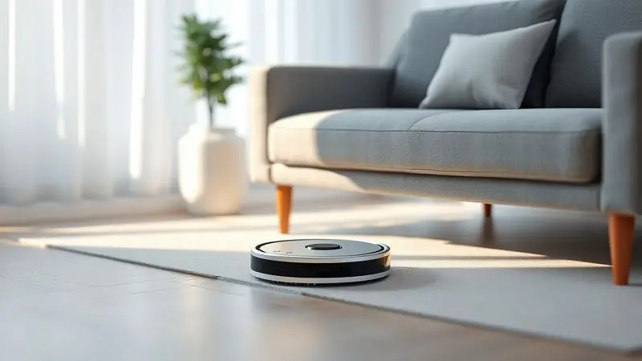
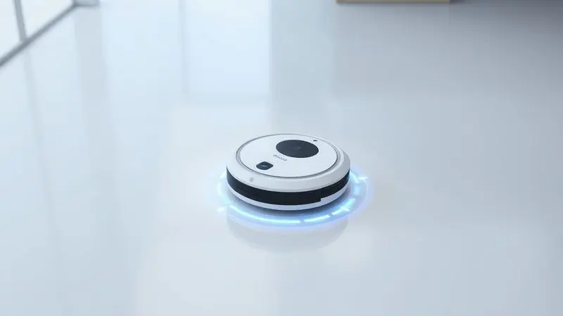

Imagine acordar com a casa impecável sem ter levantado do sofá. Essa é a promessa que tornou os robôs aspiradores companheiros indispensáveis da rotina moderna.

No vasto universo desses assistentes, a WAP se destaca com um portfólio que abrange desde soluções econômicas até modelos com inteligência artificial avançada. Mas com tanta variedade, como escolher entre o W90, o W310 ou o potente WSmart?

Este guia detalhado vai além das especificações técnicas para revelar qual modelo conversa com seu estilo de vida.

<SummaryList products={frontmatter.top_products} />

## Qual Robô Aspirador WAP comprar?

Pense na sua rotina como um mapa. Você precisa de um robô que apenas faça o básico bem feito, ou quer um parceiro que aprenda os cantos da sua casa? A resposta determina qual caminho seguir no catálogo da WAP.

Para apartamentos compactos ou quem busca economia sem abrir mão da funcionalidade, os modelos W90 e W100 são portas de entrada inteligentes. Se sua casa tem múltiplos cômodos e você valoriza autonomia, o W310 e o W400 equilibram performance e recursos.

Já para quem deseja tecnologia de ponta com mapeamento a laser e integração completa, o W1000 e o W3000 representam o que há de mais avançado. Vamos explorar cada um desses universos.

## 1. Robô aspirador WAP Robot W90

<ProductBox 
  title={frontmatter.top_products[0].title} 
  image={frontmatter.top_products[0].image} 
  link={frontmatter.top_products[0].link} 
/>

Este é o primeiro passo perfeito no mundo da limpeza automatizada. O W90 entende que sua maior virtude é a simplicidade: ele varre, aspira e passa pano sem exigir configurações complexas.

Para quem convive com pets ou lida com alergias, essa combinação tripla significa menos poeira circulando e mais saúde no ar que você respira.

Com quase duas horas de autonomia, ele cuida da maioria dos ambientes enquanto você se dedica ao que realmente importa. Os sensores de infravermelho são como um sexto sentido que protege seus móveis e evita quedas inesperadas.

Sim, ele emite um zumbido de 72 dB durante a operação, mas para muitos, esse pequeno ruído de trabalho é o som da liberdade doméstica.

<CaixaProsContras>

**Prós:**
(Os itens da CaixaProsContras devem ser mantidos exatamente como estão no original, sem alterações)

- Funcionalidade 3 em 1: varre, aspira e passa pano.

- Sensores que evitam quedas e colisões.

- Autonomia extensa para sessões de limpeza.

- Ideal para lares com animais e pessoas alérgicas.

**Contras:**

- Nível de ruído relativamente alto.

- Pode não limpar áreas muito sujas em uma única passagem.

</CaixaProsContras>

## 2. Robô aspirador WAP Robot W100

<ProductBox 
  title={frontmatter.top_products[1].title} 
  image={frontmatter.top_products[1].image} 
  link={frontmatter.top_products[1].link} 
/>

Enquanto o W90 é o iniciante confiável, o W100 é o compacto que chega onde seus dedos não alcançam. Com apenas 7,5 cm de altura, ele desliza sob camas, sofás e armários como um explorador de espaços esquecidos.

Essa baixa estatura não é acidental, é um convite para redescoberta dos cantos que a vassoura tradicional deixa para trás.

Os três modos de limpeza (aleatório, para cantos e em espiral) são como diferentes personalidades que se adaptam ao humor da sua casa.

A bateria dura o suficiente para uma sessão completa, e embora o mop precise de preparação manual, essa pequena tarefa é o preço por ter pisos que brilham sem esforço seu. Ele não tem inteligência artificial sofisticada, mas tem sabedoria prática.

<CaixaProsContras>

**Prós:**

- Design compacto que alcança locais difíceis

- Vários modos de limpeza

- Sensores de segurança para evitar quedas

- Bom custo-benefício para residências pequenas

**Contras:**

- Não possui mapeamento ou inteligência artificial

- Função de passar pano exige preparação manual

</CaixaProsContras>

## 3. Robô aspirador WAP Robot W310

<ProductBox 
  title={frontmatter.top_products[2].title} 
  image={frontmatter.top_products[2].image} 
  link={frontmatter.top_products[2].link} 
/>

Aqui a experiência muda de nível. O W310 é aquele intermediário que entrega mais do que promete, com uma sucção de 1900 Pa que literalmente aspira suas dúvidas sobre sua eficiência.

Pense nessa potência como uma garantia: cerâmica, madeira, carpete, nada escapa do seu alcance determinado.

Com mais de duas horas de autonomia, ele enfrenta apartamentos amplos ou casas térreas sem precisar recarregar no meio do serviço.

Os quatro horas de carregamento podem parecer extensos, mas são o intervalo necessário para um desempenho que transforma a limpeza de obrigação em rotina automatizada. Se você busca equilíbrio entre investimento e retorno, este modelo é o ponto de encontro perfeito.

<CaixaProsContras>

**Prós:**

- Funcionalidade 3 em 1: varre, aspira e passa pano.

- Sensores que evitam quedas e colisões.

- Boa potência de sucção para diferentes superfícies.

- Autonomia satisfatória para limpezas maiores.

**Contras:**

- Tempo de carregamento pode ser longo.

- Pode não alcançar todas as áreas em espaços muito apertados.

</CaixaProsContras>

## 4. Robô aspirador WAP Robot W400

<ProductBox 
  title={frontmatter.top_products[3].title} 
  image={frontmatter.top_products[3].image} 
  link={frontmatter.top_products[3].link} 
/>

Quando a conveniência precisa de voz, o W400 responde. Compatível com Alexa e Google Assistente, ele obedece a comandos como um mordomo digital que também varre, aspira e passa pano.

O controle via aplicativo transforma seu smartphone em um centro de comando doméstico, onde você agenda limpezas enquanto está no trabalho ou verifica o progresso do sofá.

O filtro HEPA é o pulmão deste robô, retendo alérgenos e partículas microscópicas que você nem sabia que existiam.

Sim, em casas com múltiplos andares ele pode precisar de transporte manual, mas essa pequena intervenção é compensada pela eficiência com que trata cada nível. Para quem valoriza tecnologia integrada ao cotidiano, este modelo é uma extensão natural da casa inteligente.

<CaixaProsContras>

**Prós:**

- Funcionalidades 3 em 1: varre, aspira e passa pano.

- Controle fácil via aplicativo e assistentes de voz.

- Boa autonomia com bateria de íon de lítio.

- Filtro HEPA que melhora a qualidade do ar.

**Contras:**

- Pode necessitar de transporte manual em casas de vários andares.

- O investimento inicial pode ser considerado alto por alguns.

</CaixaProsContras>

## 5. Robô aspirador WAP Robot WSmart

<ProductBox 
  title={frontmatter.top_products[4].title} 
  image={frontmatter.top_products[4].image} 
  link={frontmatter.top_products[4].link} 
/>

O nome diz tudo: inteligência aplicada à limpeza. O WSmart entende que cada ambiente tem necessidades diferentes, por isso oferece três modos de operação que se adaptam ao que seu piso pede.

Seu design slim não é apenas estética, é funcionalidade pura que alcança aqueles espaços sob móveis onde a poeira adora se esconder.

O filtro HEPA funciona como um guardião invisível, aprisionando ácaros e bactérias que desencadeiam alergias. O ruído durante a operação existe, mas também é o som da eficiência trabalhando.

As cinco a seis horas de recarga são o tempo que ele precisa para se preparar para outra jornada de limpeza completa. Para quem busca um equilíbrio entre sofisticação e praticidade, este modelo é a escolha inteligente.

<CaixaProsContras>

**Prós:**

- Realiza três funções: varre, aspira e passa pano

- Design slim que alcança áreas difíceis

- Filtro HEPA que retém ácaros e bactérias

- Modos de limpeza personalizáveis

**Contras:**

- Nível de ruído pode ser alto em ambientes silenciosos

- Tempo de carga relativamente longo (5 a 6 horas)

</CaixaProsContras>

## 6. Robô aspirador WAP Robot W1000

<ProductBox 
  title={frontmatter.top_products[5].title} 
  image={frontmatter.top_products[5].image} 
  link={frontmatter.top_products[5].link} 
/>

Aqui a navegação ganha precisão cirúrgica. Com tecnologia Gyro, o W1000 não vagueia aleatoriamente, traça rotas organizadas como um arquiteto da limpeza.

Cinco modos de operação e três níveis de sucção significam que ele se adapta não apenas ao seu piso, mas ao seu humor do dia.

O controle via aplicativo e comandos de voz transforma a limpeza em uma experiência de comando à distância. As impressionantes 2h40 de autonomia no modo silencioso são quase uma declaração: eu cuido de tudo, você aproveite o silêncio.

As cinco horas de recarga são o investimento temporal para essa liberdade prolongada. Para quem não aceita meio-termo em tecnologia e eficiência.

<CaixaProsContras>

**Prós:**

- Funcionalidade 3 em 1: varre, aspira e passa pano simultaneamente.

- Navegação inteligente Gyro que evita colisões.

- Controle via aplicativo e comandos de voz.

- Vários modos de limpeza para diferentes situações.

**Contras:**

- Tempo de recarga pode ser um pouco longo.

- Nível de ruído pode ser considerado alto durante a operação.

</CaixaProsContras>

## 7. Robô aspirador WAP Robot W3000

<ProductBox 
  title={frontmatter.top_products[6].title} 
  image={frontmatter.top_products[6].image} 
  link={frontmatter.top_products[6].link} 
/>

Este é o ápice da evolução. O W3000 não apenas limpa, ele mapeia. Com tecnologia laser SLAM, ele registra a planta da sua casa como um cartógrafo digital, armazenando até cinco mapas diferentes.

Isso significa que ele aprende seus espaços, memoriza onde estão os obstáculos e otimiza cada trajeto.

O controle via WAP CONNECT não é apenas um aplicativo, é uma central de inteligência doméstica. Os quase quatro horas de recarga são o tempo necessário para processar dados e preparar rotas ainda mais eficientes.

Para casas grandes ou quem valoriza precisão robótica, este modelo é a fronteira final da limpeza automatizada. Não é um eletrodoméstico, é um sistema.

<CaixaProsContras>

**Prós:**

- Multifuncional: varre, aspira e passa pano.

- Mapeamento a laser para rotas eficientes.

- Controle via app e compatível com assistentes de voz.

- Sensores avançados para evitar obstáculos.

**Contras:**

- Tempo de recarga longo (cerca de 3h45min).

- Pode não ser ideal para casas muito grandes sem intervenções frequentes.

</CaixaProsContras>

## Conclusão

Escolher um robô aspirador WAP é como selecionar um parceiro para sua rotina doméstica. Cada modelo tem uma personalidade distinta que conversa com necessidades específicas. O W90 e o W100 são os iniciantes confiáveis para quem dá os primeiros passos na automação.

O W310 e o W400 representam o ponto ideal entre investimento e tecnologia para a maioria das casas. Já o WSmart, o W1000 e o W3000 são para quem busca não apenas limpeza, mas uma extensão inteligente do ambiente doméstico.

A verdadeira decisão não está nas especificações técnicas, mas em responder a uma pergunta simples: como você quer que sua casa se sinta quando você chega?

Se a resposta for 'limpa, organizada e pronta para receber-me sem esforço meu', qualquer um dos modelos WAP será um passo na direção certa. Comece pelo que seu orçamento permite e sua rotina exige, e descubra como é viver em um espaço que se cuida sozinho.

---

Ainda indeciso sobre o melhor WAP para sua casa? Confira nosso [ranking dos Melhores Robôs Aspiradores WAP de 2025](/robo-aspirador-wap-qual-o-melhor/).
