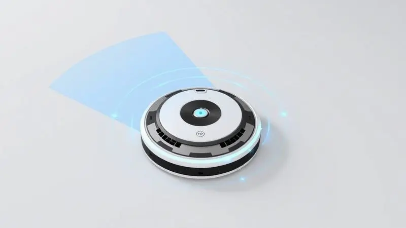
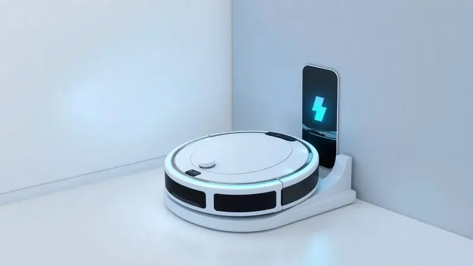
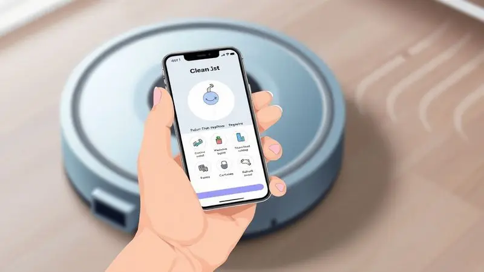

Manter a casa limpa é um desafio constante, e os robôs aspiradores surgiram como a solução definitiva para trazer mais praticidade ao dia a dia. No entanto, com tantas opções e faixas de preço no mercado, a dúvida é inevitável: o robô aspirador WAP é bom?

A marca brasileira, já consagrada por suas lavadoras de alta pressão, expandiu seu domínio para a limpeza inteligente com um portfólio vasto.

Neste guia completo, vamos analisar os principais modelos da fabricante, desde as opções de entrada até as mais tecnológicas, para descobrir se os aparelhos da WAP realmente entregam o desempenho prometido e qual deles é o ideal para a sua rotina.

<SummaryList products={frontmatter.top_products} />

## Confira os modelos de robôs aspiradores WAP

Imagine acordar e encontrar sua casa limpa sem que você precise levantar um dedo. É essa promessa que os robôs aspiradores WAP trazem para o seu dia a dia, cada modelo projetado para um perfil específico de necessidade.

Da simplicidade do dia a dia à tecnologia que se antecipa aos seus desejos, vamos explorar como cada versão pode transformar sua relação com a limpeza doméstica.

### WAP Robot W100

<ProductBox 
  title={frontmatter.top_products[0].title} 
  image={frontmatter.top_products[0].image} 
  link={frontmatter.top_products[0].link} 
/>

Para quem está dando os primeiros passos na automação doméstica, o WAP Robot W100 apresenta o fim da divisão de tarefas em um único aparelho compacto.

Ele varrer, aspira e passa pano, te libertando daquele ciclo interminável de trocar entre diferentes utensílios de limpeza. Seu design ágil e rodas emborrachadas garantem que chegue em cada canto, especialmente em casas menores onde cada centímetro conta.

O grande trunfo aqui é a simplicidade que funciona: escovas laterais que catam a sujeira dos cantos e sensores antiqueda que dão aquela paz de espírito de saber que seu investimento está seguro.

A potência de sucção é adequada para a manutenção diária, perfeita para quem deseja controle sobre a poeira e pelos sem precisar de um equipamento industrial.

Ele é aquele parceiro discreto que faz seu trabalho sem chamar atenção, mas sempre presente quando você mais precisa.

<CaixaProsContras>

**Prós:**

- Bom custo-benefício para quem busca um robô aspirador básico.

- Compacto e fácil de manobrar em espaços menores.

- Função MOP que auxilia na limpeza diária.

- Sensores antiqueda que aumentam a segurança do aparelho.

**Contras:**

- Potência de sucção reduzida, adequada apenas para sujeira leve.

- Dificuldades em navegar por ambientes com muitos obstáculos.

</CaixaProsContras>

### WAP Robot W90

<ProductBox 
  title={frontmatter.top_products[1].title} 
  image={frontmatter.top_products[1].image} 
  link={frontmatter.top_products[1].link} 
/>

Se o W100 é o primeiro passo, o W90 é onde começamos a sentir a verdadeira autonomia. Com sua bateria que dura até 1 hora e 40 minutos, você pode literalmente sair de casa pela manhã e voltar à noite com os pisos limpos.

É especialmente mágico para quem vive em apartamentos pequenos ou tem animais de estimação. Afinal, que outra forma de conviver com pelos seria tão prática?

A ausência de mapeamento inteligente pode soar como uma limitação, mas pense nisso como liberdade. O W90 opera com a espontaneidade de quem conhece cada canto da sua casa, navegando por espaços estreitos sob móveis com uma destreza impressionante.

Sua manutenção é quase um mimo: filtro e reservatório laváveis que tornam o cuidado com o aparelho tão simples quanto usá-lo. É para quem valoriza funcionalidade acima de firulas tecnológicas.

<CaixaProsContras>

**Prós:**

- Função 3 em 1 que varre, aspira e passa pano.

- Design compacto que facilita o acesso a áreas difíceis.

- Boa autonomia de bateria para limpezas diárias.

- Manutenção simples e prática.

**Contras:**

- Não possui mapeamento inteligente para otimização da limpeza.

- O reservatório de 250ml pode ser pequeno para ambientes maiores.

</CaixaProsContras>

### WAP Robot W3000

<ProductBox 
  title={frontmatter.top_products[2].title} 
  image={frontmatter.top_products[2].image} 
  link={frontmatter.top_products[2].link} 
/>

Aqui entramos no território da previsão. O W3000 não apenas limpa, ele aprende sua casa. Com tecnologia de mapeamento a laser e sistemas SLAM, ele cria um mapa em tempo real dos seus ambientes e armazena até cinco configurações diferentes.

Você pode literalmente desenhar no aplicativo as zonas que quer limpar com mais frequência, aquele canto da cozinha onde sempre caem migalhas ou o corredor onde os pets passam o dia todo.

Os 2400 Pa de sucção são sentidos na prática: tapetes mais altos, migalhas na cozinha, pelos acumulados. A integração com Alexa e Google Assistant transforma a limpeza em um comando de voz simples: "Alexa, peça ao W3000 para limpar a sala".

A bateria de 2600 mAh garante cerca de duas horas de trabalho, tempo suficiente para esquecer que existe sujeira no chão. Sim, áreas muito sujas podem precisar de atenção extra, mas isso é compensado pela inteligência que otimiza cada passe.

<CaixaProsContras>

**Prós:**

- Multifuncional: varre, aspira e passa pano.

- Tecnologia avançada de mapeamento e navegação.

- Controle via aplicativo e assistentes virtuais.

- Boa potência de sucção com ajustes automáticos.

**Contras:**

- Limitações na capacidade do tanque combinado.

- Pode exigir múltiplas passagens em áreas muito sujas.

</CaixaProsContras>

### WAP Robot W400

<ProductBox 
  title={frontmatter.top_products[6].title} 
  image={frontmatter.top_products[6].image} 
  link={frontmatter.top_products[6].link} 
/>

0

<ProductBox 
  title={frontmatter.top_products[3].title} 
  image={frontmatter.top_products[3].image} 
  link={frontmatter.top_products[3].link} 
/>

Imagine não precisar esvaziar o reservatório de sujeira por até 60 dias. O W4000 traz essa realidade com sua base autolimpante que redefine o conceito de conveniência. Enquanto você vive sua vida, ele não apenas limpa sua casa, mas também se mantém limpo.

Com 29 sensores incluindo anticolisão e antiqueda, ele navega pela sua casa com a elegância de quem conhece cada obstáculo.

O mapeamento 2D e 3D permite que ele memorize diferentes andares, adaptando-se perfeitamente se você mora em sobrado ou duplex. O tanque de água inteligente assegura a quantidade ideal de umidade para o pano, evitando tanto o excesso quanto a falta.

O investimento pode ser mais expressivo, mas pense nisso como pagar por tempo de vida. Tempo que você não gastará aspirando, varrendo, nem mesmo cuidando do próprio robô.

<CaixaProsContras>

**Prós:**

- Função 3 em 1 (varre, aspira e passa pano).

- Base autolimpante que simplifica a manutenção.

- Navegação inteligente com mapeamento 2D e 3D.

- Controle via aplicativo e compatibilidade com assistentes de voz.

**Contras:**

- O preço pode ser considerado alto para alguns usuários.

- A autonomia pode não ser suficiente para casas muito grandes.

</CaixaProsContras>

### WAP Robot WSMART

<ProductBox 
  title={frontmatter.top_products[4].title} 
  image={frontmatter.top_products[4].image} 
  link={frontmatter.top_products[4].link} 
/>

Para quem sofre com alergias ou tem animais de estimação, o filtro HEPA do WSMART não é apenas uma especificação técnica, é uma barreira de proteção.

Ele retém ácaros e alérgenos que normalmente permaneceriam circulando no ar, transformando o ambiente para quem tem sensibilidade respiratória. Seu design slim de apenas 7,5 cm de altura alcança aqueles espaços sob o sofá que sempre acumulam poeira misteriosa.

Os três modos de limpeza adaptam-se à sua necessidade: cantos para as bordas que acumulam sujeira, aleatória para uma cobertura geral e em círculo para áreas específicas. O modo TURBO ativa quando ele detecta concentração maior de sujeira.

Embora a navegação para retornar à base possa ocasionalmente parecer um pouco hesitante, isso é compensado pelos 2 horas de autonomia que garantem que ele complete o trabalho antes de precisar recarregar.

<CaixaProsContras>

**Prós:**

- Várias funções (varre, aspira e passa pano)

- Design slim que alcança espaços apertados

- Filtro HEPA que retém alérgenos

- Modo TURBO para limpeza intensa

**Contras:**

- Navegação às vezes instável para voltar à base

- Tempo de recarga relativamente longo

</CaixaProsContras>

### WAP Robot WCONNECT

<ProductBox 
  title={frontmatter.top_products[5].title} 
  image={frontmatter.top_products[5].image} 
  link={frontmatter.top_products[5].link} 
/>

A conectividade é a alma do WCONNECT. Controlar seu robô aspirador pelo aplicativo WAP Connect não é apenas conveniência, é poder de decisão em tempo real. Quer limpar a cozinha agora porque derrubou algo? Basta abrir o app.

Prefere usar comandos de voz com Alexa ou Google Assistant? Funciona perfeitamente. As três formas de controle dão flexibilidade para cada momento do seu dia.

Os 120 minutos de autonomia garantem que mesmo casas médias sejam completamente limpas em uma única sessão. O retorno automático à base quando a bateria está baixa elimina aquela preocupação de esquecer o aparelho descarregado em algum canto.

O filtro HEPA funciona como um aliado invisível contra alergias. A limitação com redes Wi-Fi WEP pode afetar alguns usuários, mas para a maioria das configurações modernas, ele se integra perfeitamente.

<CaixaProsContras>

**Prós:**

- Controle via aplicativo e integração com assistentes de voz.

- Múltiplos modos de limpeza para maior eficiência.

- Filtro HEPA que ajuda na redução de alérgenos.

- Retorno automático à base quando a bateria está baixa.

**Contras:**

- Não funciona com redes Wi-Fi WEP, o que pode limitar alguns usuários.

- Tempo de carregamento pode ser considerado longo (5 a 6 horas).

</CaixaProsContras>

### WAP Robot W400

A multifuncionalidade ganha agilidade com o W400. Seus 1400 Pa de sucção combinados com três níveis de filtragem, incluindo o filtro HEPA, criam um sistema que não apenas remove a sujeira visível, mas também melhora a qualidade do ar que sua família respira.

Para quem tem animais de estimação, essa combinação é especialmente valiosa, lidando tanto com pelos quanto com partículas invisíveis.

Com apenas 7,5 cm de altura, ele alcança lugares que normalmente exigiriam que você se ajoelhasse e olhasse sob os móveis.

O agendamento via aplicativo transforma a limpeza em um hábito automático, que acontece no horário que você definir, independentemente de estar em casa ou não.

A ausência de mapeamento avançado faz com que ele possa repetir algumas áreas, mas essa "repetição" pode ser vista como cuidado extra onde mais precisa.

<CaixaProsContras>

**Prós:**

- Limpeza 3 em 1: varre, aspira e passa pano.

- Design slim que alcança locais difíceis.

- Filtro HEPA eficiente na retenção de alérgenos.

- Controle via aplicativo para conveniência.

**Contras:**

- Sem mapeamento avançado, podendo repetir áreas.

- Tempo de carregamento relativamente longo (5 a 6 horas).

</CaixaProsContras>

## Como funciona o robô aspirador WAP?

Por trás de cada modelo está uma filosofia de operação que une sensibilidade e eficiência. Os robôs WAP utilizam sensores que funcionam como extensões dos seus sentidos, detectando não apenas obstáculos, mas também variações no tipo de sujeira.

Eles se movimentam com uma inteligência que parece quase orgânica, ajustando rotas para alcançar áreas difíceis enquanto garantem que nenhum centímetro fique descoberto.

### Design e durabilidade

O design não é apenas estética, é funcionalidade aplicada à realidade brasileira. Os materiais são escolhidos para resistir ao desgaste do dia a dia, desde o calor intenso até a umidade característica de algumas regiões.

As baterias de longa duração são projetadas pensando nos ciclos frequentes de carga e descarga, garantindo que seu investimento dure anos.

A construção robusta aliada a um suporte técnico acessível cria uma relação de confiança: você sabe que se algo acontecer, terá para quem recorrer.

### Funções e usabilidade

Cada função é um convite à simplicidade. A navegação inteligente não é apenas tecnologia, é compreensão do espaço.

Os modos de limpeza específicos se adaptam às suas necessidades do momento: automático para a rotina, intensificação para aqueles dias em que a sujeira parece ter se multiplicado.

A usabilidade é tão intuitiva que mesmo quem não tem familiaridade com tecnologia consegue configurar horários e rotinas pelo aplicativo. É automação que respeita seu ritmo.

### Capacidade de Aspiração

A capacidade de aspiração traduz-se em resultados que você pode ver (e sentir). A tecnologia de ajuste automático da potência significa que seu robô entende quando está em um piso liso que exige menos força ou em um tapete felpudo que demanda mais poder.

Essa inteligência proporciona não apenas limpeza eficiente, mas também economia de energia e preservação da bateria.

Em lares com pets ou crianças, onde diferentes tipos de sujeira coexistem, essa adaptabilidade faz toda a diferença entre uma limpeza superficial e uma realmente profunda.

### Bateria e autonomia

A autonomia de 60 a 120 minutos não é um número aleatório, é cálculo pensado na realidade das casas brasileiras. Tempo suficiente para que o robô percorra ambientes médios sem interrupções constantes.

O retorno automático à base quando a carga está baixa elimina uma das maiores preocupações: a de encontrar o aparelho parado em algum canto, sem bateria.

A tecnologia Li-ion garante não apenas durabilidade, mas também segurança, com ciclos de carga mais eficientes e menos degradação ao longo do tempo.

### Conectividade e Aplicativo WAP

O aplicativo WAP Connect transforma seu smartphone em um centro de controle da limpeza da sua casa.

Programar horários específicos para cada dia da semana, monitorar o progresso em tempo real, receber notificações quando a limpeza é completada ou quando o reservatório precisa ser esvaziado.

A integração com assistentes virtuais adiciona uma camada de conveniência que parece vinda do futuro: controle por voz que se encaixa perfeitamente na sua rotina. É tecnologia que se coloca a serviço da tranquilidade.

## Conclusão

Voltando à pergunta inicial: o robô aspirador WAP é bom? A resposta está na diversidade inteligente que a marca oferece. Não se trata de um produto único tentando agradar a todos, mas de uma linha que reconhece diferentes necessidades, orçamentos e níveis de exigência.

Se você busca praticidade básica sem complicações, o W100 ou W90 são porta de entrada que já entregam muito mais do que prometem. Para quem deseja tecnologia que antecipe suas necessidades, o W3000 e W4000 oferecem mapeamento inteligente e até mesmo autolimpeza.

Alérgicos e donos de pets encontram no WSMART, WCONNECT e W400 a proteção extra dos filtros HEPA combinada com design que alcança cada canto.

O que une todos esses modelos é a filosofia WAP: produtos brasileiros pensados para a realidade brasileira, com durabilidade, suporte técnico acessível e tecnologia que realmente facilita a vida.

Cada robô não é apenas uma máquina, mas um parceiro na conquista de mais tempo livre e qualidade de vida. A escolha certa depende menos de qual é o "melhor" em termos absolutos, e mais de qual se encaixa perfeitamente no seu ritmo de vida, espaço e prioridades.

Qualquer que seja sua decisão, será um passo em direção a uma rotina mais leve e uma casa que se cuida sozinha.

---

Ainda indeciso sobre qual WAP escolher? Confira nosso [ranking dos Melhores Robôs Aspiradores WAP de 2025](/robo-aspirador-wap-qual-o-melhor/).
