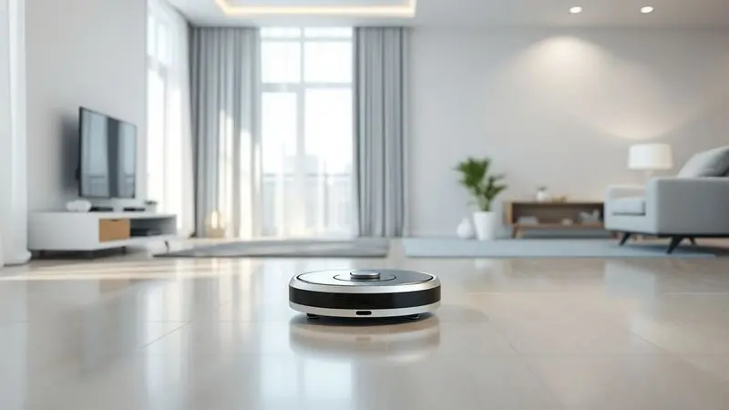
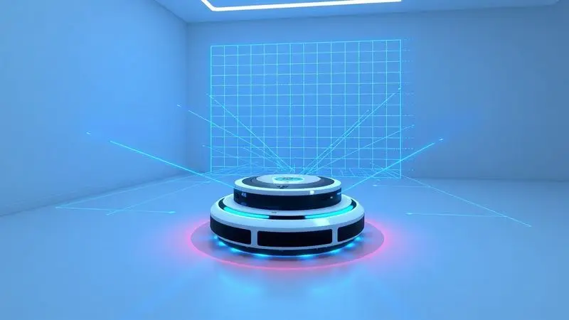
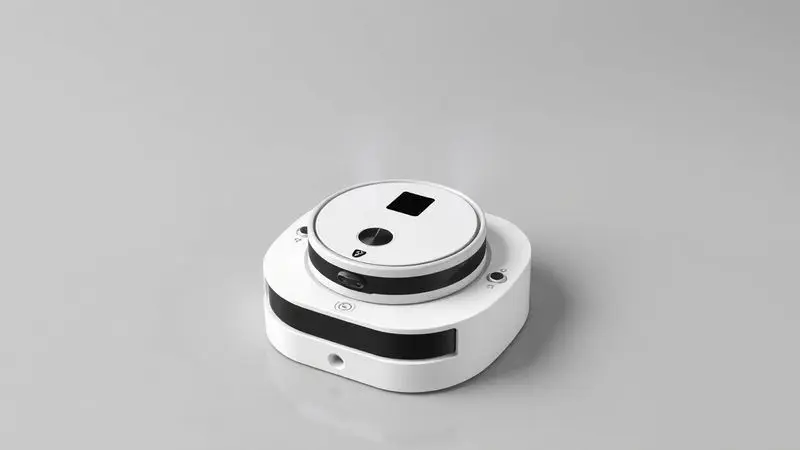
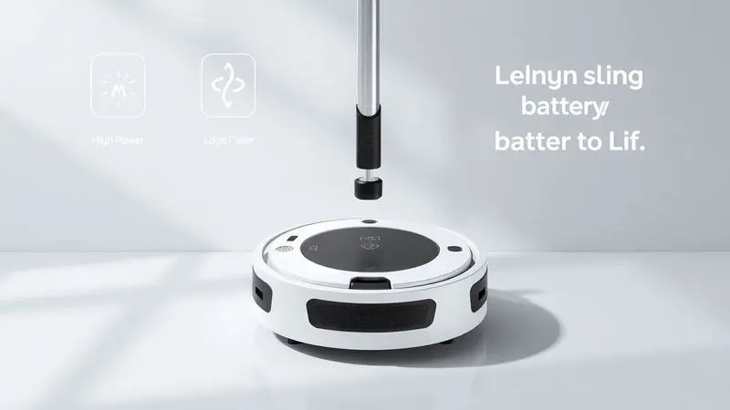

A marca transformou-se em uma referência sólida no mercado brasileiro de eletrodomésticos, apresentando uma linha Robot que vai desde modelos básicos para quem deseja apenas praticidade até opções premium que praticamente pensam por você.

Com mapeamento inteligente, estações de autolimpeza e conectividade total, escolher entre tantas variações pode realmente parecer um quebra-cabeça técnico.

Neste guia, vamos além das especificações para revelar qual robô aspirador Wap se encaixa na sua rotina e, mais importante, na sua paz de espírito em 2025.

<SummaryList products={frontmatter.top_products} />

## Confira as melhores opções de robôs aspiradores da Wap

Imagine acordar com o piso já limpo, sem ter levantado do sofá. É essa promessa que a linha Wap traz, mas cada modelo cumpre de um jeito diferente.

Dos mais simples aos que são verdadeiros assistentes domésticos, aqui está o panorama completo para você não se perder entre tantas siglas e números.

### 1. Robô Aspirador Wap W90

<ProductBox 
  title={frontmatter.top_products[0].title} 
  image={frontmatter.top_products[0].image} 
  link={frontmatter.top_products[0].link} 
/>

Para quem está começando no mundo da automação doméstica ou precisa de uma ajudinha básica e eficiente.

O W90 opera com três modos de funcionamento que se adaptam ao seu humor: aleatório para um passeio geral, cantos para aqueles espaços traiçoeiros, e espiral para uma limpeza concentrada.

Com autonomia de até 100 minutos, ele dá conta de apartamentos e casas menores, mas você sentirá a necessidade de esvaziar seu reservatório de 250ml com certa frequência em ambientes maiores.

Os sensores de antiqueda e colisão são seu sistema nervoso, garantindo que ele não tente "voar" escadas abaixo ou se choque repetidamente com o pé da mesa.

A função de passar pano existe, mas funciona mais como um complemento leve, não espere que ele substitua aquela limpeza manual caprichada em superfícies mais sujas.

<CaixaProsContras>

**Prós:**

- Vários modos de limpeza adaptáveis.

- Sensores de antiqueda e colisão.

- Design baixo que alcança áreas difíceis.

- Ideal para lares com animais e alérgicos.

**Contras:**

- Função de passar pano pode deixar a desejar.

- Capacidade do reservatório pode ser insuficiente para casas grandes.

</CaixaProsContras>

### 2. Robô Aspirador Wap W100

<ProductBox 
  title={frontmatter.top_products[1].title} 
  image={frontmatter.top_products[1].image} 
  link={frontmatter.top_products[1].link} 
/>

Aqui a praticidade ganha corpo fino: com apenas 7,5 cm de altura, o W100 é a solução para alcançar aquela poeira esquecida sob o sofá baixo ou a cama. Ele reúne três tarefas em uma única passada: varre, aspira e passa pano.

Os três modos de operação permitem que você escolha entre eficiência e cuidado, dependendo do piso.

Com a mesma autonomia do W90, ele promete cerca de 1h40 de trabalho contínuo. Os sensores infravermelhos são seus olhos, evitando desastres e garantindo uma operação independente.

O ponto de atenção fica no ruído: 72 dB(A) pode ser perceptível se você trabalha em casa ou prefere ambientes de silêncio quase absoluto.

<CaixaProsContras>

**Prós:**

- Design ultrafino que alcança locais difíceis

- Varre, aspira e passa pano

- Três modos de limpeza adaptáveis

- Sensores antiqueda e anticolisão

**Contras:**

- Nível de ruído pode ser considerável

- Autonomia pode variar conforme o uso

</CaixaProsContras>

### 3. Robô Aspirador Wap WSmart

<ProductBox 
  title={frontmatter.top_products[2].title} 
  image={frontmatter.top_products[2].image} 
  link={frontmatter.top_products[2].link} 
/>

Inteligência no nome e na função, o WSmart é para quem quer um passo a mais sem complicações tecnológicas.

Além do trio varre-aspira-pano, ele traz uma função Turbo que aumenta a potência de sucção quando encontra resistência, perfeito para dias de mais bagunça ou para quem tem pets que soltam pelos.

Os três modos de limpeza, cantos, aleatória e em círculo, são comandados por sensores que previnem quedas e colisões. O filtro HEPA é um alívio para alérgicos, aprisionando partículas minúsculas.

A limitação está justamente na função pano: para sujeiras mais pesadas ou secas, você ainda precisará da ajuda das mãos.

<CaixaProsContras>

**Prós:**

- Design slim que alcança locais difíceis

- Vários modos de limpeza disponíveis

- Função Turbo para maior potência de sucção

- Sensores que evitam quedas e colisões

**Contras:**

- Pode não substituir a limpeza manual em sujeiras pesadas

- Não possui inteligência para mapear a casa

</CaixaProsContras>

### 4. Robô Aspirador Wap WConnect

<ProductBox 
  title={frontmatter.top_products[3].title} 
  image={frontmatter.top_products[3].image} 
  link={frontmatter.top_products[3].link} 
/>

Quando a preguiça encontra a tecnologia, surge o WConnect. Com Wi-Fi integrado, você pode deitar no sofá e comandá-lo por voz através da Alexa ou Google Assistente, ou pelo aplicativo WAP Connect, onde agenda horários e modos.

A função Turbo Brush foi pensada para pelos de animais e sujeiras teimosas, enquanto a função mop permite que ele aspire e passe pano simultaneamente.

Sua bateria dura até 120 minutos, o que pode não cobrir mansões, mas para a maioria dos lares é mais que suficiente. E quando a energia está no fim, ele encontra sozinho o caminho de volta para a base carregadora, você nem precisa se lembrar de recarregá-lo.

<CaixaProsContras>

**Prós:**

- Conectividade com Alexa e Google Assistente

- Múltiplos modos de limpeza

- Função de passar pano incluída

- Retorno automático à base carregadora

**Contras:**

- Autonomia de bateria pode ser limitada para casas grandes

- Não possui um sistema de mapeamento avançado

</CaixaProsContras>

### 5. Robô Aspirador Wap W400

<ProductBox 
  title={frontmatter.top_products[4].title} 
  image={frontmatter.top_products[4].image} 
  link={frontmatter.top_products[4].link} 
/>

A evolução para quem deseja controle total sem falar com assistentes. O W400 é um 3 em 1 com navegação inteligente que identifica obstáculos e alcança cantos com uma precisão que modelos anteriores não tinham.

A função de autorrecarga garante que ele esteja sempre disponível, como um mordomo robótico que nunca tira férias.

O controle remoto e o aplicativo dão a você o poder de definir rotinas, verificar o status da bateria e acompanhar onde ele já limpou. Em testes, mostrou-se eficiente até com sujeira mais pesada.

A ausência de um sistema de mapeamento avançado, porém, significa que ele não "aprende" o layout da sua casa, cada limpeza é uma nova aventura.

<CaixaProsContras>

**Prós:**

- Design compacto e eficaz para limpeza em diversas superfícies.

- Controle remoto e aplicativo para facilitar o uso.

- Boa capacidade de aspirar sujeira pesada.

- Função de passar pano integrada.

**Contras:**

- Não possui mapeamento, o que pode limitar a eficiência em grandes áreas.

- Nível de ruído pode ser uma preocupação em ambientes silenciosos.

</CaixaProsContras>

### 6. Robô Aspirador Wap W300

<ProductBox 
  title={frontmatter.top_products[5].title} 
  image={frontmatter.top_products[5].image} 
  link={frontmatter.top_products[5].link} 
/>

Especialista em espaços apertados e inimigo dos alérgenos. Com apenas 7,8 cm de altura, o W300 invade territórios que outros aspiradores nem sonham alcançar.

Sua navegação inteligente, reforçada por sensores antiqueda e anticolisão, faz com que ele desvie de obstáculos como um pequeno detetive da limpeza.

Os cinco modos de limpeza, selecionáveis por controle remoto, permitem personalizar cada sessão. O filtro HEPA é sua arma secreta, capturando 99,9% dos ácaros e bactérias, um respiro de alívio para quem sofre com alergias.

A autonomia varia entre 45 e 75 minutos, um tempo que pode ser reduzido se você abusar da função SUPER, mas suficiente para a maioria dos ambientes.

<CaixaProsContras>

**Prós:**

- Navegação inteligente com sensores antiqueda

- Vários modos de limpeza

- Filtro HEPA eficaz para alérgicos

- Design compacto que permite alcançar espaços apertados

**Contras:**

- Autonomia limitada da bateria

- Função SUPER consome mais bateria

</CaixaProsContras>

### 7. Robô Aspirador Wap W1000

<ProductBox 
  title={frontmatter.top_products[6].title} 
  image={frontmatter.top_products[6].image} 
  link={frontmatter.top_products[6].link} 
/>

Aqui começamos a entrar no território premium. O W1000 não apenas realiza as três funções básicas, mas faz isso com um cérebro: a navegação inteligente Gyro mapeia o ambiente em tempo real, criando rotas lógicas e evitando redundâncias.

O aplicativo WAP CONNECT transforma seu smartphone em um centro de comando, onde você agenda, seleciona modos e acompanha o progresso.

Com cinco modos de limpeza e três níveis de sucção, ele se adapta desde um piso laminado delicado até um carpete denso. Até 160 minutos de autonomia e retorno automático à base garantem que nenhum cômodo fique para trás.

O sistema de filtragem com HEPA mantém o ar limpo enquanto ele trabalha. O preço dessa eficiência? Um ruído que pode chegar a 75 dB(A) nos modos mais potentes.

<CaixaProsContras>

**Prós:**

- Função 3 em 1 (varre, aspira e passa pano)

- Navegação inteligente com mapeamento em tempo real

- Controle via aplicativo e compatibilidade com assistentes de voz

- Sistema de filtragem eficiente com filtro HEPA

**Contras:**

- Nível de ruído relativamente alto

- Autonomia pode variar dependendo do modo de limpeza

</CaixaProsContras>

### 8. Robô Aspirador Wap W3000

<ProductBox 
  title={frontmatter.top_products[7].title} 
  image={frontmatter.top_products[7].image} 
  link={frontmatter.top_products[7].link} 
/>

Se o W1000 tem um cérebro, o W3000 tem um cérebro com memória fotográfica.

A tecnologia SLAM com navegação a laser mapeia seu ambiente em 360°, armazenando até 5 mapas diferentes, perfeito para quem tem casa com vários andares ou quer limpar apenas zonas específicas, como a área onde as crianças brincam.

Além do trio de funções, ele oferece modos especializados como limpeza de cantos e umedecida. O controle por aplicativo e compatibilidade com assistentes de voz mantêm a conveniência.

O laser e os algoritmos inteligentes garantem uma limpeza metódica, mas essa precisão vem com um ruído de até 65 dB(A) e um tempo de carregamento que exige paciência.

<CaixaProsContras>

**Prós:**

- Função 3 em 1: varre, aspira e passa pano

- Mapeamento preciso com tecnologia LDS e SLAM

- Compatível com assistentes de voz

- Diversidade de modos de limpeza

**Contras:**

- Nível de ruído pode ser considerado alto

- Tempo de carregamento relativamente longo

</CaixaProsContras>

### 9. Robô Aspirador Wap W4000

<ProductBox 
  title={frontmatter.top_products[8].title} 
  image={frontmatter.top_products[8].image} 
  link={frontmatter.top_products[8].link} 
/>

O topo da linha, onde a automação encontra a autossuficiência. O W4000 faz tudo que seus irmãos fazem, mas com um upgrade crucial: uma base autolimpante que esvazia sozinha o recipiente de sujeira.

Isso significa que você só precisa intervir a cada 60 dias, não a cada uso.

Seu mapeamento inteligente em 2D e 3D memoriza até cinco andares, criando rotas perfeitas. Os 29 sensores de navegação fazem com que ele evite obstáculos com uma graça quase humana.

Controlável por aplicativo ou comando de voz, ele representa o futuro da limpeza doméstica, desde que sua casa tenha a voltagem correta, já que não é bivolt, e que os ambientes não sejam tão extensos que exijam mais que suas 2 horas de bateria.

<CaixaProsContras>

**Prós:**

- Função 3 em 1: varre, aspira e passa pano.

- Base autolimpante que reduz a necessidade de manutenção frequente.

- Mapeamento inteligente com capacidade de memorizar até cinco andares.

- Controle via aplicativo ou comandos de voz.

**Contras:**

- Não é bivolt, então é necessário escolher a voltagem correta.

- A autonomia pode ser insuficiente para áreas muito grandes sem recarga.

</CaixaProsContras>

## Robô aspirador Wap vale a pena?

Valer a pena depende do que você valoriza mais: tempo ou dinheiro? Se horas livres no final do dia soam melhor do que passar o aspirador manualmente, então sim, cada modelo Wap oferece um retorno tangível.

Dos mais simples aos mais avançados, todos compartilham um objetivo: dar a você a liberdade de viver em um ambiente limpo sem o trabalho de mantê-lo assim.

Para quem tem rotina agitada, animais de estimação, alergias ou simplesmente prefere dedicar seu tempo a outras atividades, esses robôs não são apenas gadgets, são investimentos em qualidade de vida.

## Critérios Essenciais para Escolher seu Robô Aspirador

Antes de se apaixonar por um modelo específico, faça a si mesmo algumas perguntas práticas. Qual o tamanho da área que precisa ser limpa? Uma bateria de 45 minutos serve para um apartamento de 50m², mas deixará uma casa de 150m² pela metade.

Você tem muitos móveis baixos? Então a altura do robô (geralmente entre 7,5 e 10 cm) será crucial. Pelos de animais exigem maior potência de sucção e escovas específicas. A conectividade com aplicativos é um luxo ou uma necessidade para sua rotina?

E o mapeamento inteligente, você prefere que o robô aprenda o layout da sua casa ou está bem com uma limpeza mais aleatória? As respostas guiarão você muito melhor do que qualquer lista de especificações técnicas.

## Tecnologias de Mapeamento: LDS vs SLAM

Essas siglas determinam como seu robô "enxerga" o mundo. O LDS (Sensor de Distância a Laser) usa um laser que gira 360°, medindo distâncias com precisão milimétrica para criar um mapa estático do ambiente. É como ter um arquiteto robótico desenhando sua casa.

Já o SLAM (Localização e Mapeamento Simultâneos) é mais adaptativo: usa múltiplos sensores (câmeras, giroscópios) para entender onde está enquanto mapeia, lidando melhor com mudanças, como uma cadeira que foi movida.

O LDS tende a ser mais preciso em ambientes complexos, enquanto o SLAM se sai melhor em espaços que mudam com frequência. Na prática, ambos garantem que seu robô não fique andando em círculos ou limpando o mesmo lugar dez vezes.

## Funcionalidades Extras: Autolimpeza e MOP Giratório

Alguns recursos transformam um robô aspirador de útil para indispensável. A base autolimpante, presente no topo da linha W4000, é o ápice da conveniência: depois de aspirar, o robô retorna à base, que suga a sujeira do seu reservatório para um compartimento maior.

Você só precisa esvaziar esse compartimento a cada dois meses. Já o mop giratório é um sistema de panos rotativos que aplicam pressão uniforme contra o piso, removendo manchas e sujeiras incrustadas muito melhor do que um pano estático.

São esses detalhes que separam uma experiência "bom o suficiente" de uma verdadeira revolução na limpeza doméstica.

## Comparativo de Potência e Autonomia

Potência se mede em Pascal (Pa), e na linha Wap você encontrará de 600 Pa nos modelos básicos a mais de 3.000 Pa nos premium. Mas o que esses números significam na prática? Um robô com 600 Pa aspira pó e migalhas tranquilamente em pisos lisos.

Já 3.000 Pa conseguem extrair pelos de pet profundamente embutidos em carpetes. A autonomia segue lógica similar: de 45 a 160 minutos. A regra geral é que cada 30 minutos de bateria cobrem aproximadamente 50m² em modo normal.

Modelos com recarga automática quebram essa limitação, eles limpam, recarregam e retomam de onde pararam, cobrindo áreas ilimitadas em múltiplas sessões.

## Perguntas Frequentes

Ele realmente limpa bem? Sim, mas com expectativas realistas. Os modelos Wap removem pó, pelos, migalhas e sujeira solta diária com eficiência. Para sujeiras pesadas, secas ou áreas muito sujas, uma passada manual ocasional ainda será necessária.

E se minha casa tiver muitos obstáculos? Os sensores anticolisão lidam bem com móveis e paredes. Para fios soltos e objetos muito pequenos no chão, é melhor organizar o ambiente antes da limpeza, uma dica que serve para qualquer robô aspirador do mercado.

Preciso ficar em casa supervisionando? Não. A graça está justamente na autonomia. Você programa pelo aplicativo, sai para trabalhar e volta com o chão limpo. Os sensores de antiqueda previnem acidentes em escadas.

A manutenção é complicada? Pelo contrário: limpar o filtro (geralmente a cada 1-2 semanas), tirar pelos das escovas e esvaziar o reservatório são tarefas de 5 minutos. Nos modelos com base autolimpante, esse cuidado é ainda mais esporádico.

Funciona em todos os tipos de piso? Sim, desde madeira e porcelanato até carpetes de até 1,5 cm de altura. Alguns modelos detectam automaticamente a mudança de superfície e ajustam a potência.

## Conclusão

Escolher um robô aspirador Wap é como selecionar um assistente pessoal para sua casa. Do discreto W90, que faz seu trabalho sem alarde, ao quase autossuficiente W4000, que lembra dos cômodos e se limpa sozinho, há um modelo para cada estilo de vida e orçamento.

O que todos compartilham é a promessa de transformar uma tarefa doméstica repetitiva em algo do qual você simplesmente pode se esquecer.

Em 2025, ter um chão limpo não será mais uma questão de encontrar tempo, mas de ter escolhido o robô certo para devolver esse tempo a você.

Antes de decidir, pense menos nas especificações técnicas e mais em quantas horas por semana gostaria de ganhar de volta, a resposta estará na linha Wap que melhor se alinha com essa nova rotina que você deseja construir.