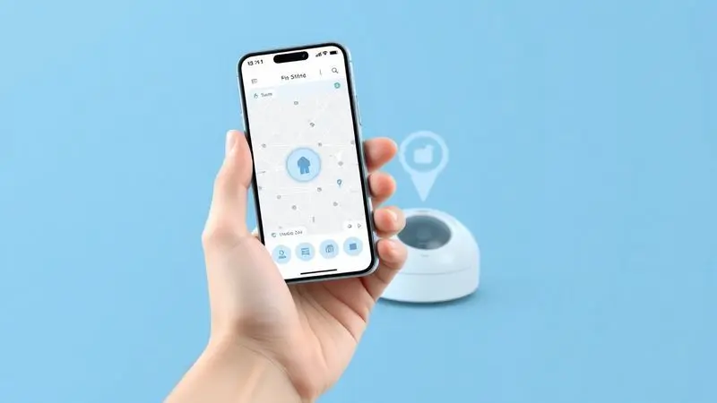
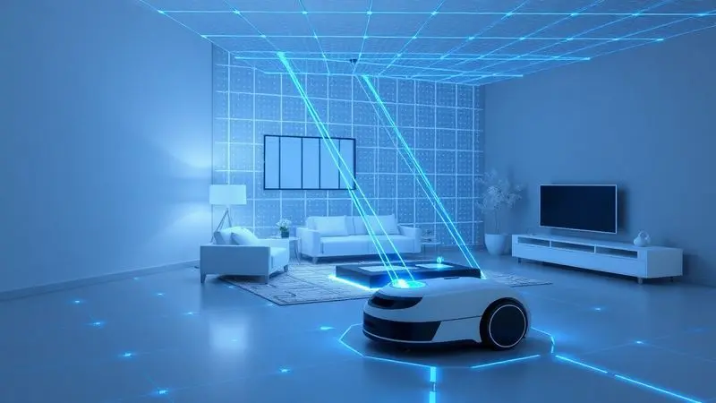
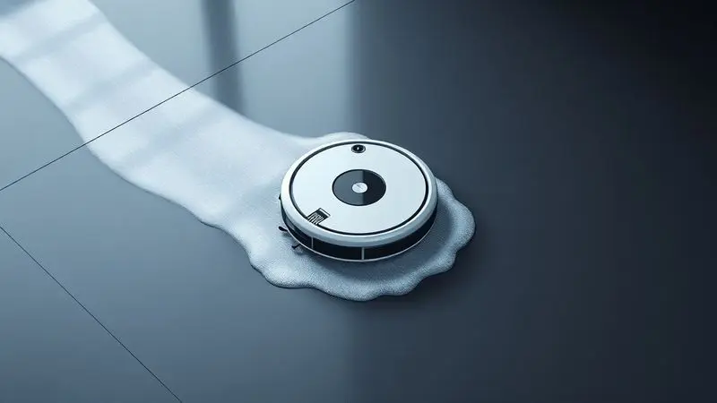
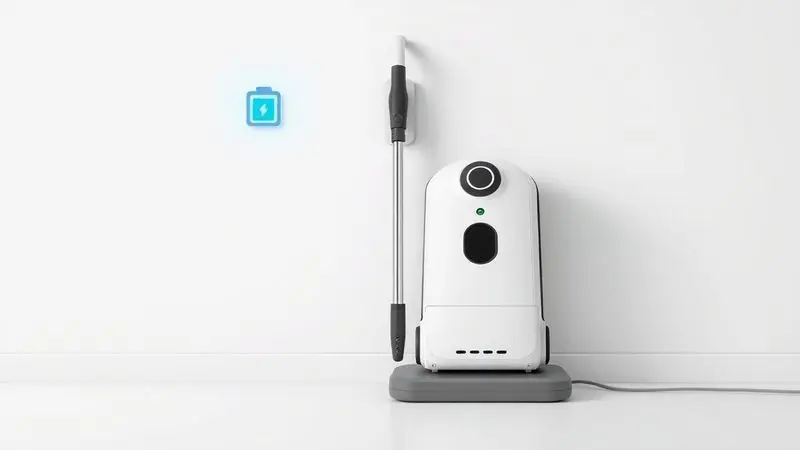

Imaginar um assistente doméstico que cuida da limpeza enquanto você vive sua vida é um sonho moderno. O WAP W1000 chega ao mercado intermediário prometendo exatamente isso: mapeamento inteligente, alta sucção e a prática função de passar pano em um único dispositivo.

Mas será que essa combinação realmente funciona no dia a dia, ou é mais uma promessa que desaponta na prática? Nós testamos cada detalhe, da navegação à bateria, para descobrir se este robô é o investimento que sua casa merece.

<SummaryList products={frontmatter.top_products} />

## Ficha Técnica do Robô Aspirador WAP W1000

<ProductBox 
  title={frontmatter.top_products[0].title} 
  image={frontmatter.top_products[0].image} 
  link={frontmatter.top_products[0].link} 
/>

Aqui está o que você realmente precisa saber antes de mergulhar na experiência. O W1000 é um triturador de tarefas: ele varre, aspira e passa pano simultaneamente.

Seu cérebro é a navegação inteligente Gyro, que mapeia seu ambiente para evitar colisões e otimizar cada movimento. Com bateria de 2600mAh, ele trabalha por até 2h40 sem pedir folga, suficiente para a maioria dos apartamentos e casas.

O recipiente duplo comporta 290ml de resíduos e água, enquanto o filtro HEPA captura 99,97% dos alérgenos, tornando-o um aliado contra alergias. E sim, ele obedece à sua voz através da Alexa e Google Assistant.

<CaixaProsContras>

**Prós:**

- Multifuncional: varre, aspira e passa pano

- Navegação inteligente que otimiza a limpeza

- Autonomia considerável e recarga automática

- Compatível com controle por aplicativo e assistentes de voz

**Contras:**

- Não aspira água, o que pode limitar sua funcionalidade em algumas situações

- O nível de ruído pode ser um pouco alto em potência máxima

</CaixaProsContras>

## Primeiras impressões do Robô Aspirador WAP W1000

Retirar o W1000 da caixa é como receber um novo companheiro doméstico. Seu design arredondado e compacto sugere que ele passará por debaixo da maioria dos móveis.

Ao ligá-lo, há uma sensação imediata de inteligência: ele não sai trombando pelas paredes como robôs mais básicos. Em vez disso, faz um reconhecimento metódico do espaço, como se estivesse memorizando cada centímetro.

A sucção impressiona desde o primeiro momento, especialmente com pelos de animais que desaparecem como mágica. Os sensores anti-queda funcionam perfeitamente, dando confiança para deixá-lo trabalhar sozinho. A primeira impressão?

Este não é um brinquedo, mas uma ferramenta séria.

## Design e Acabamento do Robô Wap

O W1000 não tenta se esconder. Com acabamento em preto fosco e detalhes em cinza, ele tem uma presença discreta mas sofisticada que combina com quase qualquer decoração.

A construção transmite solidez, sem aquela sensação de plástico barato que alguns modelos nacionais deixam. As rodas são um destaque: elas transitam entre piso frio, carpete e pequenas irregularidades sem emperrar.

A superfície é fácil de limpar, um detalhe importante quando você precisa remover pelos acumulados.

Mas o verdadeiro trunfo está na funcionalidade do design: tudo que você precisa acessar regularmente (reservatório, filtro, escovas) está a um clique de distância, sem parafusos ou truques complicados.

## Capacidade de Aspiração e Modos de Limpeza

Este é onde o W1000 prova seu valor ou revela suas limitações. Com cinco modos de limpeza e três níveis de sucção, ele oferece o tipo de versatilidade que transforma uma tarefa chata em algo quase prazeroso. Vamos entender cada função:

### Cantos

Aquela ansiedade de ver seu robô ignorando os cantos da sala? O W1000 tem uma resposta. Suas escovas laterais giram a 360 graus, varrendo a sujeira dos cantos para o caminho central de aspiração.

Não é perfeito, especialmente em ângulos muito agudos, mas é significativamente melhor que modelos sem essa tecnologia. Para áreas realmente problemáticas, o modo Espiral (que abordaremos a seguir) faz maravilhas.

### Aleatória

O modo padrão para quando você só precisa de uma faxina rápida. O robô navega de forma não sistemática, cobrindo o chão de maneira eficiente sem o mapeamento completo que consome mais bateria.

Ideal para aqueles 15 minutos antes da visita chegar, quando você quer que o chão pareça limpo sem uma faxina profunda.

### Espiral

Aqui está a arma secreta para manchas localizadas. Quando o W1000 detecta uma área particularmente suja, ele entra neste modo e gira em círculos concêntricos, passando múltiplas vezes pelo mesmo ponto.

Funciona incrivelmente bem contra migalhas concentradas na área do sofá ou pelos acumulados no cantinho favorito do seu pet.

### Inteligente

Este é o modo que justifica o investimento. O W1000 mapeia seu ambiente, cria um plano lógico de limpeza e segue rotas otimizadas que evitam redundâncias.

A primeira limpeza neste modo leva um pouco mais, mas as subsequentes são significativamente mais rápidas e eficientes. É a diferença entre alguém que limpa com método e alguém que apenas passa o pano aleatoriamente.

## Aplicativo - WAP Connect e Controle de Voz

O WAP Connect transforma seu smartphone em um controle remoto para sua casa mais limpa. A interface é surpreendentemente intuitiva: em menos de cinco minutos você estará programando limpezas, revisando o histórico e até direcionando o robô para áreas específicas.

Mas o verdadeiro luxo está na integração com assistentes de voz. Imagine terminar o jantar e simplesmente dizer: "Alexa, pede para o robô limpar a cozinha". O W1000 obedece enquanto você lava a louça ou assiste sua série favorita.

Essa sinergia entre tecnologia e conveniência é o que separa os robôs modernos dos meramente automáticos.

## Mapeamento e Inteligência do Robô Aspirador WAP

A inteligência do W1000 não é marketing, é funcionalidade tangível. Seus sensores criam um mapa virtual da sua casa que ele memoriza e otimiza a cada limpeza.

Isso significa que na terceira vez que ele trabalhar, saberá exatamente como contornar a perna daquela mesa difícil, quanto tempo gastar no corredor estreito e onde estão os cantos que precisam de atenção extra.

O sistema evita quedas com uma precisão quase infalível, e aprende com os obstáculos: se você mover um sofá, ele ajustará sua rota na próxima limpeza sem precisar ser reprogramado.

## Função Passar Pano: Como funciona?

Adicione água (ou solução de limpeza) no compartimento dedicado, fixe o pano de microfibra na parte inferior, e o W1000 se transforma em um limpador úmido. A distribuição é controlada, evitando poças enquanto proporciona uma limpeza superficial eficiente.

É perfeito para remover aquela poeira fina que a aspiração deixa para trás em pisos de cerâmica ou laminado.

Não espere que ele substitua uma esfregona tradicional para sujeiras mais pesadas, mas para manutenção diária entre faxinas mais profundas, é um diferencial que faz valer cada centavo.

## Reservatório do Wap W1000 e Filtros

A simplicidade da manutenção é um trunfo subestimado. O reservatório combinado (sujidade + água) tem 290ml, suficiente para limpar até 150m² sem reabastecer. A limpeza é tão fácil quanto esvaziar o compartimento na lixeira e enxaguá-lo na pia.

O filtro HEPA é lavável, economizando dinheiro a longo prazo, e captura partículas microscópicas que desencadeiam alergias.

Para famílias com animais ou crianças pequenas que passam muito tempo no chão, essa capacidade de filtrar alérgenos não é um luxo, é uma necessidade.

## Bateria e Carregamento Inteligente

Aqui está uma das maiores virtudes do W1000: ele é autossuficiente. Com 2h40 de autonomia, limpa a maioria dos apartamentos de dois quartos em uma única carga.

Quando a bateria chega a 15%, ele interrompe a limpeza, calcula a rota mais curta até a base e recarrega automaticamente. Se a tarefa não foi completada, ele retoma exatamente de onde parou assim que estiver pronto.

Essa inteligência elimina a ansiedade de monitorar o nível da bateria ou encontrar seu robô morto no meio da sala. Ele simplesmente cuida de si mesmo enquanto cuida da sua casa.

## Nível de Ruído e Modos de Potência

O W1000 não é silencioso, mas está longe de ser intrusivo. No modo mais baixo, é comparável a um ventilador de mesa, permitindo conversas normais ou assistir TV sem problemas.

Na potência máxima para carpetes, o ruído aumenta consideravelmente, mas ainda é menos incômodo que um aspirador tradicional.

A beleza está na adaptabilidade: em piso frio, use o modo silencioso e economize bateria; em tapetes, aumente a potência para garantir uma limpeza profunda. Essa flexibilidade significa que você não precisa escolher entre eficiência e conforto acústico.

## Manutenção e Peças Substituíveis

A promessa de praticidade se mantém na manutenção. Limpar as escovas leva segundos (especialmente importante se você tem cabelos longos ou animais), e o filtro HEPA é lavável sob água corrente.

Peças de reposição como escovas laterais, rodas e filtros extras são amplamente disponíveis e relativamente acessíveis. Essa facilidade de manutenção estende significativamente a vida útil do aparelho, transformando um investimento inicial em anos de serviço confiável.

## Xiaomi S40C vs WAP W1000: qual robô focado em custo-benefício é melhor?

Esta comparação define uma escolha filosófica sobre o que "custo-benefício" realmente significa para você.

O Xiaomi S40C é o atleta olímpico: sucção de 5000Pa que remove sujeiras incrustadas, navegação a laser que mapeia com precisão cirúrgica e tanque de água personalizável.

Para quem tem animais grandes, crianças que fazem bagunça ou simplesmente quer o máximo de tecnologia disponível, ele é uma escolha quase incontestável.

O WAP W1000 é o parceiro confiável: potência suficiente para a maioria das situações (2340Pa), autonomia generosa (2h40) e a conveniência de aspirar e passar pano simultaneamente.

Como produto nacional, tem suporte local e preço mais acessível, oferecendo 80% do desempenho por uma fração do custo.

A decisão se resume a uma pergunta: você está comprando tecnologia de ponta ou uma solução prática? Para necessidades cotidianas em apartamentos ou casas sem desafios extremos, o W1000 entrega resultados surpreendentes.

Para ambientes maiores ou com exigências específicas, o investimento extra no S40C pode valer a pena.

<CaixaProsContras>

**Prós:**

- Xiaomi S40C oferece potência superior e tecnologia de navegação avançada

- WAP W1000 possui boa autonomia e é fácil de operar

- Ambos os modelos têm compatibilidade com assistentes de voz

- O WAP W1000 é uma opção mais econômica e acessível

**Contras:**

- O Xiaomi S40C pode ter um preço mais elevado pela tecnologia embutida

- O desempenho do WAP W1000 em carpetes mais grossos pode ser limitado

</CaixaProsContras>

## Conclusão

O WAP W1000 não é perfeito, mas é exatamente o que promete: um assistente doméstico confiável que transforma a limpeza de uma tarefa diária em um processo automatizado. Sua verdadeira força está na combinação equilibrada entre funcionalidades.

Ele não tem a potência bruta dos modelos premium nem a inteligência cirúrgica dos robôs com navegação a laser, mas oferece uma experiência coesa onde tudo funciona bem em conjunto.

Para quem vive em apartamentos ou casas menores, com pisos predominantemente duros e rotinas previsíveis, o W1000 é um investimento inteligente. A função de passar pano adiciona valor real, a autonomia é mais que suficiente e o aplicativo funciona como deveria.

A decisão final depende da sua tolerância a pequenas limitações: se você pode conviver com uma limpeza um pouco mais ruidosa em potência máxima e a necessidade de ocasionalmente complementar os cantos, o W1000 recompensa com anos de serviço confiável.

Em um mercado onde muitos produtos prometem revolução mas entregam frustração, o WAP W1000 faz algo mais valioso: ele simplesmente funciona, dia após dia, transformando seu tempo em liberdade. E no final das contas, isso pode ser o melhor custo-benefício de todos.

---

Ainda em dúvida sobre o WAP W1000? Confira nosso [ranking dos 9 melhores robôs aspiradores WAP de 2025](/robo-aspirador-wap-qual-o-melhor/) e encontre o ideal para sua casa.
