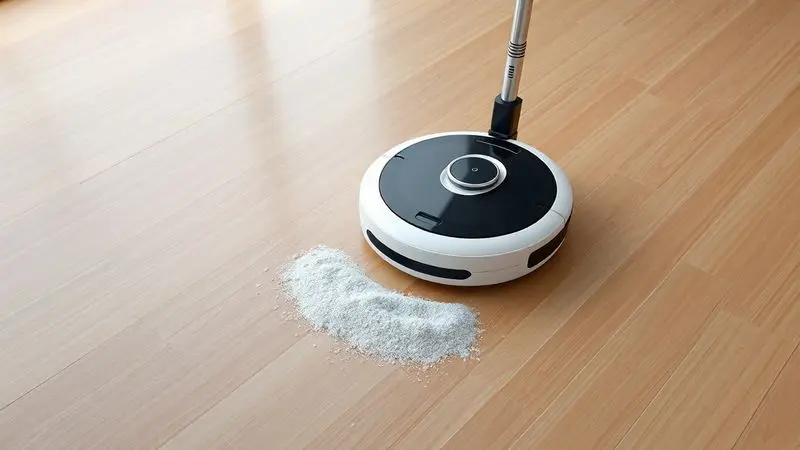
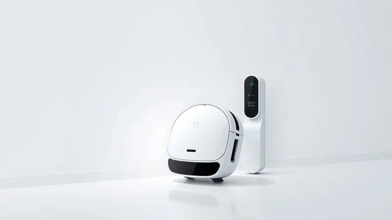
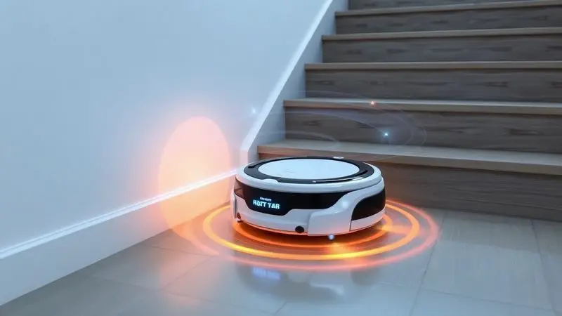

Você já imaginou chegar em casa após um longo dia de trabalho e encontrar o chão impecável, sem precisar mover um dedo?

Ter um robô aspirador deixou de ser um luxo de ficção científica para se tornar uma realidade acessível, e o WAP Robot W300 é um dos [modelos mais comentados](/robo-aspirador-wap-qual-o-melhor/) do mercado.

Neste guia completo, vamos analisar cada detalhe deste dispositivo: desde sua potência de sucção e autonomia de bateria até o seu real desempenho em diferentes tipos de piso.

Se você está em dúvida se este investimento realmente vale a pena ou se ele é apenas mais um gadget barulhento, você está no lugar certo para descobrir a verdade definitiva sobre [o custo-benefício](/robo-aspirador-qual-o-melhor/) deste robô.

<SummaryList products={frontmatter.top_products} />

## O que é o WAP Robot W300 e qual sua proposta de valor?

Imagine ter um assistente silencioso que cuida da limpeza enquanto você se concentra no que realmente importa. O WAP Robot W300 é exatamente isso: um parceiro doméstico que transforma a tarefa maçante de aspirar em uma experiência automatizada.

Sua proposta de valor vai além da simples tecnologia, ele oferece tempo de volta para sua vida. Você programa os horários, e ele percorre pisos duros e carpetes com uma precisão que surpreende, usando sensores para navegar entre móveis sem causar danos.

O design compacto é pensado para alcançar aqueles cantos que você normalmente deixaria para 'depois', garantindo que cada centímetro da sua casa receba atenção.

## Ficha Técnica Completa: Especificações que você precisa conhecer

Para entender como essa máquina se torna seu aliado na limpeza, vamos desmontar o que há por dentro. O sistema de navegação inteligente não apenas evita obstáculos, ele mapea seu ambiente para criar rotas eficientes.

O motor potente enfrenta desde poeira superficial até pelos de animais com a mesma determinação.

A bateria recarregável oferece autonomia que se adapta aos diferentes modos de uso, enquanto o filtro HEPA trabalha silenciosamente para capturar 99,9% dos alérgenos que flutuam no ar.

Tudo isso pode ser controlado através do aplicativo, transformando seu smartphone em um controle remoto para a limpeza da sua casa.

## Design Slim: Ele realmente alcança lugares difíceis e embaixo de móveis?

<ProductBox 
  title={frontmatter.top_products[0].title} 
  image={frontmatter.top_products[0].image} 
  link={frontmatter.top_products[0].link} 
/>

Com apenas 7,8 cm de altura, o WAP Robot W300 é o convidado perfeito para os espaços que normalmente ignoramos. Pense naquela poeira acumulada sob o sofá que você promete limpar há meses, ou nos cantos atrás da cama que nunca vêem uma vassoura.

Essa agilidade significa que você nunca mais precisará arrastar móveis pesados apenas para uma limpeza básica. Os sensores infravermelhos garantem que ele explore esses territórios com segurança, evitando quedas e colisões enquanto desliza suavemente.

É verdade que tapetes muito grossos podem apresentar um desafio, mas para a maioria dos pisos frios e carpetes finos que compõem nossas casas, ele se movimenta com uma graça que faz esquecer que há tecnologia envolvida.

A verdadeira magia está em redescobrir partes da sua casa que você havia esquecido que podiam estar limpas.

## Desempenho na Prática: Potência de Sucção e os 5 Modos de Limpeza

A potência de sucção do W300 é como ter múltiplos aspiradores em um único dispositivo. Mas o que realmente diferencia essa experiência são os cinco modos de limpeza que se adaptam ao seu humor e necessidades do dia. Tem um dia tranquilo em casa?

O modo silencioso mantém a paz. Recebeu visitas e as crianças deixaram migalhas por toda parte? O modo turbo entra em ação. Há dias em que você precisa de uma limpeza rápida antes de uma reunião inesperada, e outros em que deseja uma faxina profunda no fim de semana.

O W300 entende essa variação e se ajusta conforme seu ritmo de vida.

### O Diferencial do Filtro HEPA: Saúde e Ar mais Puro para Alérgicos

<ProductBox 
  title={frontmatter.top_products[1].title} 
  image={frontmatter.top_products[1].image} 
  link={frontmatter.top_products[1].link} 
/>

Para quem acorda com aquela coceira nos olhos ou espirra ao abrir o armário, o filtro HEPA do W300 não é apenas um detalhe técnico, é uma mudança na qualidade de vida.

Ele captura 99,9% das partículas que desencadeiam alergias, ácaros, pólen e pelos que flutuam invisivelmente pelo ar. O resultado é um ambiente onde você respira mais fácil, onde o ar da sua casa deixa de ser um inimigo silencioso.

Manter essa proteção requer atenção simples: uma limpeza ou substituição a cada 1 a 3 meses, dependendo do uso. É um pequeno ritual que garante que o alívio que você sentiu no primeiro mês continue indefinidamente.

Esse cuidado regular transforma o robô de um simples eletrodoméstico em um guardião da saúde da sua família.

## Autonomia da Bateria e Sistema de Auto-Carregamento: Ele volta sozinho para a base?

A autonomia prática do W300 significa que ele pode limpar sua sala, cozinha e corredores sem pedir permissão. Mas o verdadeiro luxo moderno está no sistema de auto-carregamento.

Imagine seu robô percebendo que está cansado e, com discrição, retornando à sua base para recarregar sozinho. Você não precisa marcar horários, não precisa se preocupar se esqueceu de plugá-lo.

Ele simplesmente se cuida, garantindo que esteja sempre pronto quando você precisar.

Essa independência transforma a experiência: você programa a limpeza pela manhã e, ao voltar do trabalho, encontra não apenas o chão limpo, mas o robô descansado em sua base, como se nada tivesse acontecido.

É a autossuficiência que permite que você esqueça da limpeza de verdade, não apenas temporariamente.

## Sensores Antiqueda e Anticolisão: Como o W300 navega pela casa?

A navegação do W300 é uma dança delicada entre tecnologia e intuição. Os [sensores antiqueda](/como-funciona-o-robo-aspirador/) criam uma barreira invisível nas bordas das escadas, permitindo que ele explore ambientes em vários níveis com total segurança.

Já os sensores anticolisão funcionam como um sistema de radar que detecta móveis, paredes e objetos antes do contato, fazendo ajustes suaves na rota.

O resultado é um movimento que parece quase orgânico, como se o robô tivesse desenvolvido uma memória muscular da sua casa. Você pode confiar que ele não ficará preso atrás do pé da mesa ou tentará descer escadas.

Essa combinação permite que você o deixe trabalhando enquanto cuida de outras coisas, sabendo que sua casa e o próprio dispositivo estão seguros.

## Guia de Manutenção: Como limpar e prolongar a vida útil do seu robô aspirador

<ProductBox 
  title={frontmatter.top_products[2].title} 
  image={frontmatter.top_products[2].image} 
  link={frontmatter.top_products[2].link} 
/>

[Manter o W300 em pleno funcionamento](/como-usar-o-aspirador-robo-wap/) é mais simples do que parece, e cada pequeno cuidado se traduz em anos de serviço fiel. Após cada uso, esvaziar o compartimento de pó se torna um ritual satisfatório de ver o trabalho concluído.

As escovas merecem uma inspeção rápida para remover fios e cabelos que possam reduzir a eficiência, algo que leva segundos.

O filtro HEPA requer atenção periódica, mas essa manutenção garante que o ar da sua casa continue puro. Usar apenas a bateria original e cuidar do carregador são precauções que protegem seu investimento.

E embora o W300 seja robusto, evitar ambientes com poeira extremamente fina que possa afetar o motor é uma consideração inteligente.

Esses momentos de cuidado criam uma relação com seu dispositivo, onde você reconhece que está preservando um aliado que, por sua vez, preserva seu tempo e saúde.

## Comparativo Real: WAP Robot W300 vs WAP Robot W100 – Qual escolher?

<ProductBox 
  title={frontmatter.top_products[3].title} 
  image={frontmatter.top_products[3].image} 
  link={frontmatter.top_products[3].link} 
/>

A escolha entre o W300 e o W100 depende menos de especificações técnicas e mais do estilo de vida que você leva.

Se você acorda com alergia e valoriza cada respiração limpa, o W300 com seu filtro HEPA que retém 99,9% de ácaros e bactérias se torna não uma opção, mas uma necessidade.

Seu sistema de auto-recarga significa que você nunca encontrará um robô 'morto' no meio da sala, e os 5 modos de limpeza oferecem personalização para dias diferentes.

Por outro lado, se sua maior frustração é ter múltiplas ferramentas de limpeza, o W100 oferece a praticidade [3 em 1](/robo-aspirador-3-em-1-qual-o-melhor/): varre, aspira e passa pano. Seus 7,5 cm de altura podem acessar espaços ainda mais restritos.

A troca é clara: você ganha versatilidade, mas perde a autossuficiência completa, pois precisará colocá-lo na base para carregar.

Pense em sua rotina matinal: você prefere programar e esquecer, ou não se importa em dar uma ajuda ocasional? Sua resposta guiará sua decisão entre conveniência total e multifuncionalidade compacta.

## Vantagens e Desvantagens: O que ninguém te conta sobre o modelo

As vantagens do W300 se revelam nos detalhes do cotidiano. A eficiência em captar sujeira significa que você para de notar aquela camada fina de poeira que antes se acumulava nos cantos.

O design compacto transforma a limpeza sob móveis de uma tarefa trimestral em algo que acontece automaticamente toda semana.

Mas há nuances que poucos mencionam. Como [modelo acessível](/robo-aspirador-mondial-fast-clean-plus-e-bom/), ele não possui todas as funções premium, como navegação por mapeamento a laser ou integração com assistentes de voz complexos.

O controle via aplicativo é prático, mas não tão avançado quanto sistemas que criam mapas detalhados da sua casa.

A verdade é que ele é excepcional para o que promete: limpeza automática eficiente, não para quem busca um robô com inteligência artificial que aprenda seus hábitos.

Para tarefas básicas e consistentes, ele cumpre com excelência. Para necessidades específicas que requerem personalização extrema, pode haver espaço para considerar opções mais avançadas.

A beleza está em reconhecer que 'básico' aqui significa 'funcionalidade que resolve 95% das necessidades da maioria das pessoas'.

## Veredito Final: O WAP Robot W300 vale a pena em 2024?

Em 2024, quando o tempo se tornou nossa commodity mais preciosa, o WAP Robot W300 não apenas vale a pena, ele representa um upgrade na qualidade de vida.

Sua tecnologia de navegação inteligente e potência de sucção transformam a limpeza de uma obrigação para uma funcionalidade automática da sua casa, como iluminação ou aquecimento.

A capacidade de programar limpezas para quando você não está em casa significa voltar para um ambiente que acolhe, não que exige trabalho.

Para quem busca simplificar as tarefas domésticas sem comprometer a eficiência, o W300 é uma escolha sólida que entende as necessidades do cotidiano moderno. Ele não promete revolucionar sua vida, mas garante que uma parte dela se torne significativamente mais leve.

O verdadeiro valor não está no que ele faz, mas no que ele permite que você deixe de fazer: arrastar móveis, programar horários de limpeza, preocupar-se com alergias sazonais.

Em um mundo onde buscamos automatizar o trivial para focar no essencial, o W300 se posiciona não como um gadget, mas como um facilitador de tempo e bem-estar.

## Conclusão

O WAP Robot W300 é mais do que um [robô aspirador](/aspirador-robo-wap-w310-e-bom/), é uma redefinição de como interagimos com a limpeza doméstica.

Ele transforma uma tarefa repetitiva em uma experiência de liberdade, onde você recupera horas preciosas que antes eram dedicadas a varrer, aspirar e organizar.

Seu design inteligente, filtro HEPA e sistema de auto-carregamento trabalham em conjunto para criar um ecossistema de limpeza que opera independentemente, permitindo que você foque nas conexões que realmente importam: família, trabalho, hobbies e descanso.

Para quem valoriza saúde respiratória, conveniência e eficiência, o investimento se paga não apenas em termos monetários, mas na qualidade de cada dia.

Em um mundo onde buscamos soluções que nos libertem do trivial, o W300 se estabelece como um companheiro discreto que cuida dos detalhes para que você possa cuidar do quadro geral.

A pergunta não é mais se você precisa de um robô aspirador, mas se está pronto para receber o tempo de volta que ele oferece.

## Perguntas Frequentes sobre o WAP W300 (FAQ)

Uma dúvida comum é sobre a duração da bateria: ele opera por até 120 minutos, cobrindo ambientes de tamanho médio com sobra. Quanto aos tipos de piso, destaca-se em superfícies duras e carpetes leves, adaptando-se automaticamente às diferentes texturas.

A funcionalidade de agendamento permite programar limpezas para horários específicos, ideal para quem tem rotinas previsíveis ou deseja voltar para casa com os pisos já limpos.

Essas respostas confirmam que o W300 foi projetado não apenas para funcionar, mas para se integrar harmoniosamente na dinâmica do seu lar.