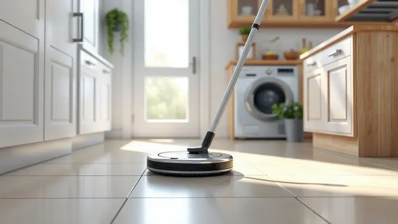
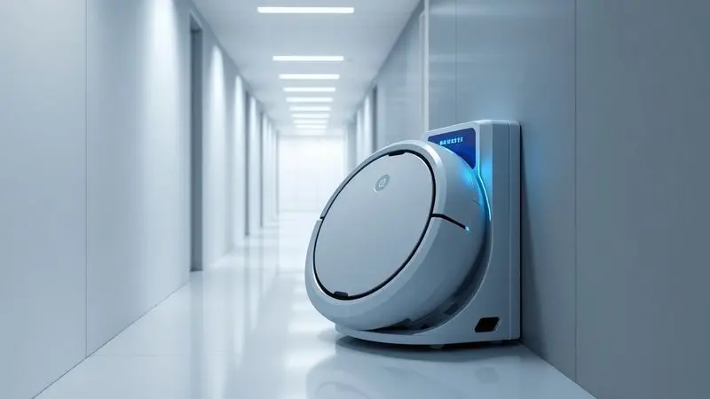
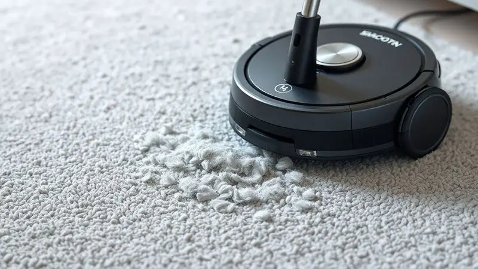

Ter um robô aspirador deixou de ser luxo para se tornar uma necessidade na rotina moderna. A pergunta que surge é inevitável: o WAP Robot W3000 é bom e dá conta do recado?

Este modelo promete equilibrar potência e custo-benefício, mas será que supera os desafios de tapetes e pelos de animais? Nesta análise completa, destrinchamos cada detalhe, desde sua autonomia até os acessórios, para que você tome a melhor decisão.

Se você busca automatizar a limpeza, descubra se esse investimento realmente vale a pena.

<SummaryList products={frontmatter.top_products} />

## O que é o Robô Aspirador WAP Robot W3000?

Imagine um assistente silencioso que trabalha enquanto você faz outras coisas. O WAP Robot W3000 é justamente isso: um dispositivo autônomo com navegação inteligente que mapeia seus espaços e identifica obstáculos, otimizando a limpeza em qualquer superfície.

Equipado com sucção potente, ele é ideal tanto para ambientes residenciais quanto comerciais.

Os modos de limpeza programáveis permitem que você personalize a rotina conforme sua necessidade, prometendo facilitar seu dia a dia e garantir um lar mais limpo com menos esforço. A praticidade, enfim, ganha um novo significado.

## Ficha técnica e especificações detalhadas

<ProductBox 
  title={frontmatter.top_products[0].title} 
  image={frontmatter.top_products[0].image} 
  link={frontmatter.top_products[0].link} 
/>

Essas especificações impressionantes vêm em um pacote 3 em 1: varre, aspira e passa pano simultaneamente.

A tecnologia de navegação a laser (LDS) e mapeamento SLAM permitem que ele mapeie o ambiente em 360° em tempo real, sendo capaz de armazenar até 5 mapas diferentes para uma limpeza realmente eficiente.

Aqui estão os números que importam: poder de sucção de 2400 Pa (suficiente para lidar com pelos e poeira mais persistentes), quatro níveis de potência que se ajustam automaticamente conforme o piso, e uma bateria de Li-Ion com autonomia de até 2 horas.

Você o controla via aplicativo WAP CONNECT ou controle remoto, além de poder usar comandos de voz com Alexa e Google Assistente. Sensores anti-queda e anti-colisão garantem operação tranquila, enquanto o design slim alcança até os cantos mais difíceis.

<CaixaProsContras>

**Prós:**

- Realiza três funções em um único aparelho.

- Navegação a laser para mapeamento preciso.

- Controle via aplicativo e compatibilidade com assistentes de voz.

- Design slim que alcança áreas difíceis.

**Contras:**

- Preço pode ser alto para algumas pessoas.

- Pode não ser ideal para quem busca um produto mais básico.

</CaixaProsContras>

## Design: Compacto e moderno para alcançar cantos difíceis

Mas especificações são apenas números se o design não colaborar. O W3000 foi pensado para eficácia: suas linhas elegantes e perfil baixo conseguem se infiltrar sob móveis e em espaços apertados, onde aspiradores comuns sequer chegam.

Essa estrutura compacta não só facilita a manobrabilidade como torna o armazenamento mais prático. O visual moderno ainda combina com a decoração da sua casa, transformando um item funcional em algo que você não precisa esconder.

É a prova de que eficiência pode vir embrulhada em bom gosto.

## Como ele funciona na limpeza do dia a dia?

Agora, a parte que realmente interessa: como ele se sai na prática? A navegação inteligente permite que ele mapeie seu ambiente e identifique os melhores caminhos, como se tivesse memorizado cada cômodo.

Sensores evitam quedas e obstáculos, coletando sujeira e poeira de diferentes superfícies com segurança. Os modos de limpeza se adaptam a pisos duros e carpetes, então você pode programá-lo para otimizar a eficiência enquanto se dedica a outras atividades.

É como ter um faxineiro discreto que conhece cada cantinho da sua casa.

## Bateria e autonomia: Quanto tempo dura a limpeza?

E esse assistente tem fôlego? Com autonomia de 100 a 120 minutos por carga, ele limpa áreas de tamanho médio sem interrupções. Imagine cobrir toda a sua casa em uma única sessão enquanto você resolve outras coisas.

Quando a energia está baixa, ele retorna automaticamente à base para recarregar, garantindo que esteja sempre pronto para a próxima tarefa.

Essa combinação de duração e inteligência elimina a ansiedade de ficar vigiando a bateria, oferecendo praticidade real na sua rotina.

## Principais recursos e acessórios inclusos na caixa

Ao abrir a caixa, você encontra tudo o que precisa para começar: o robô, carregador, manual de instruções e escovas laterais que alcançam cantos difíceis. Os sensores de obstáculos e quedas garantem navegação autônoma segura, protegendo seus móveis e evitando acidentes.

Além disso, o aplicativo permite programar limpezas e monitorar o desempenho, transformando a experiência em algo realmente prático. São recursos que parecem simples, mas fazem toda diferença no dia a dia.

## Testes em casa: Da poeira fina aos pelos de pet

Na prática, ele entrega? Durante testes, mostrou capacidade impressionante com poeira fina (normalmente difícil de capturar) e eficiência notável na remoção de pelos de pets. Para quem tem animais em casa, isso significa menos tempo passando aspirador manualmente.

O sistema de navegação percorre ambientes com facilidade, evitando limpar áreas já tratadas. Sua versatilidade o torna uma opção sólida para quem valoriza um dia a dia mais limpo sem precisar se sacrificar.

## Robô W1000, W3000 ou W4000: Qual é o melhor para você?

Diante desse desempenho, como o W3000 se compara aos outros modelos da linha? A escolha depende das suas necessidades específicas, tamanho do ambiente e funcionalidades que realmente importam para você.

### Diferenciais do WAP Robot W1000

<ProductBox 
  title={frontmatter.top_products[1].title} 
  image={frontmatter.top_products[1].image} 
  link={frontmatter.top_products[1].link} 
/>

O W3000 se destaca como um aliado 3 em 1 que varre, aspira e passa pano simultaneamente. O mapeamento a laser cria rotas precisas, otimizando o trabalho e evitando retrabalho.

Pelo aplicativo WAP CONNECT, você programa horários e define áreas específicas, enquanto os 2400 Pa de sucção garantem que nem o pó mais teimoso escape. O design slim acessa espaços apertados, oferecendo praticidade real para quem quer automatizar a rotina de limpeza.

<CaixaProsContras>

**Prós:**

- Funcionalidade 3 em 1 (varre, aspira e passa pano).

- Navegação inteligente com mapeamento a laser.

- Controle remoto via aplicativo e compatibilidade com assistentes de voz.

- Alto poder de sucção com quatro níveis ajustáveis.

**Contras:**

- Reservatório de pó e água pode ser pequeno para casas maiores.

- Tempo de carregamento relativamente longo.

</CaixaProsContras>

### Diferenciais do WAP Robot W4000

<ProductBox 
  title={frontmatter.top_products[2].title} 
  image={frontmatter.top_products[2].image} 
  link={frontmatter.top_products[2].link} 
/>

O W4000 leva a tecnologia adiante: além da funcionalidade 3 em 1 com dois mops giratórios, oferece navegação por laser que mapeia em 360° e cria mapas em 2D e 3D. A base autolimpante esvazia o reservatório automaticamente, reduzindo drasticamente a manutenção.

Com cinco modos de limpeza, bateria de 2 horas e filtro HEPA que retém alérgenos, é uma opção voltada para quem busca o máximo em conveniência e saúde.

<CaixaProsContras>

**Prós:**

- Funcionalidade 3 em 1 (varre, aspira e passa pano).

- Navegação inteligente com mapeamento preciso.

- Base autolimpante que reduz a manutenção.

- Controle via aplicativo e comandos de voz.

**Contras:**

- Pode ser complexo para usuários menos habituados à tecnologia.

- Exige configuração inicial que pode demandar tempo.

</CaixaProsContras>

## Principais concorrentes do mercado atual

Em um mercado competitivo, o W3000 enfrenta rivais como o iRobot Roomba (conhecido por eficiência e navegação avançada), o Roborock (com mapeamento em tempo real e recarga automática) e o Ecovacs Deebot (destaque no custo-benefício e limpeza profunda).

Cada um tem suas particularidades, então a escolha final deve considerar suas necessidades específicas, orçamento e o que realmente importa na sua rotina de limpeza.

## Veredito final: O WAP Robot W3000 vale o investimento?

O WAP Robot W3000 se destaca oferecendo eficiência e praticidade que simplificam genuinamente a rotina de limpeza. Sensores inteligentes evitam obstáculos, enquanto a sucção potente lida com diferentes superfícies.

Porém, seu desempenho varia conforme o tipo de sujeira e layout do ambiente. Se você busca uma solução para automatizar a limpeza diária e está disposto a investir em tecnologia, o W3000 pode ser uma ótima escolha.

## Conclusão

O WAP Robot W3000 representa mais do que um aparelho, é um investimento em tempo e qualidade de vida.

Ele traduz números técnicos em benefícios reais: 2400 Pa de sucção viram a certeza de que pelos de pet não dominam sua casa, 2 horas de bateria se transformam em liberdade para focar no que realmente importa, e a navegação inteligente significa que sua casa é limpa de forma eficiente, sem exigir sua atenção constante.

Se você busca equilibrar desempenho sólido com custo-benefício e está pronto para dar o próximo passo na automação doméstica, o W3000 não decepcionará.

Considere suas necessidades específicas, compare com os concorrentes e veja se essa solução se encaixa no seu estilo de vida. A praticidade nunca foi tão acessível.

---

Ainda em dúvida sobre qual WAP escolher? Confira nosso ranking dos [Melhores Robôs Aspiradores WAP de 2025](/robo-aspirador-wap-qual-o-melhor/).
