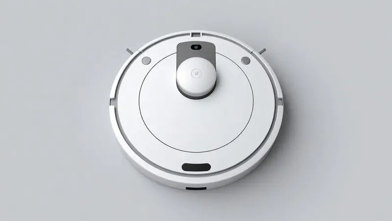
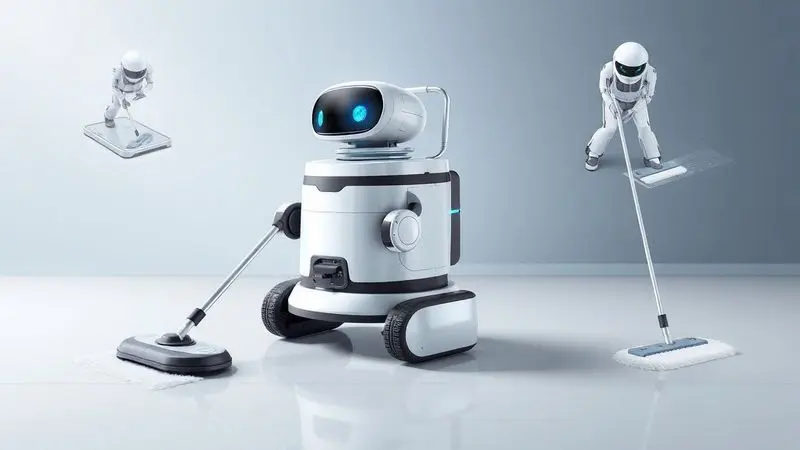
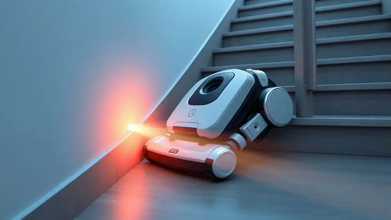
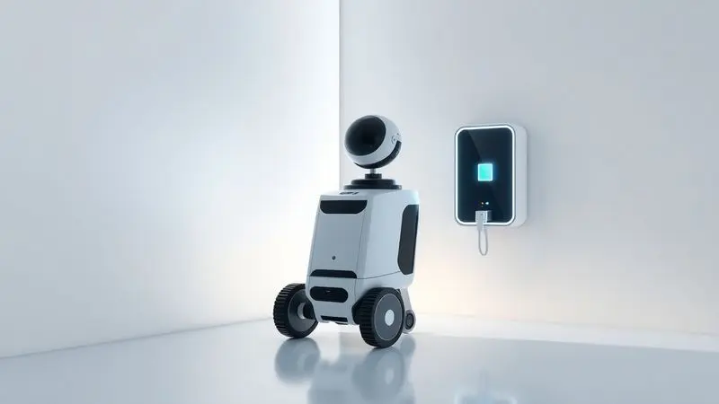

Ter um robô aspirador em casa deixou de ser luxo e se tornou uma necessidade de praticidade no dia a dia.

Entre as diversas opções do mercado, o WAP Robot W90 desponta como um dos modelos de entrada mais populares, prometendo a funcionalidade 3 em 1: varrer, aspirar e passar pano. Mas será que o Wap Robot W90 é bom mesmo ou ele acaba deixando a desejar na limpeza pesada?

Nesta análise completa, testamos os sensores, a autonomia da bateria e o desempenho real deste dispositivo para responder se ele vale o investimento para a sua rotina.

<SummaryList products={frontmatter.top_products} />

## O que é o Wap Robot W90?

Imagine acordar e encontrar o chão da sua casa já limpo, sem que você precise pegar vassoura, aspirador ou pano. É exatamente essa promessa que o Wap Robot W90 traz para o seu dia a dia.

Mais do que um simples robô aspirador, ele representa a possibilidade de automatizar uma das tarefas mais repetitivas da rotina doméstica.

Ao combinar navegação inteligente com sensores que mapeiam seu ambiente, ele percorre diferentes superfícies enquanto você se dedica a coisas mais importantes.

A programação de horários transforma a limpeza em algo que simplesmente acontece, como se você tivesse um funcionário discreto e silencioso cuidando do seu lar.

## Especificações do Wap Robot W90

<ProductBox 
  title={frontmatter.top_products[0].title} 
  image={frontmatter.top_products[0].image} 
  link={frontmatter.top_products[0].link} 
/>

Por dentro daquele design compacto, o W90 esconde uma engenharia pensada para a realidade brasileira. O coração do sistema é um motor de 30W que proporciona sucção suficiente para lidar com a poeira do dia a dia e aqueles farelos que sempre caem da mesa.

Com um reservatório lavável de 250ml, ele consegue trabalhar por cerca de 1h40, tempo que pode chegar a até 2 horas em pisos mais lisos, dependendo da configuração do ambiente.

O segredo está na combinação dos modos de limpeza: aleatória para áreas abertas, em espiral para focar em pontos específicos, e o modo cantos para aqueles lugares que normalmente ficam esquecidos.

A ausência de conectividade com aplicativo ou base de recarga automática não é um defeito, mas uma escolha de design que mantém o produto simples e acessível para quem não quer complicações tecnológicas.

<CaixaProsContras>

**Prós:**

- Funcionalidade 3 em 1 (varre, aspira e passa pano).

- Design compacto que alcança locais difíceis.

- Autonomia de até 1h40 para limpeza eficiente.

- Sensores que evitam quedas e colisões.

**Contras:**

- Não possui conectividade com aplicativo ou controle remoto.

- Sem base de recarga automática; precisa ser ligado diretamente na tomada.

</CaixaProsContras>

## Unboxing e Primeiras Impressões

Ao abrir a caixa, você encontra um robô que parece saído de um filme de ficção científica, mas com uma elegância discreta. A montagem é tão simples que em menos de cinco minutos você já tem o W90 pronto para trabalhar.

As escovas extras incluídas mostram que a marca pensou na durabilidade, e o manual é direto ao ponto, sem aquelas instruções complicadas que ninguém lê.

Ligá-lo pela primeira vez é uma experiência curiosa: ele começa a andar pelo ambiente como um explorador cauteloso, aprendendo os limites do seu território.

O som é tão discreto que você pode continuar conversando ou assistindo TV sem precisar aumentar o volume, um detalhe que faz toda diferença no dia a dia.

## Design do Wap Robot W90

A primeira coisa que chama atenção é como o W90 consegue ser compacto sem parecer frágil. Com apenas 8cm de altura, ele desliza sob a maioria dos móveis como se estivesse feito sob medida para aqueles espaços que você nunca consegue limpar direito.

O preto predominante com detalhes em azul não é apenas estética, cria um contraste que ajuda a localizá-lo rapidamente no ambiente.

Os sensores distribuídos estrategicamente ao redor do corpo parecem pequenos olhos eletrônicos, sempre atentos para evitar que ele se machuque ou machuque seus móveis.

O painel de controle intuitivo dispensa manuais: um toque e ele já sabe o que fazer, como se estivesse sintonizado com sua necessidade de simplicidade.

## Funcionamento do Wap Robot W90: Como ele limpa?

A magia acontece quando você percebe que o W90 não só limpa, mas aprende com o seu ambiente. A navegação inteligente faz com que ele crie um mapa mental dos cômodos, identificando onde estão os obstáculos e quais áreas precisam de mais atenção.

As escovas rotativas trabalham em conjunto com a sucção, criando um efeito de vórtice que levanta a poeira antes de aspirá-la. É como ter um profissional da limpeza que conhece cada cantinho da sua casa, mas sem o custo mensal.

### Modos de limpeza e função 3 em 1

A verdadeira revolução do W90 está na forma como ele transforma três tarefas em uma só sequência natural. Primeiro, as cerdas laterais varrem a sujeira maior para o centro. Em seguida, o sistema de aspiração captura a poeira e partículas menores.

Finalmente, se você adicionar água ao reservatório, o pano úmido completa o serviço com aquela sensação de chão realmente limpo.

A beleza dessa funcionalidade 3 em 1 está na economia de tempo: o que antes exigia três etapas separadas e pelo menos meia hora do seu dia agora acontece enquanto você prepara o jantar ou ajuda as crianças com a lição de casa.

### Sensores de impacto e antiqueda

Você já teve aquela sensação de ansiedade ao deixar um eletrônico trabalhando sozinho? Com os sensores do W90, essa preocupação desaparece. Eles funcionam como um sexto sentido que detecta obstáculos antes mesmo do contato físico.

Quando se aproxima de uma parede, o robô reduz a velocidade e muda suavemente de direção. Ao encontrar um desnível como o topo de uma escada, ele simplesmente para e recua, como se dissesse "aqui não é seguro".

Essa inteligência básica fornece uma tranquilidade valiosa, especialmente para quem tem animais de estimação ou crianças pequenas correndo pela casa.

## Cobertura e Bateria do Wap Robot W90

A autonomia anunciada de 1h40 se traduz na prática como limpeza completa de um apartamento de 70m² com sobra de energia.

Em ambientes maiores, ele tem inteligência suficiente para retornar à tomada quando a bateria atinge 20%, garantindo que nunca fique preso no meio do caminho.

A transição entre diferentes tipos de piso é quase imperceptível: ele ajusta a potência automaticamente ao sair do piso frio para o carpete, mantendo a eficiência sem sacrificar a bateria.

Para quem vive em espaços com múltiplos níveis, vale o ritual simples de levá-lo de um andar para outro, já que ele reconhece rapidamente o novo ambiente e começa o trabalho onde parou no anterior.

## Recursos e Acessórios inclusos

Além do robô em si, a caixa traz tudo que você precisa para começar imediatamente. O filtro HEPA é o herói invisível para quem sofre com alergias, capturando 99,97% das partículas que normalmente ficariam suspensas no ar depois da limpeza tradicional.

As escovas laterais extras não são apenas peças de reposição, mas ferramentas especializadas para diferentes tipos de sujeira: uma mais rígida para carpetes, outra mais macia para pisos de madeira.

O controle remoto permite um direcionamento preciso quando você quer que ele limpe aquele café derramado debaixo da mesa sem ter que programar toda a rotina.

## Preço do Wap Robot W90 e Custo-benefício

Quando você para para calcular quanto tempo gasta por mês varrendo, aspirando e passando pano, o investimento no W90 deixa de ser gasto e vira economia.

Considerando que ele pode trabalhar todos os dias sem cansaço, o custo por limpeza cai drasticamente após os primeiros meses.

A verdadeira economia, porém, não está apenas no dinheiro, mas na recaptura do seu tempo mais valioso: aquele que você dedicaria à limpeza pode ser redirecionado para um hobby, para mais tempo com a família, ou simplesmente para descansar depois de um dia cansativo.

A durabilidade das peças e a simplicidade da manutenção garantem que esse retorno continue por anos.

## Conclusão

O Wap Robot W90 não é sobre substituir completamente a limpeza manual, mas sobre transformar sua relação com ela.

Ele assume a parte repetitiva e cansativa do processo, aquela que consome tempo mas não traz satisfação, liberando você para focar nas limpezas que realmente importam ou simplesmente para viver mais.

A ausência de conectividade com aplicativo, que poderia parecer uma limitação, na verdade se revela uma virtude em um mundo já saturado de telas e notificações.

Para quem busca praticidade sem complicação, autonomia sem abrir mão do controle, e eficiência sem custo exorbitante, o W90 representa um equilíbrio raro no mercado de robôs aspiradores.

Ele não promete milagres, mas cumpre o essencial com uma consistência que transforma a limpeza de uma obrigação diária em um simples hábito que acontece nos bastidores da sua vida.

---

Ainda em dúvida sobre o Wap Robot W90? Confira nosso ranking com os [Melhores Robôs Aspiradores Wap de 2025](/robo-aspirador-wap-qual-o-melhor/) e encontre o ideal para sua casa.
