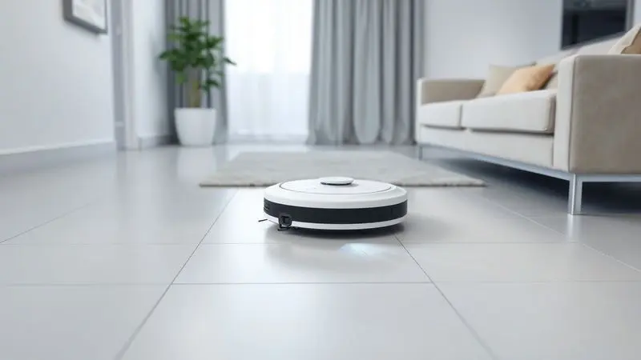
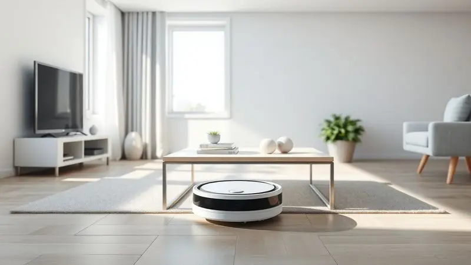
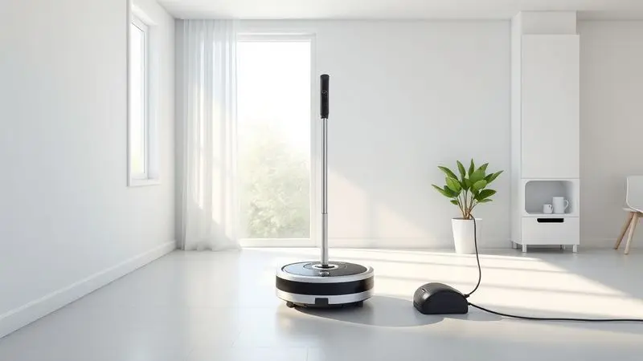
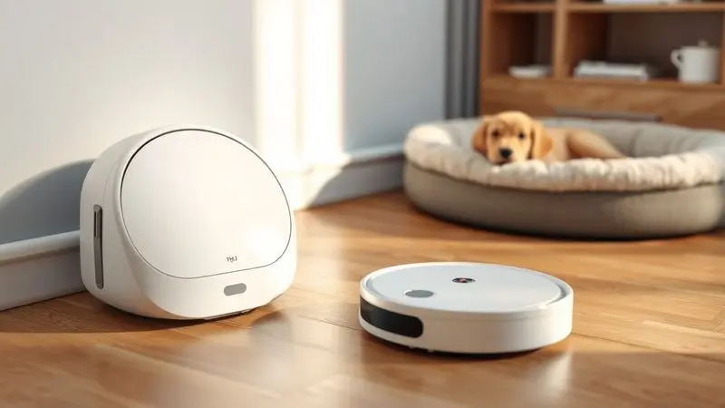

Manter a casa limpa pode ser um desafio diário, e o Robô Aspirador WAP W96 surge como uma promessa de praticidade e eficiência para quem busca automatizar a faxina. Mas será que ele realmente cumpre o que promete?

Com tantos modelos de entrada no mercado, entender se o WAP W96 é bom e se vale o investimento é fundamental antes de fechar a compra.

Nesta análise completa, mergulhamos nas especificações técnicas, funcionalidades de limpeza e autonomia de bateria deste robô aspirador para trazer um veredito sincero sobre sua performance real no dia a dia.

<SummaryList products={frontmatter.top_products} />

## Robô Aspirador WAP W96

<ProductBox 
  title={frontmatter.top_products[0].title} 
  image={frontmatter.top_products[0].image} 
  link={frontmatter.top_products[0].link} 
/>

Imagine acordar e já encontrar sua sala limpa, sem que você tenha precisado sequer erguer um dedo. É essa a sensação que o WAP W96 tenta proporcionar.

Mais do que um aparelho, ele se apresenta como um ajudante silencioso que opera por até 2 horas ininterruptas, alternando entre três estratégias de limpeza conforme o ambiente exige: varredura em cantos, movimento aleatório e concentrado em espiral para áreas mais sujas.

A grande vantagem desse design inteligente está justamente na adaptabilidade.

Se você tem animais de estimação, vai apreciar como as escovas giratórias laterais e o MOP de microfibra trabalham em conjunto para capturar pelos que, de outra forma, ficariam espalhados por todos os cantos.

O reservatório de 250ml, embora compacto, facilita a limpeza pós-operacional, mantendo a manutenção livre de complicações.

Sim, com apenas 7,5 centímetros de altura, ele é o tipo de companheiro que passa por baixo da maioria dos móveis da sua casa. Isso significa alcançar aqueles espaços embaixo da cama ou do sofá que raramente vêem um aspirador tradicional. A contrapartida?

Algumas estruturas muito baixas podem bloqueá-lo, mas essa é uma compensação que vale a pena pela cobertura abrangente que ele oferece.

<CaixaProsContras>

**Prós:**

- Boa autonomia de até 2 horas.

- Três modos de limpeza versáteis.

- Eficaz na remoção de pelos, ideal para quem tem pets.

- Design compacto que alcança lugares difíceis.

**Contras:**

- Pode ter limitações em espaços extremamente baixos.

- O reservatório poderia ser maior para intervalos de limpeza mais longos.

</CaixaProsContras>

### Características Técnicas

O que realmente diferencia o W96 não são apenas números em uma ficha técnica, mas como essa tecnologia se traduz em tranquilidade para você.

A potência de sucção foi pensada para não apenas aspirar, mas garantir que cada superfície, do carpete mais espesso ao piso de madeira mais delicado, receba o tratamento adequado.

Quando você ouve falar em sensores de obstáculos, pense na segurança de saber que seu robô não vai despencar escada abaixo ou se chocar contra seus móveis favoritos.

E sim, a bateria é de longa duração, mas o verdadeiro benefício vai além do tempo: é sobre conseguir programar uma limpeza completa enquanto você está no trabalho, confiante de que quando voltar, encontrará uma casa revitalizada.

A operação silenciosa completa esse pacote, permitindo que o W96 trabalhe até mesmo durante o sono das crianças ou o descanso dos seus pets, sem perturbar a paz do lar.

## Funcionalidades e Modos de Limpeza

Você já parou para pensar como seria ter um assistente pessoal para cada tipo de sujeira? O W96 se aproxima dessa ideia ao oferecer não apenas múltiplas funções, mas inteligência para saber quando usar cada uma delas.

### Modos de Limpeza Disponíveis

A flexibilidade começa com a limpeza programada: imagine definir que toda segunda, quarta e sexta-feira, às 10h da manhã, sua sala será aspirada automaticamente.

Para aquela área específica onde as crianças sempre derrubam migalhas, o modo espiral entra em ação, concentrando o esforço exatamente onde mais importa.

Já o modo automático é para quando você prefere delegar completamente a decisão, permitindo que o robô detecte a sujeira e ajuste sua potência em tempo real. É como ter um especialista em limpeza que conhece sua casa melhor do que você mesmo.

### Autonomia de Bateria

Dois horas podem parecer pouco, até você considerar que essa é a duração média de um filme, uma reunião importante ou uma boa sessão de exercícios.

Enquanto você se dedica ao que realmente importa, o W96 percorre seus ambientes, cobrindo desde apartamentos compactos até casas de tamanho médio.

Em residências com pets, essa autonomia ganha ainda mais valor: enquanto seu cachorro dorme tranquilamente no sofá, o robô trabalha para remover os pelos que inevitavelmente se acumulam.

A duração varia conforme a dificuldade da tarefa, mas sempre com inteligência suficiente para retornar à base antes que a energia acabe, evitando que você precise resgatá-lo no meio da sala.

## Usabilidade e Experiência do Usuário

A melhor tecnologia é aquela que se torna invisível, integrando-se tão naturalmente à sua rotina que você quase esquece que ela existe. É exatamente nisso que o W96 se concentra: tornar a limpeza automática uma experiência tão simples que parece mágica.

### Facilidade de Configuração e Uso

Tirar o robô da caixa e colocá-lo para trabalhar leva menos tempo do que preparar uma xícara de café.

O aplicativo móvel guia você passo a passo, mas a verdadeira magia acontece quando você percebe que, depois da configuração inicial, quase nunca precisará interagir com ele novamente.

Programar limpezas se torna uma questão de alguns toques na tela do celular, enquanto os sensores fazem o mapeamento automático dos ambientes. A cereja do bolo?

Quando termina o trabalho ou a bateria está baixa, ele simplesmente volta sozinho para a base de carregamento, como um animal de estimação bem treinado.

### Manutenção e Limpeza

Manter o W96 em perfeito funcionamento exige menos esforço do que limpar um aspirador tradicional vassoura. Após cada ciclo de limpeza, basta esvaziar o compartimento de resíduos e, ocasionalmente, passar um pano úmido na carcaça externa.

Os filtros e escovas, projetados para fácil acesso, permitem uma limpeza rápida que impede o acúmulo de poeira e pelos. Essa simplicidade não apenas prolonga a vida útil do equipamento, mas também garante que a eficiência permaneça intacta mês após mês, ano após ano.

### Assistência Técnica e Garantia

Investir em um robô aspirador é uma decisão de longo prazo, e é reconfortante saber que o W96 vem protegido por uma garantia que cobre defeitos de fabricação.

A marca oferece suporte técnico acessível, garantindo que eventuais problemas possam ser resolvidos sem grandes transtornos.

Antes da compra, vale conferir os detalhes específicos da cobertura na sua região, mas a estrutura de apoio geralmente proporciona a tranquilidade necessária para você focar no que realmente importa: aproveitar uma casa mais limpa com menos esforço.

## Análise de Custo-Benefício

Quando você considera adquirir um W96, está comprando muito mais do que um eletrodoméstico: está investindo em tempo livre, em menos estresse e em uma rotina doméstica mais leve.

Sim, o investimento inicial é maior do que um aspirador comum, mas como colocar preço nas horas que você recupera?

A navegação inteligente significa que cada sessão de limpeza é eficiente, cobrindo todos os cantos sem repetições desnecessárias. A facilidade de manutenção reduz custos futuros, enquanto a durabilidade garante que esse seja um companheiro por anos.

Para famílias com animais de estimação, crianças ou simplesmente vidas agitadas, o retorno vai além do financeiro: é sobre qualidade de vida, sobre chegar em casa e encontrar um ambiente acolhedor e limpo, sem que isso tenha exigido seu suor.

## Conclusão

O Robô Aspirador WAP W96 não é perfeito, mas representa uma das melhores opções de entrada no universo da automação doméstica. Ele equilibra inteligência com simplicidade, oferecendo funcionalidades avançadas sem complicar a experiência do usuário.

Para quem está começando a jornada rumo a uma casa mais automatizada, ou para quem busca um assistente confiável para a limpeza diária, o W96 cumpre sua promessa com competência.

Aqueles que têm animais de estimação encontrarão nele um aliado especialmente valioso, enquanto qualquer pessoa que valorize seu tempo apreciará a liberdade que ele proporciona.

Lembre-se apenas de considerar o layout da sua casa e suas necessidades específicas antes da decisão final. Se o que você busca é praticidade sem abrir mão da eficiência, esse robô pode muito bem ser o próximo membro da sua família.

## Perguntas Frequentes (FAQ)

### Qual a diferença entre os modelos WAP W96 e W100?

Enquanto o W96 é o parceiro compacto ideal para apartamentos e espaços menores, o W100 é o irmão mais potente e ambicioso.

A diferença principal está na capacidade de sucção e no sistema de navegação: o W100 possui tecnologia mais avançada para mapear e cobrir áreas maiores com precisão cirúrgica.

Se sua casa tem vários cômodos amplos ou você simplesmente quer a máxima potência disponível, o W100 pode ser o investimento certo. Caso contrário, o W96 oferece uma excelente relação custo-benefício para necessidades mais modestas.

### Quais são os principais recursos do Robô Aspirador WAP W96 30W?

A versão 30W do W96 eleva o jogo com uma sucção 30% mais potente que os modelos convencionais. Isso se traduz em capacidade de remover sujeiras mais incrustadas e uma limpeza mais rápida e eficiente.

O sistema de navegação inteligente mapeia cada canto do ambiente, garantindo que nenhuma área fique esquecida.

Combinado com a programação de horários flexível, você tem nas mãos uma ferramenta que praticamente antecipa suas necessidades, limpando antes mesmo que você perceba que a sujeira se acumulou.

### Como é o desempenho do Robô Aspirador WAP W96 30W na limpeza de pelos de animais?

Para tutores de pets, o W96 30W é como ter um especialista em pelos trabalhando em tempo integral. As escovas específicas foram projetadas para penetrar nos tecidos mais densos e alcançar os cantos preferidos dos animais para descansar.

A potência extra de 30W garante que não apenas os pelos soltos sejam capturados, mas também aqueles que já começaram a se entrelaçar nas fibras do carpete.

Ele não elimina completamente a necessidade de aspirações manuais ocasionais, mas reduz drasticamente a frequência, transformando uma tarefa diária em uma preocupação semanal.

### Existem reclamações frequentes sobre o Robô Aspirador WAP W96 no Reclame Aqui?

Como qualquer produto, o W96 tem seus pontos de atenção. Alguns usuários relatam desafios no suporte técnico, especialmente para questões específicas.

Outros mencionam que, em ambientes excepcionalmente bagunçados ou com muitos obstáculos móveis, a eficiência pode diminuir. Questões de durabilidade da bateria também aparecem, embora sejam menos frequentes.

No entanto, é importante notar que essas experiências representam uma minoria: a grande maioria dos compradores celebra a praticidade e o tempo economizado, considerando o W96 um investimento que transformou positivamente sua rotina doméstica.

---

Ainda na dúvida sobre o WAP W96? Confira nosso [ranking dos Melhores Robôs Aspiradores WAP de 2025](/robo-aspirador-wap-qual-o-melhor/) para encontrar o ideal para sua casa.
