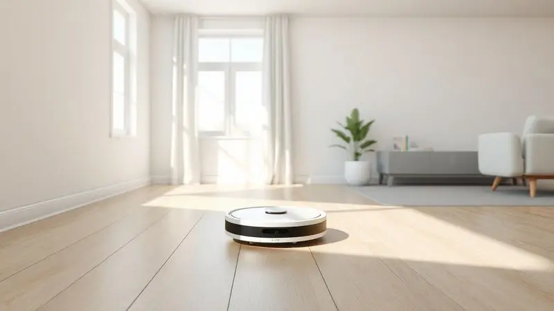
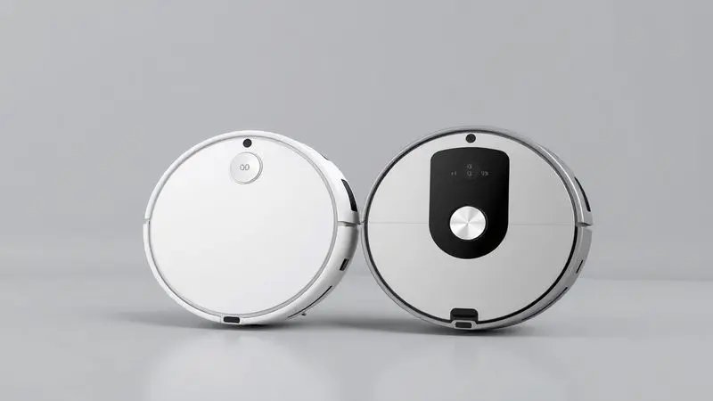

A busca por praticidade na limpeza doméstica transformou o robô aspirador em um item essencial nos lares modernos. Entre as diversas opções, o Xiaomi Mi Robot Vacuum-Mop 2C surge como um forte candidato para quem busca tecnologia e eficiência sem gastar uma fortuna.

Mas será que ele é bom mesmo? Com tantas promessas de sucção potente e mapeamento inteligente, é natural ter dúvidas antes de investir.

Nossa análise detalhada vai além da ficha técnica para descobrir como esse robô se comporta na vida real e se ele realmente pode simplificar seus dias.

<SummaryList products={frontmatter.top_products} />

## Vale a pena investir em um robô aspirador Xiaomi?

Para quem está cansado da rotina de vassoura e pano, a resposta tende a ser sim. A Xiaomi construiu uma reputação por oferecer tecnologia avançada a preços acessíveis, e seus robôs aspiradores seguem essa filosofia.

Eles trazem a promessa concreta de tempo de volta: horas que você gastaria limpando podem ser dedicadas ao lazer, trabalho ou família.

A chave está em escolher o modelo que dialoga com suas necessidades específicas, como o tamanho da sua casa, o tipo de piso e a convivência com animais de estimação. É aí que uma análise criteriosa faz toda a diferença.

## Como escolher o melhor modelo para sua casa?

Imagine seu robô como um novo membro da casa. Ele precisa se adaptar ao seu espaço e à sua rotina.

Antes de tudo, pense no tamanho dos ambientes: uma bateria generosa é crucial para apartamentos grandes, enquanto a capacidade de passar sob móveis baixos pode ser decisiva. A potência de sucção define se ele dará conta dos pelos do seu pet ou do pó acumulado no canto.

E a conexão com um aplicativo não é apenas um detalhe técnico, é a liberdade de programar a limpeza para quando você não está ou de comandar tudo pelo celular. Com esses critérios em mente, vamos dissecar o Mi Robot Vacuum-Mop 2C para ver como ele se sai.

## Análise Completa: Robô aspirador Xiaomi Mi Robot Vacuum-Mop 2C

<ProductBox 
  title={frontmatter.top_products[0].title} 
  image={frontmatter.top_products[0].image} 
  link={frontmatter.top_products[0].link} 
/>

O coração desse robô é sua navegação visual dinâmica. Em vez de andar aleatoriamente, ele usa uma câmera para enxergar o ambiente, mapear cada cômodo e traçar rotas lógicas, como se tivesse um plano.

Um processador quad-core e a tecnologia VSLAM garantem que ele saiba exatamente onde está a cada segundo, o que se traduz em uma limpeza metódica, sem repetir áreas desnecessariamente ou deixar cantos para trás.

A sucção de 2200 Pa é forte o suficiente para levantar a sujeira embutida e prender pelos de animais.

A grande surpresa é o tanque de água com controle eletrônico. Você escolhe entre três níveis de umidade para o pano de piso, adaptando a lavagem para um laminado delicado ou um porcelanato que precisa de mais vigor.

Com até 110 minutos de bateria, ele promete cobrir boa parte de uma casa média sem precisar recarregar no meio do serviço. Tudo isso é gerenciado por um aplicativo intuitivo.

É verdade que ele não tem algumas funções de modelos premium, mas cumpre sua missão essencial com competência: manter seus pisos limpos enquanto você vive sua vida.

<CaixaProsContras>

**Prós:**

- Navegação precisa com tecnologia VSLAM.

- Potência de sucção alta (2200 Pa).

- Controle via aplicativo para agendamento fácil.

- Tanque de água com controle de umidade em três níveis.

**Contras:**

- Não possui recursos avançados como outros modelos premium.

- Autonomia pode ser limitada em casas maiores.

</CaixaProsContras>

### 1. Ficha técnica do Xiaomi Mi Robot 2C

Os números contam uma história de versatilidade. Este é um robô híbrido, feito para aspirar e passar pano em uma única passagem. Seu motor gera uma força de sucção de 2500 Pa, capaz de capturar desde migalhas até fios de cabelo mais teimosos.

O sistema de navegação inteligente é o cérebro que orquestra esse trabalho, e a bateria de íon-lítio sustenta até 110 minutos de operação contínua. Em resumo, a ficha técnica promete um ajudante robusto para a faxina do dia a dia.

### 2. Xiaomi Mi Robot 2C: veja o design

A primeira impressão é de discrição elegante. Com linhas arredondadas e um acabamento em tons neutros, ele se camufla facilmente em qualquer decoração, sem chamar atenção indesejada.

Seu formato circular e baixa altura (apenas 9,6 cm) são projetos funcionais: permitem que ele deslize sob sofás, camas e armários, atingindo justamente aqueles locais esquecidos onde o pó adora se acumular.

O painel superior mantém a simplicidade, com um único botão para iniciar uma limpeza rápida. É um design que prioriza a eficiência silenciosa.

### 3. Funcionamento do Xiaomi Mi Robot 2C

A mágica acontece quando você aperta o botão ou programa pelo app. Sensores espalhados por seu corpo fazem o robô "enxergar" obstáculos, desviar de móveis e detectar degraus para evitar quedas.

Enquanto a escova central e a sucção potente removem a sujeira seca, um pano úmido acoplado na traseira dá o acabamento, arrastando a poeira residual e deixando um brilho leve. A sincronia entre aspiração e lavagem é contínua.

E o melhor: você pode estar no trabalho e acompanhar pelo smartphone onde ele já limpou, ou pedir para ele começar quando sair de casa.

### 4. Xiaomi Mi Robot 2C: cobertura e bateria

A combinação entre bateria e inteligência define o território que ele consegue dominar. Com sua autonomia de 110 minutos, ele é capaz de limpar, em média, um espaço de até 240 metros quadrados em uma única carga.

O sistema de navegação não só evita obstáculos, mas também cria um mapa mental eficiente, garantindo que cada metro seja coberto sem desperdício de energia.

Para a maioria dos apartamentos e casas de tamanho médio, isso significa que você pode programar uma limpeza completa sem se preocupar com ele parando no corredor.

### 5. Recursos e acessórios do Xiaomi Mi Robot 2C

A caixa traz tudo que você precisa para começar: além do robô em si, vem um pano de microfibra reutilizável para a função mop, um pincel de limpeza para manter as escovas livres de fios, e um carregador.

O grande recurso embutido é o mapeamento baseado em visão (VSLAM), que substitui o laser mais caro de modelos topo de linha. Sensores anti-queda e anti-colisão são seus olhos, garantindo que ele não tombe de escadas nem bata com força nos móveis.

É um pacote completo para quem quer funcionalidade sem complexidade.

### 6. Aplicativo e conectividade do Xiaomi Mi Robot 2C

É aqui que a conveniência vira realidade. O aplicativo Mi Home transforma seu smartphone em um controle remoto poderoso.

Nele, você desenha zonas virtuais para onde o robô não deve ir (como perto do potinho de água do pet), cria horários fixos de limpeza (todos os dias às 10h, por exemplo) e escolhe entre modos de sucção mais forte ou mais silencioso.

A integração com Alexa e Google Assistant acrescenta uma camada de magia: basta dizer "Alexa, ligar o robô aspirador" e ele começa a trabalhar. É automação doméstica acessível.

## Comparativo: Outros modelos de robô aspirador Xiaomi que valem a pena

Se o 2C não parecer a combinação perfeita para suas necessidades, a boa notícia é que a Xiaomi tem um ecossistema variado.

Cada modelo atende a um perfil diferente: alguns focam em poder bruto de sucção, outros em navegação laser impecável, e há os que incluem estações de auto-limpeza. Conhecer essas alternativas é a garantia de encontrar o robô que vai se tornar seu verdadeiro aliado.

### 1. Xiaomi Vacuum E10

<ProductBox 
  title={frontmatter.top_products[1].title} 
  image={frontmatter.top_products[1].image} 
  link={frontmatter.top_products[1].link} 
/>

Pense no E10 como o especialista em espaços apertados. Com apenas 8 cm de altura, ele passa como uma sombra sob móveis baixos onde outros robôs nem tentam entrar.

Sua arma secreta é uma sucção de 4000 Pa, quase o dobro da do 2C, tornando-o um aspirador poderoso para quem sofre com muita poeira ou pelos. A bateria de 2600 mAh mantém ele funcionando por até 110 minutos. O ponto de atenção?

Tapetes grossos ou fios soltos podem atrapalhar seu caminho, então ambientes muito desarrumados exigem uma preparação prévia.

<CaixaProsContras>

**Prós:**

- Potência de sucção de até 4000 Pa.

- Design ultrafino que passa sob móveis.

- Controle remoto pelo aplicativo Xiaomi Home.

- Autonomia de até 110 minutos.

**Contras:**

- Dificuldade com tapetes mais espessos.

- Pode não limpar tão eficazmente em pisos muito texturizados.

</CaixaProsContras>

### 2. Xiaomi Vacuum S10

<ProductBox 
  title={frontmatter.top_products[2].title} 
  image={frontmatter.top_products[2].image} 
  link={frontmatter.top_products[2].link} 
/>

Para quem prioriza precisão milimétrica, o S10 entra em cena com sua navegação a laser LDS. Esse sistema cria mapas extremamente detalhados da sua casa, permitindo que você delimite cômodos específicos no app e peça para o robô limpar apenas a cozinha, por exemplo.

A sucção de 4000 Pa é igualmente robusta, e a função mop oferece três níveis precisos de umidade. A autonomia sobe para 130 minutos, ideal para residências maiores.

A contrapartida é um reservatório de água um pouco modesto, que pode exigir reabastecimento em limpezas extensas de piso molhado.

<CaixaProsContras>

**Prós:**

- Potência de sucção forte (4000 Pa) para uma limpeza eficiente.

- Navegação a laser para evitar obstáculos e mapear o ambiente.

- Função mopa com controle de água para diferentes superfícies.

- Controle remoto via aplicativo com funcionalidades avançadas.

**Contras:**

- Reservatório de água pequeno em comparação com outros modelos.

- Desempenho limitado em casas muito grandes.

</CaixaProsContras>

### 3. Xiaomi Robot Vacuum X20 Max

<ProductBox 
  title={frontmatter.top_products[3].title} 
  image={frontmatter.top_products[3].image} 
  link={frontmatter.top_products[3].link} 
/>

Este é o modelo que mais se aproxima do conceito "esqueça a limpeza". Com uma sucção avassaladora de 8000 Pa e pads de lavagem giratórios que esfregam ativamente o chão, ele lida com sujeira pesada.

Sua estação multifuncional é o grande diferencial: ela lava automaticamente os panos sujos, seca-os e ainda esvazia o pó do reservatório, permitindo semanas de operação totalmente autônoma. A navegação por laser e luz estruturada é de última geração.

O preço reflete esse pacote premium, e a detecção de obstáculos, apesar de boa, pode ter lapsos em ambientes muito cheios de objetos pequenos no chão.

<CaixaProsContras>

**Prós:**

- Potência de sucção elevada.

- Sistema de mop avançado com pads giratórios.

- Estação multifuncional com lavagem automática.

- Boa autonomia de bateria.

**Contras:**

- Desempenho da detecção de obstáculos pode ser inconsistente.

- Posicionado como uma opção de gama média-alta.

</CaixaProsContras>

## Principal concorrente do Xiaomi Mi Robot 2C

No radar de qualquer comprador, o Roborock S6 é um nome que sempre aparece.

Tecnicamente, é um primo mais sofisticado: sua navegação a laser e mapeamento em tempo real são considerados um padrão ouro, oferecendo uma eficiência ligeiramente superior em ambientes com muitos móveis. A sucção também costuma ser mais potente.

No entanto, essa excelência tem um preço. O Mi Robot 2C se posiciona como a alternativa inteligente para quem quer 80% do desempenho do Roborock por uma fração significativa do custo.

É a essência do custo-benefício: renunciar a alguns refinamentos para ter um assistente de limpeza que funciona muito bem pelo investimento.

## Perguntas Frequentes (FAQ) sobre o Xiaomi 2C

Ele limpa todos os tipos de piso? Sim, de madeira e laminado a porcelanato e cerâmica. O controle da umidade do mop permite ajustar para cada superfície. Preciso ficar em casa para ele funcionar? De forma alguma.

A graça está justamente em programar pelo app para ele limpar enquanto você está no trabalho ou fazendo compras. A bateria dá conta da minha casa? Com 110 minutos e navegação eficiente, ele cobre até 240 m². Para a maioria dos lares, é suficiente.

Casas muito maiores podem exigir que ele retorne à base para recarregar e depois retome. E com animais de estimação? A sucção de 2200/2500 Pa é adequada para pelos de cães e gatos. O pano também ajuda a remover as pegadinhas que ficam no chão. O aplicativo é complicado?

Pelo contrário. A interface do Mi Home é intuitiva e em português, tornando o agendamento e controle muito simples.

## Conclusão

O Xiaomi Mi Robot Vacuum-Mop 2C cumpre brilhantemente sua proposta: é a porta de entrada acessível para o mundo da automação residencial em limpeza.

Ele não é o robô mais poderoso nem o mais inteligente do mercado, mas entrega exatamente o que promete: uma limpeza consistente e prática, que tira um peso enorme das suas costas.

A combinação de aspiração decente, lavagem de piso ajustável e um aplicativo que realmente facilita a vida cria uma experiência gratificante.

Se você busca um aliado confiável para manter a ordem sem complicação e sem estourar o orçamento, o 2C é uma escolha difícil de errar. Ele transforma uma tarefa tediosa em um processo silencioso e automático, devolvendo a você um tempo precioso.

No final das contas, é justamente isso que você está comprando: mais vida para viver.

---

Ainda em dúvida sobre qual Xiaomi escolher? Confira nosso [ranking dos Melhores Robôs Aspiradores Xiaomi de 2025](/melhor-robo-aspirador-xiaomi/).
