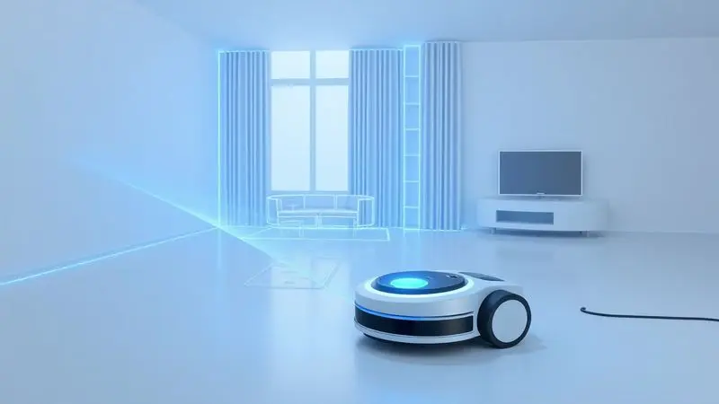
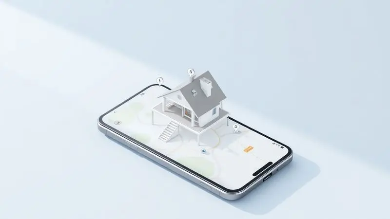
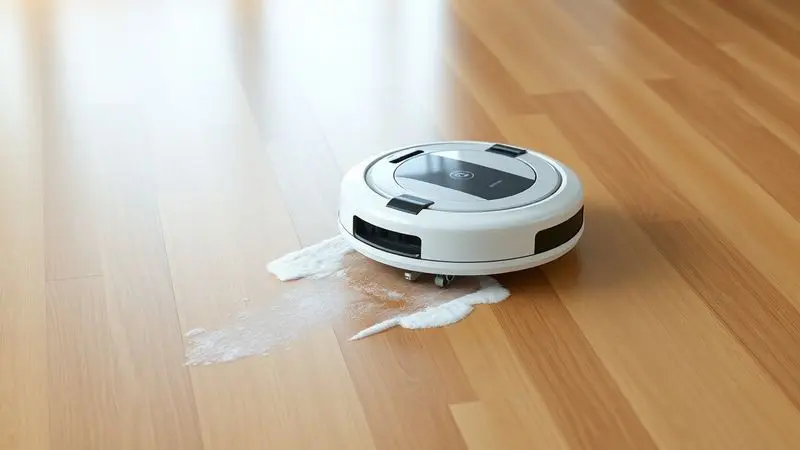
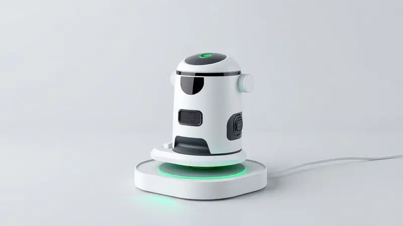

Imagine acordar com a casa limpa sem ter levantado um dedo. É essa promessa de liberdade que robôs aspiradores como o Xiaomi S10 trazem para o dia a dia. Mas será que esse modelo intermediário premium realmente entrega inteligência e eficiência sem complicações?

Vamos além das especificações técnicas para descobrir como ele se comporta na rotina real de uma família.

<SummaryList products={frontmatter.top_products} />

## Ficha técnica do Robô Aspirador Xiaomi S10

<ProductBox 
  title={frontmatter.top_products[0].title} 
  image={frontmatter.top_products[0].image} 
  link={frontmatter.top_products[0].link} 
/>

À primeira vista, o S10 impressiona com números robustos: 4000 Pa de força de sucção que removem até os grãos de areia mais persistentes, autonomia de até 130 minutos (tempo suficiente para limpar um apartamento de 100m² sem interrupções) e um sistema de navegação a laser que parece saído de um filme de ficção científica.

Com 35 cm de diâmetro e menos de 10 cm de altura, ele desliza sob a maioria dos móveis, alcançando aqueles cantos que sempre adiamos para limpar.

O controle acontece principalmente pelo aplicativo Mi Home, que transforma seu smartphone em um centro de comando completo. Programe horários, defina zonas proibidas ou simplesmente peça para ele aspirar a sala enquanto você está no trabalho.

A configuração inicial pode demandar alguns minutos de paciência, mas é um investimento único que se paga em praticidade diária.

<CaixaProsContras>

**Prós:**

- Potência de sucção de 4000 Pa, ideal para várias superfícies

- Navegação a laser com suporte a múltiplos mapas

- Controle via aplicativo Mi Home, facilitando o gerenciamento

- Autonomia de até 130 minutos, adequada para grandes áreas

**Contras:**

- Configuração inicial pode ser complexa para alguns usuários

- O peso pode ser um pouco elevado comparado a outros modelos

</CaixaProsContras>

## Design e Acabamento

O S10 chega com aquele visual minimalista que a Xiaomi domina tão bem. Branco puro, linhas arredondadas e um tamanho compacto que faz com que ele quase desapareça no ambiente quando não está trabalhando.

Mas a beleza vai além da estética: esse design funcional permite que ele acesse espaços de até 9,5 cm de altura, alcançando embaixo de camas e sofás onde a poeira adora se acumular.

A superfície lisa de plástico resistente também é fácil de limpar, com um simples pano úmido.

## Reservatório e Filtros

Aqui está um detalhe que faz diferença na rotina: o reservatório de 0,6 litros significa que você não precisará esvaziá-lo após cada uso, mesmo em casas com animais de estimação. Para famílias alérgicas, o sistema de filtragem em três estágios é um trunfo silencioso.

Ele captura 99% das partículas finas, desde pólen até ácaros, devolvendo apenas ar limpo ao ambiente. A manutenção é simples, com filtros laváveis que economizam na compra de reposições frequentes.

## Sensores e Tecnologia de Mapeamento LDS

É aqui que a mágica acontece. O sensor a laser LDS gira 360 vezes por segundo, criando um mapa preciso da sua casa em tempo real.

Em vez de bater aleatoriamente nos móveis como robôs mais básicos, o S10 traça rotas inteligentes em padrão zigue-zague, cobrindo cada centímetro sem repetições desnecessárias. O resultado?

Uma limpeza 30% mais rápida e completa, com a curiosa sensação de que o robô conhece sua casa melhor que você.

## Aplicativo Xiaomi Home e Configurações de Limpeza

Se os sensores são o cérebro do S10, o aplicativo é sua extensão nas suas mãos. A primeira sensação é de controle total: você vê em tempo real onde o robô está, quais áreas já limpou e quanto tempo falta. Mas as funções mais inteligentes surgem depois.

### Parede Virtual e Áreas Restritas

Tem aquele tapete persa delicado ou o cantinho onde as crianças deixam os brinquedos? Com dois toques no aplicativo, você desenha paredes invisíveis que o S10 respeita religiosamente.

Pode também criar zonas de limpeza intensiva, pedindo para ele passar três vezes na cozinha após o jantar, por exemplo. É personalização que transforma um eletrodoméstico genérico em seu assistente pessoal de limpeza.

### Limpeza Programada e Histórico de Uso

A verdadeira liberdade vem com a programação. Configure para o S10 limpar a sala às 10h da manhã, quando ninguém está em casa, ou o quarto às 14h, depois que as crianças vão para a escola.

O histórico mantém um registro de todas as limpezas, mostrando padrões e ajudando a ajustar a frequência para cada ambiente. Esqueça completamente da tarefa, enquanto sua casa se mantém impecável no piloto automático.

## Eficiência de Limpeza em Pisos Rígidos e Tapetes

Na prática, é aqui que o S10 mais surpreende. Em pisos de cerâmica ou madeira, ele varre tudo: migalhas, pelos, poeira fina.

Mas o verdadeiro teste são os tapetes médios, onde seu sensor de carpete automaticamente aumenta a potência para 4000 Pa, sugando a sujeira incrustada que vassouras comuns deixam para trás.

A transição entre superfícies é tão suave que você nem percebe quando ele sai do laminado para o tapete da sala.

## Função de Passar Pano (Mop)

Para uma limpeza realmente completa, o acessório de pano úmido converte o S10 em um lavador de pisos automático. O tanque de água de 250ml permite regular a umidade, evitando que pisos de madeira fiquem encharcados.

Ele segue o mesmo mapeamento inteligente da aspiração, passando sistematicamente por toda a área.

Não substitui uma lavagem manual profunda, mas remove manchas de café, marcas de sapatos e aquela poeira que gruda no piso, mantendo a casa com aspecto de 'limpeza de fim de semana' durante a semana toda.

## Bateria e Autonomia de Carregamento

Os 130 minutos de autonomia não são apenas números no papel. Eles significam que o S10 limpa um apartamento de três quartos completamente antes de precisar recarregar.

Quando a bateria atinge 15%, ele interrompe a limpeza, volta sozinho para a base, se recarrega e, se necessário, retoma exatamente de onde parou. Você pode sair para trabalhar com a casa bagunçada e voltar encontrando tudo limpo, sem precisar recarregar manualmente.

## Pressão de Sucção e Ruído Sonoro

Os 4000 Pa fazem diferença auditiva e prática. Na potência máxima, você ouve um zumbido consistente, similar a um aspirador de pó convencional na potência média, mas a inteligência do S10 raramente exige esse nível.

No modo silencioso (para limpezas noturnas ou quando há pessoas trabalhando em casa), ele opera com um ruído suave de fundo, menor que uma conversa normal. A beleza está no equilíbrio: potência quando necessário, discrição no dia a dia.

## Manutenção e Disponibilidade de Peças de Reposição

Após anos de uso, a facilidade de manutenção se torna crucial. O S10 foi projetado para desmontagem simples: o compartimento de poeira abre com um botão, as rodas laterais saem sem ferramentas, e os filtros são laváveis.

Peças de reposição, como escovas laterais e filtros HEPA, são amplamente disponíveis tanto na rede autorizada Xiaomi quanto em marketplaces online a preços acessíveis. É um robô feito para durar, não para ser descartado após o primeiro problema.

## Para qual tipo de usuário o Xiaomi S10 é indicado?

Perfeito para quem valoriza tempo mais do que dinheiro.

Famílias com crianças pequenas que espalham migalhas diariamente, donos de pets que lutam contra pelos constantes, profissionais home office que precisam de silêncio durante reuniões, ou qualquer pessoa cansada de gastar finais de semana com vassoura e pano.

Não é o modelo mais barato, mas oferece a melhor relação entre tecnologia avançada e usabilidade diária na sua faixa de preço.

## O que os compradores falam sobre o robô aspirador?

A comunidade de usuários destaca consistentemente três qualidades: a inteligência de navegação ('ele realmente evita obstáculos'), a potência silenciosa ('sugou coisas que meu aspirador comum deixava') e a liberdade proporcionada ('voltei a ter finais de semana').

A curva de aprendizado do aplicativo é mencionada, mas sempre seguida do comentário 'valeu cada minuto investido'. O consenso é claro: depois de adaptar sua rotina ao S10, voltar à limpeza manual parece retroceder uma década em tecnologia doméstica.

## Conclusão

O Xiaomi Robot Vacuum S10 representa aquele ponto ideal onde tecnologia avançada encontra utilidade prática no dia a dia.

Ele não promete milagres, mas entrega consistentemente o que mais desejamos: uma casa limpa sem esforço, tempo recuperado para o que realmente importa e a tranquilidade de saber que, mesmo nos dias mais corridos, o ambiente estará acolhedor.

Seu investimento se paga não em especificações técnicas, mas nas horas semanais que você deixa de gastar com limpeza, convertidas em momentos com família, hobbies ou simples descanso.

Para quem busca um equilíbrio inteligente entre desempenho, durabilidade e custo, o S10 não é apenas uma compra sensata, é um upgrade na qualidade de vida doméstica.

---

Ainda em dúvida sobre o Xiaomi S10? Confira nosso ranking completo dos [Melhores Robôs Aspiradores Xiaomi de 2025](/melhor-robo-aspirador-xiaomi/) e encontre o ideal para sua casa.
