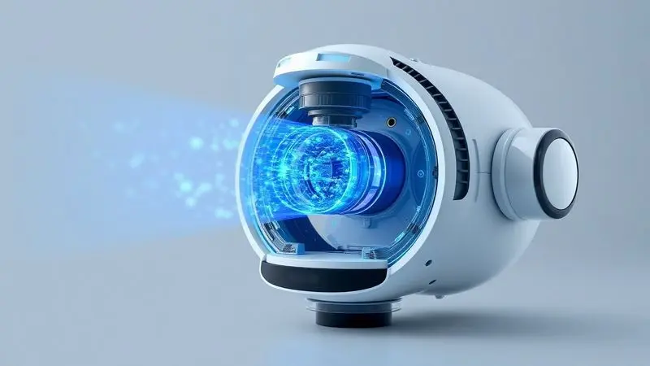
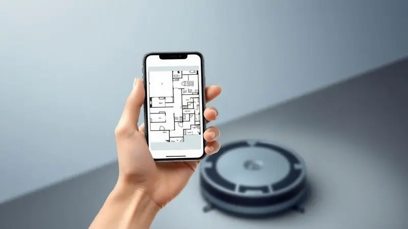
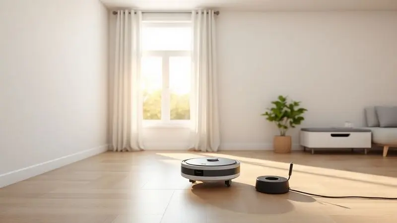

Procurar por um robô aspirador é, no fundo, buscar um pouco mais de liberdade no dia a dia. Menos tempo com a vassoura, mais tempo para você.

No meio desse caminho, o Xiaomi S20 surge como um candidato interessante: não é o mais básico, nem o topo de linha, mas promete entregar inteligência e eficiência sem pesar no bolso.

Será que ele cumpre o que promete e se torna aquele parceiro silencioso que mantém a casa limpa sem estresse? Vamos analisar cada detalhe para descobrir.

<SummaryList products={frontmatter.top_products} />

## Ficha técnica do robô aspirador Xiaomi S20

<ProductBox 
  title={frontmatter.top_products[0].title} 
  image={frontmatter.top_products[0].image} 
  link={frontmatter.top_products[0].link} 
/>

Os números contam uma história promissora. O coração do S20 é um motor com potência de sucção de até 5000Pa, capaz de lidar com a sujeira do dia a dia.

Sua inteligência vem de um sistema de navegação a laser (LDS), que escaneia o ambiente para criar um mapa preciso da sua casa, otimizando cada rota de limpeza. Sensores espalhados pelo corpo ajudam a evitar colisões e quedas.

Na prática, isso significa que ele carrega um reservatório de pó de 400ml e um tanque de água de 270ml para a função mopa, tudo dentro de um corpo compacto de apenas 3,5 kg e 98mm de altura (perfeito para passar sob a maioria dos móveis).

A bateria de 2900mAh garante tempo suficiente para cobrir ambientes médios. O controle fica ainda mais conveniente com suporte a comando de voz via Alexa ou Google Assistente e integração completa com o app Xiaomi Home.

Vale ficar atento apenas a pequenas variações de especificação entre algumas versões do modelo.

<CaixaProsContras>

**Prós:**

- Potência de sucção elevada (5000Pa).

- Navegação inteligente com mapeamento a laser.

- Controle por voz com assistentes virtuais.

- Capacidade de operar em ambientes escuros.

**Contras:**

- A bateria poderia ter mais autonomia para limpezas maiores.

- Algumas versões variam em especificações, o que pode causar confusão.

</CaixaProsContras>

## Design e construção do Xiaomi S20

A primeira impressão é de um objeto discreto e moderno, que se camufla facilmente na decoração.

Seu design minimalista, com linhas arredondadas e superfície lisa, não é apenas uma questão de estilo: facilita a limpeza do próprio robô e permite que ele deslize suavemente por cantos e ao redor dos móveis.

A construção robusta transmite a sensação de um produto feito para durar, preparado para a rotina de uma casa ativa.

A base de carregamento é tão compacta que você pode escondê-la facilmente em um cantinho, e o funcionamento silencioso garante que a faxina não vire um concerto de ruídos.

## Tecnologia de funcionamento e poder de sucção

A verdadeira magia do S20 acontece quando ele começa a trabalhar.

Enquanto os sensores a laser desenham o mapa da sua sala, o motor de 5000Pa entra em ação, garantindo que cada partícula de pó, migalha ou pelo de pet seja sugado eficientemente, seja do piso frio, do laminado ou do carpete.

A sensação é de uma limpeza profunda, sem você precisar repetir a passada.

O sistema de filtragem HEPA é o herói invisível nessa história, capturando alérgenos e micropartículas e devolvendo ao ar uma qualidade melhor, especialmente importante para quem convive com alergias ou animais de estimação.

## Cobertura e autonomia da bateria do Xiaomi S20

Imagine programar uma limpeza completa e voltar para casa com todos os cômodos aspirados, sem que o robô precise parar no meio do caminho para recarregar.

Com uma autonomia que pode chegar a 150 minutos, o S20 é projetado para cobrir áreas amplas em uma única carga, tornando-o um aliado confiável para residências maiores.

Sua navegação inteligente não apenas evita obstáculos, mas calcula a rota mais eficiente para garantir que nenhum cantinho fique de fora. Para quem busca praticidade real, essa combinação de duração e cobertura inteligente faz toda a diferença.

## Recursos extras e acessórios inclusos

A experiência com o S20 começa bem antes do primeiro clique no aplicativo.

Na caixa, você encontra tudo o que precisa para colocá-lo em ação: a base de carregamento automático (para ele voltar sozinho quando a bateria estiver baixa), um par de escovas laterais que se esticam até os cantos mais difíceis e o essencial filtro HEPA.

Esses acessórios não são apenas itens de cortesia; são peças fundamentais que prolongam a vida útil do robô e garantem sua eficiência limpeza após limpeza. É aquele tipo de detalhe que mostra que o produto foi pensado para facilitar sua rotina desde o primeiro dia.

## Aplicativo e conectividade: Como controlar o robô pelo smartphone

É aqui que a praticidade ganha uma nova dimensão. Através do aplicativo Xiaomi Home, seu smartphone se transforma em um centro de controle remoto.

Você pode agendar a faxina do quarto para as segundas e quartas às 10h, ver em tempo real por onde o robô está passando ou acionar uma limpeza rápida da sala minutos antes de uma visita chegar.

A interface é intuitiva, permitindo criar mapas, definir zonas proibidas e ajustar a potência de sucção para cada ambiente. Conectar o S20 ao Wi-Fi da casa significa ter um mordomo digital sempre à disposição, adaptando a limpeza ao seu ritmo, e não o contrário.

## Xiaomi S20 x S20 Plus: Quais as diferenças entre os modelos?

<ProductBox 
  title={frontmatter.top_products[1].title} 
  image={frontmatter.top_products[1].image} 
  link={frontmatter.top_products[1].link} 
/>

A escolha entre o S20 e o S20 Plus depende do nível de exigência da sua casa. Enquanto o S20 oferece 5000Pa de sucção, o modelo Plus aumenta para 6000Pa, lidando com sujeiras mais persistentes com mais vigor.

Ambos partem da mesma bateria de 5200mAh, mas o Plus consegue estender a operação em até 50 minutos em certas condições.

A diferença mais notável, porém, está na limpeza úmida. O S20 conta com um pano estático, mas o S20 Plus investe em mops duplos rotativos, que giram e esfregam como uma limpeza manual, sendo muito mais eficaz contra manchas secas no chão.

Além disso, o Plus possui detecção automática de carpetes, aumentando a potência ao identificar um tapete. Se sua necessidade é por uma limpeza diária eficiente e descomplicada, o S20 atende muito bem.

Mas se você busca um aliado com recursos mais robustos para uma casa com maiores desafios, o investimento no S20 Plus pode valer cada minuto de trabalho que ele vai economizar para você.

<CaixaProsContras>

**Prós:**

- Potência de sucção superior no modelo Plus.

- Maior autonomia em comparação ao S20.

- Funcionalidades de limpeza avançadas no S20 Plus.

- Melhoria na detecção inteligente de carpetes.

**Contras:**

- O modelo Plus tende a ser mais caro.

- O S20 pode ser suficiente para limpezas básicas.

</CaixaProsContras>

## Preço e principais concorrentes no mercado

No competitivo mercado de robôs aspiradores, o Xiaomi S20 se posiciona frente a nomes consagrados como iRobot, Roborock e Ecovacs. Cada marca traz sua própria abordagem em tecnologias como mapeamento, aplicativos e desempenho em diferentes superfícies.

A proposta do S20 é clara: entregar uma navegação inteligente via laser e uma sucção potente por um custo que não assuste.

Ao comparar, pense menos em marcas e mais no que realmente importa para sua rotina: a facilidade de programação, a eficiência no seu tipo de piso e, principalmente, a tranquilidade de ter um ajudante confiável cuidando da limpeza enquanto você vive.

## O que os compradores dizem sobre o Xiaomi S20?

Quem já levou o S20 para casa costuma elogiar dois pontos acima de tudo: a eficiência em manter os ambientes livres de pó e pelos (especialmente em lares com pets) e a praticidade do controle via aplicativo.

A possibilidade de agendar tudo e esquecer da faxina é frequentemente citada como um divisor de águas no dia a dia.

Algumas ressalvas aparecem em relação a pequenos degraus ou desníveis que podem confundir o robô, e há quem deseje um reservatório de pó um pouco maior para limpezas muito extensas.

No geral, a sensação entre os usuários é de satisfação, com muitos destacando que o produto entrega exatamente o que promete: autonomia e praticidade sem complicação.

## Conclusão: O robô aspirador Xiaomi S20 vale a pena?

O Xiaomi S20 é muito mais do que uma lista de especificações: é uma proposta de liberdade. Ele entrega exatamente o que alguém busca ao pensar em um robô aspirador: a certeza de chegar em casa e encontrar os pisos limpos, sem ter gasto energia ou tempo com isso.

Sua navegação inteligente evita desastres, sua sucção potente lida com a sujeira real do cotidiano e o aplicativo transforma a limpeza em uma tarefa que você gerencia, não que executa.

Claro, modelos mais caros trazem funcionalidades extras, como mops rotativos ou maior autonomia.

Mas se o seu objetivo é simplificar a rotina doméstica com um equipamento eficiente, confiável e que não exige um investimento exorbitante, o S20 se mostra uma escolha extremamente acertada.

Ele não promete milagres, mas cumpre com maestria o papel de um aliado silencioso que trabalha nos bastidores, devolvendo a você horas preciosas para gastar com o que realmente importa.

---

Ainda em dúvida sobre qual Xiaomi escolher? Confira nosso [ranking dos 11 Melhores Robôs Aspiradores Xiaomi de 2025](/melhor-robo-aspirador-xiaomi/).
