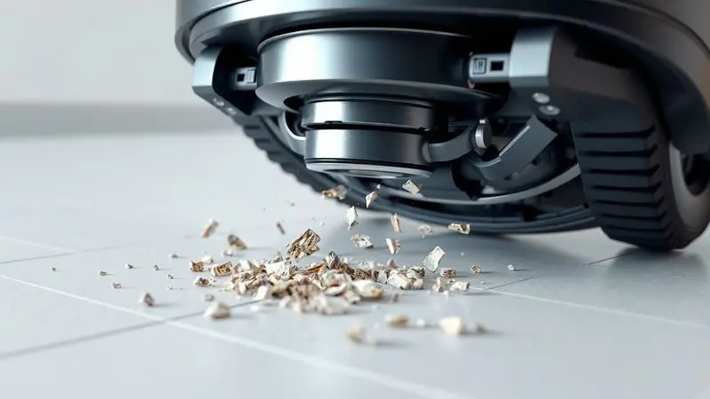

Imagine acordar em uma casa que se mantém limpa quase por magia, enquanto você se dedica ao que realmente importa. O Xiaomi S40 chega ao mercado prometendo exatamente isso: equilíbrio perfeito entre preço acessível e alta eficiência.

Como sucessor do popular S20, ele atrai olhares de quem deseja praticidade sem gastar uma fortuna, mas será que entrega tudo o que promete?

Com recursos como sucção poderosa, sistema anti-emaranhamento e navegação inteligente, este modelo intermediário pode ser a peça que faltava na sua rotina.

Neste guia, vamos além da ficha técnica para mostrar como ele realmente se comporta na prática, ajudando você a decidir se este robô aspirador merece um lugar no seu lar.

<SummaryList products={frontmatter.top_products} />

## 1. Ficha técnica do Xiaomi S40

<ProductBox 
  title={frontmatter.top_products[0].title} 
  image={frontmatter.top_products[0].image} 
  link={frontmatter.top_products[0].link} 
/>

Para começar, vamos entender o que há dentro dessa máquina. Com dimensões compactas de 340 x 340 x 98 mm e peso de 4,12 kg, o S40 se move com agilidade pelos ambientes.

A potência de sucção impressiona: 10.000 Pa que garantem a remoção eficiente de sujeira e detritos, mesmo os mais persistentes.

A bateria de 5200 mAh oferece autonomia suficiente para limpar áreas amplas sem interrupções frequentes, enquanto o sistema de navegação a laser mapeia seu espaço com precisão cirúrgica.

A função anti-embaraço merece destaque especial, pois evita que cabelos e fios se prendam nas escovas, uma dor de cabeça comum em outros modelos. Os depósitos de lixo (520 mL) e água (270 mL) completam o pacote, permitindo limpezas prolongadas.

<CaixaProsContras>

**Prós:**

- Potência de sucção elevada, garantindo limpeza eficaz.

- Sistema de navegação a laser que melhora a eficiência da limpeza.

- Função anti-embaraço evita problemas com fios e cabelos.

- Possui controle via aplicativo para agendamento e personalização.

**Contras:**

- O aparelho pode ter um preço mais elevado que modelos básicos.

- A autonomia pode ser um pouco limitada em grandes áreas se comparado a modelos mais caros.

</CaixaProsContras>

## 2. Design do robô e da base carregadora

Primeira impressão é a que fica, e o S40 sabe disso. Seu design moderno e funcional com linhas elegantes se integra perfeitamente em qualquer ambiente, seja um apartamento minimalista ou uma casa familiar.

A base carregadora é tão compacta que você quase esquece onde a colocou, ocupando espaço mínimo enquanto cumpre sua função essencial.

### Design discreto e detalhes do revestimento

Mas a beleza vai além da superfície. O revestimento cuidadosamente elaborado não só garante uma estética agradável, mas também facilita a limpeza quando necessário. Você sabe aquela poeira que gruda em superfícies porosas? Aqui não acontece.

Os materiais duráveis garantem que o produto mantenha sua aparência impecável mesmo após meses de uso diário, resistindo a pequenos impactos sem marcas visíveis.

É a combinação perfeita entre design inteligente e funcionalidade prática que conquista quem busca modernidade sem complicações.

## 3. Tecnologia de funcionamento e poder de sucção

Agora vamos ao coração da máquina. O verdadeiro diferencial do S40 está em como ele transforma dados técnicos em resultados palpáveis. Imagine aquela sensação de areia sob os pés desaparecendo completamente, ou os cantos do sofá finalmente livres de poeira acumulada.

A tecnologia avançada maximiza os 10.000 Pa de sucção para criar essa experiência, enquanto a função anti-embaraço elimina aqueles momentos de frustração ao desenrolar mechas de cabelo das escovas.

### Limpeza em diferentes pisos e eficiência em carpetes

A vida real não acontece apenas em pisos lisos, e o S40 entende isso. Ele transita com naturalidade entre porcelanato, madeira e carpetes, ajustando automaticamente a potência para cada superfície.

Em carpetes, a sucção poderosa atinge camadas mais profundas, removendo aquela poeira que parece invisível até você passar a mão. A função anti-embaraço atua como um guardião silencioso, prevenindo que fios soltos ou pelos de animais comprometam o desempenho.

O resultado? Uma limpeza uniforme e eficiente, independentemente do desafio que seu piso apresentar.

### Tecnologia anti-emaranhamento e função de lavagem de chão

Para famílias com pets ou crianças, essa tecnologia não é luxo, é necessidade. A função anti-emaranhamento trabalha continuamente para evitar que cabelos e fios se prendam nas escovas, reduzindo drasticamente a manutenção necessária.

Mas o S40 vai além: quando acoplado ao tanque de água, ele não apenas aspira, mas também lava o piso, proporcionando uma higiene superior que elimina manchas e resíduos pegajosos.

É como ter um ajudante dedicado que cuida dos detalhes enquanto você se ocupa com outras tarefas.

## 4. Bateria, autonomia e controle via aplicação

Imagine programar a limpeza para as primeiras horas da manhã e acordar com os ambientes já preparados para seu dia. A bateria de 5200 mAh do S40 torna isso possível, oferecendo autonomia suficiente para cobrir áreas extensas sem exigir recargas constantes.

O controle via aplicativo transforma a experiência: com alguns toques no smartphone, você programa horários específicos, monitora o status da bateria em tempo real e ajusta modos de limpeza conforme a necessidade do momento.

É a conveniência que você espera de um dispositivo inteligente, integrando-se perfeitamente ao seu estilo de vida conectado.

## 5. Recursos extras e acessórios inclusos na caixa

Abrir a caixa do S40 é como descobrir um kit completo de soluções. Além do robô principal, você encontra bocais especializados que alcançam cantos impossíveis e superfícies delicadas sem riscar.

O suporte de parede oferece armazenamento prático, mantendo o aspirador organizado quando não está em uso. O filtro lavável é uma joia escondida: além de melhorar a durabilidade, ele reduz custos com manutenção e oferece uma opção mais sustentável.

Cada acessório foi pensado para resolver problemas reais, transformando a limpeza de uma obrigação em uma tarefa simples e eficiente.

## 6. Preço e principais concorrentes do mercado

No universo dos aspiradores inteligentes, o S40 ocupa um território estratégico. Seu posicionamento de preço equilibra características premium com acessibilidade, competindo diretamente com marcas como Dyson, Philips e Black+Decker.

Ao comparar, percebe-se que ele entrega funções avançadas normalmente encontradas em modelos mais caros, como a navegação a laser e o sistema anti-emaranhamento.

A decisão vai além do valor inicial: considere o custo-benefício a longo prazo, a redução no tempo dedicado à limpeza e a qualidade de vida que ganha ao automatizar essa rotina. Para muitas famílias, esse investimento se paga em qualidade de tempo recuperada.

## 7. Para quem o Xiaomi S40 é indicado?

Se você vive a correria diária e valoriza cada minuto livre, o S40 pode ser seu aliado perfeito.

Ele é especialmente indicado para lares com pets, onde pelos se espalham com frequência assustadora, ou famílias com crianças, que constantemente trazem terra e migalhas para dentro.

Sua potente sucção garante limpeza profunda sem exigir sua supervisão constante, enquanto a função anti-emaranhamento cuida dos detalhes que costumam frustrar outros aspiradores.

É para quem entende que tecnologia doméstica não é sobre ostentação, mas sobre criar espaço para o que realmente importa na vida.

## 8. O que os compradores dizem sobre o modelo?

A voz dos usuários revela histórias reais de transformação. Muitos destacam como a potência de sucção efetivamente remove sujeira e pelos de animais que outros aspiradores deixavam para trás.

A função anti-emaranhamento recebe elogios constantes, especialmente de quem tem cabelos longos ou pets de pelo comprido. A durabilidade da bateria permite limpezas completas sem interrupções, um detalhe que faz diferença na rotina.

Alguns mencionam que o nível de ruído poderia ser menor, mas a maioria concorda que o desempenho geral compensa amplamente essa característica. É o consenso de quem encontrou um parceiro confiável para a limpeza doméstica.

## Conclusão

O Xiaomi S40 representa mais do que um simples eletrodoméstico; ele é um facilitador de tempo e qualidade de vida.

Sua poderosa capacidade de sucção transforma ambientes, enquanto a função anti-emaranhamento elimina uma das maiores frustrações dos aspiradores convencionais.

O design inteligente e o controle via aplicativo entregam a experiência moderna que esperamos dos dispositivos conectados.

Claro, como qualquer escolha, depende das suas necessidades específicas: se você busca praticidade sem abrir mão da eficiência, automação inteligente e um aliado contra a poeira e pelos, o S40 se apresenta como uma opção convincente.

Ele não promete milagres, mas entrega consistência e confiança, transformando a limpeza doméstica de uma tarefa cansativa em um processo quase invisível. A pergunta final não é se ele vale a pena, mas quanto vale para você recuperar horas preciosas da sua semana.

---

Ainda em dúvida sobre o Xiaomi S40? Confira nosso [ranking dos Melhores Robôs Aspiradores com Mapeamento](/melhor-robo-aspirador-com-mapeamento/) e encontre a opção perfeita para sua casa.
