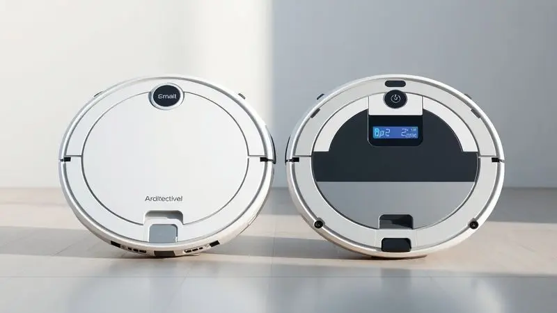
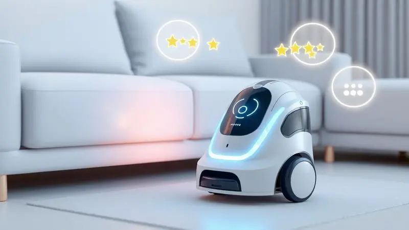
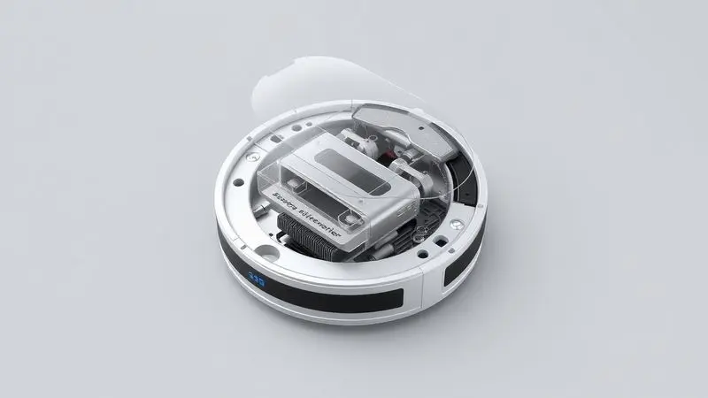

O Robô Aspirador Ximeijie tem chamado a atenção em plataformas como o AliExpress devido ao seu preço extremamente acessível, prometendo automatizar a limpeza doméstica sem pesar no bolso.

No entanto, em um mercado repleto de opções consagradas, a dúvida "será que o robô aspirador Ximeijie é bom?" é muito comum entre os consumidores.

E você, que está considerando dar esse passo rumo à automação da sua casa, merece uma resposta honesta.

Esta análise parte exatamente do seu ponto de vista: será que a simplicidade desse robô pode realmente facilitar sua rotina, ou você estaria melhor investindo em marcas mais conhecidas? Vamos descobrir juntos.

<SummaryList products={frontmatter.top_products} />

## Robô Aspirador Ximeijie: O Guia Completo para Escolher o Melhor para Seu Lar

<ProductBox 
  title={frontmatter.top_products[0].title} 
  image={frontmatter.top_products[0].image} 
  link={frontmatter.top_products[0].link} 
/>

Imagine chegar em casa e encontrar seus pisos limpos, mesmo depois de um dia corrido. É essa promessa que o Ximeijie traz para a sua rotina, com seu design compacto de 23,6 cm de diâmetro que se espreme debaixo dos móveis onde você quase nunca alcança.

A experiência realmente começa quando você liga o aparelho e percebe como seus 1500PA de potência trabalham silenciosamente, enquanto a bateria de 1200 mAh lhe dá 2,5 a 3 horas de autonomia para limpar toda a casa.

Você nem precisa estar presente: os sensores anticolisão cuidam para que ele não fique preso ou danifique seus móveis.

Mas vamos ser realistas: este é um robô que não promete milagres. Se você tem muitos tapetes grossos ou precisa de uma limpeza profunda após uma festa, talvez ele não seja sua melhor escolha.

A verdadeira beleza do Ximeijie está na sua simplicidade prática que resolve 80% das necessidades diárias de limpeza.

<CaixaProsContras>

**Prós:**

- Design compacto que facilita o acesso a espaços pequenos.

- Potência de sucção adequada para pisos.

- Funciona por várias horas antes de precisar ser recarregado.

- Possui sensor anticolisão em alguns modelos.

**Contras:**

- Pode não ter conectividade Wi-Fi em todos os modelos.

- Não é ideal para limpeza profunda de tapetes.

</CaixaProsContras>

## Como o robô aspirador Ximeijie se compara com o robô aspirador Xiaomi ou o robô aspirador Mi?

Agora vem a questão que todo mundo faz: vale a pena pagar mais pela Xiaomi? Para responder isso, pense na sua relação com tecnologia doméstica.

Os robôs da Xiaomi são como smartphones premium: têm aplicativos sofisticados, mapeam sua casa com precisão cirúrgica e se integram a outros aparelhos inteligentes. É tecnologia que você exibe com orgulho para os amigos.

O Ximeijie, por outro lado, é aquele funcional que simplesmente faz seu trabalho bem feito. Não tem pretensões de ser o centro da sua casa inteligente, mas cumpre sua missão com eficiência.

Sua potência pode ser 30% menor que a de modelos Mi, mas também custa metade do preço.

A decisão final depende do que você realmente quer: um assistente tecnológico que se conecta a tudo ou um funcionário dedicado que limpa sua casa enquanto você faz coisas mais importantes?

## Como os usuários avaliam o robô aspirador Ximeijie em comparação com o robô aspirador melhor ou o robô aspirador bom?

Quando você lê avaliações reais, um padrão emocional emerge. As pessoas não estão apenas relatando especificações técnicas, elas estão compartilhando experiências de vida.

"Pela primeira vez em meses, meu apartamento ficou livre de pelos de gato sem eu precisar passar horas com a vassoura," escreve uma usuária. Outro comenta: "Não é perfeito, mas pelo preço, é como ter um ajudante de graça."

O sentimento predominante? Gratidão pela acessibilidade. Muitos usuários são jovens que estão montando seu primeiro apartamento ou famílias que precisam de ajuda extra sem gastar uma fortuna.

Eles sabem que existem robôs melhores, mas valorizam o que o Ximeijie oferece pelo que pagam.

As críticas geralmente vêm de quem esperava milagres: "Achei que ia substituir minha aspiração semanal completa, mas ainda preciso complementar." Essa é a lição: o Ximeijie é um ótimo complemento, não necessariamente uma substituição total.

## Quais são os principais fatores a considerar ao comprar um robô aspirador Ximeijie?

Se você está quase decidindo, pare por um momento e faça essas três perguntas para si mesmo:

Primeiro, quais são suas expectativas reais? Se você quer eliminar completamente a necessidade de aspirar manualmente, talvez precise de um modelo mais potente. Mas se busca reduzir em 70% essa tarefa, o Ximeijie pode ser perfeito.

Segundo, como é sua casa? Pisos lisos como porcelanato ou madeira? Ele adora. Tapetes felpudos ou muitos degraus? Melhor reconsiderar.

Terceiro, quanto você valoriza a conveniência tecnológica? Se controlar tudo pelo celular é essencial para você, verifique especificamente se o modelo que escolheu tem Wi-Fi. Alguns têm, outros não.

Por fim, pense na manutenção: reservatórios menores significam esvaziar mais frequentemente. Mas para apartamentos pequenos, isso nem sempre é um problema.

## Quais são os outros robôs aspiradores populares no mercado?

Enquanto você pondera sobre o Ximeijie, é justo conhecer seus concorrentes diretos. O iRobot Roomba é o veterano que quase todo mundo conhece, com uma eficiência testada ao longo dos anos.

É como contratar um profissional experiente: você sabe exatamente o que vai receber.

O Xiaomi Mi Robot trouxe a sofisticação asiática para o mercado, com um design minimalista que combina bem com decorações modernas.

O Roborock elevou o jogo com sistemas de navegação que parecem quase mágicos, enquanto o Ecovacs Deebot encontrou um ponto doce entre funcionalidade e preço.

Cada um desses modelos conta uma história diferente sobre como a tecnologia pode servir sua casa. O importante é encontrar aquela que combine com sua rotina, seu espaço e, claro, seu orçamento.

## Conclusão

Chegamos ao ponto crucial da sua decisão. O Robô Aspirador Ximeijie não é sobre ter o melhor robô do mercado, mas sobre ter o robô certo para o seu momento de vida.

Ele representa a democratização da automação doméstica, permitindo que mais pessoas experimentem o alívio de chegar em uma casa limpa sem esforço.

Se você está começando sua jornada na automação doméstica, tem um orçamento limitado ou simplesmente quer testar se um robô aspirador realmente faz diferença na sua rotina, o Ximeijie é uma porta de entrada perfeita.

Ele cumpre sua promessa básica com honestidade: limpa bem pisos lisos, funciona por horas, evita obstáculos e te dá tempo de volta.

Mas se você já sabe que precisa de mapeamento preciso, controle por aplicativo sofisticado ou potência extrema para tapetes, talvez valha a pena investir mais desde o início.

A verdadeira pergunta não é "o Ximeijie é bom?", mas "o Ximeijie é bom PARA MIM?". E depois desta análise completa, você tem todas as informações para responder isso com confiança. Sua casa mais limpa e sua rotina mais leve estão esperando por sua decisão.

---

Ainda em dúvida sobre o melhor robô aspirador para o seu lar? Confira nosso ranking completo dos [11 Melhores Aspiradores Robô em 2025](/melhores-robos-aspiradores-2023/) e encontre a opção ideal!
