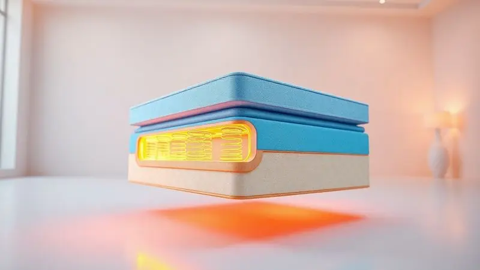
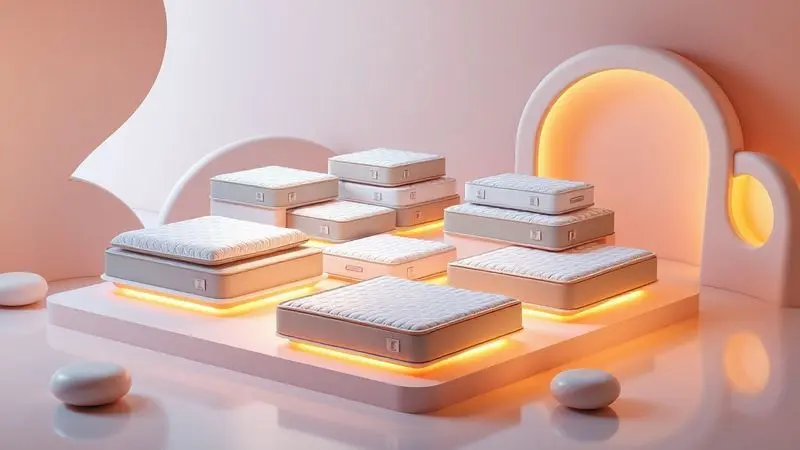

Imagine aquela noite de sono que parece nunca chegar ao fim. Você se revira, sente o peso do corpo concentrado em um ponto, ou percebe cada movimento do seu parceiro.

É justamente para transformar essa experiência que a Sealy, uma das marcas mais renomadas do mundo, desenvolve seus colchões. Mas no Brasil, com modelos específicos e adaptados, essa reputação se mantém?

Para responder, mergulhamos na tecnologia, nos materiais e nas avaliações dos modelos mais populares disponíveis aqui. Este artigo vai além da lista de features; ele conecta cada especificação à sensação que você busca na hora de dormir.

<SummaryList products={frontmatter.top_products} />

## Colchão Sealy é bom?

A resposta não é um simples 'sim'. É um 'sim, se...'. O colchão Sealy é construído com uma filosofia clara: oferecer suporte que se adapta, não que impõe.

As tecnologias como as molas Posturepedic e as espumas de resposta diferenciada trabalham para distribuir o peso do corpo, aliviar pontos de pressão e promover uma postura natural.

Isso se traduz em conforto que dura, a durabilidade é um ponto frequentemente celebrado pelos usuários. Mas o 'se' é crucial: se suas necessidades de firmeza, se sua preferência por frescor ou se sua condição de dormir acompanhado alinham-se com o modelo escolhido.

A satisfação relatada por muitos não vem apenas da marca; vem da combinação correta entre a tecnologia da Sealy e o corpo único de cada pessoa.

## Qual o melhor colchão da Sealy?

O 'melhor' desaparece quando você entra na loja. O que surge é o 'ideal para você'. Cada modelo da Sealy canaliza sua tecnologia avançada para resolver um problema específico do sono.

O Posturepedic, por exemplo, é a base dessa abordagem, mas suas variações, como o Brooklyn, o Comfort Gel, o Starck e o Joy, são especialistas em nichos diferentes. A escolha, portanto, começa com uma autoavaliação: qual é a sua maior frustração ao acordar?

### Colchão Brooklyn Sealy Pocket

<ProductBox 
  title={frontmatter.top_products[0].title} 
  image={frontmatter.top_products[0].image} 
  link={frontmatter.top_products[0].link} 
/>

Se você compartilha o colchão, a sensação de ser uma 'placa de comunicação' de movimentos pode ser frustrante. O Brooklyn Sealy Pocket resolve isso com sua tecnologia de molas ensacadas individualmente.

Cada mola responde apenas ao peso sobre ela, criando zonas de apoio independentes. O resultado é uma privacidade do movimento: você não sente o parceiro se mexendo, e ele não sente você.

Essa adaptação individual também significa que o colchão se molda melhor às curvas do seu corpo, aliviando pontos de pressão.

Para completar a experiência, camadas de espuma e tecidos com controle de temperatura e umidade trabalham para manter uma sensação de frescor, evitando aquela abafação que interrompe o sono.

A altura generosa do modelo (chegando a 37cm) contribui para essa sensação elevada de conforto, mas pode ser uma consideração prática para pessoas com mobilidade reduzida.

A robustez, com bordas reforçadas, garante que essa experiência de apoio se mantenha firme até nos cantos do colchão, prolongando sua vida útil.

<CaixaProsContras>

**Prós:**

- Redução da transferência de movimento entre casais.

- Várias opções de conforto e suporte.

- Tecnologias que controlam temperatura e umidade.

- Bordas reforçadas para maior durabilidade.

**Contras:**

- Altura do colchão pode ser desafiadora para alguns usuários.

- Modelos específicos podem ter sido descontinuados.

</CaixaProsContras>

### Colchão Comfort Gel Sealy

<ProductBox 
  title={frontmatter.top_products[1].title} 
  image={frontmatter.top_products[1].image} 
  link={frontmatter.top_products[1].link} 
/>

Aquela sensação de ficar 'grudado' no calor, especialmente em camadas de espuma, é um dos grandes sabotadores do descanso. O Comfort Gel Sealy ataca esse problema diretamente.

Suas camadas de espuma incorporam gel, que atua como um regulador térmico, dissipando o calor corporal e mantendo uma temperatura mais constante e fresca na superfície.

Combinado com o sistema de molas ensacadas, que também se adapta individualmente ao seu peso,  o colchão oferece suporte personalizado sem o custo do abafamento.

Essa combinação de tecnologias não é apenas sobre conforto imediato; é sobre durabilidade. Os materiais, incluindo espumas certificadas, são escolhidos para resistir ao uso constante, fazendo do colchão um investimento que se paga ao longo de anos de sono recuperado.

Para preservar essa performance, um cuidado simples como girar o colchão periodicamente se torna parte da rotina.

<CaixaProsContras>

**Prós:**

- Tecnologia de molas ensacadas proporciona adaptação individual.

- Camadas de espuma com gel que regulam a temperatura.

- Durabilidade e qualidade reconhecidas.

- Suporte eficaz que alivia pontos de pressão.

**Contras:**

- Pode ser considerado um investimento mais alto.

- Necessita de cuidados regulares para manter sua integridade.

</CaixaProsContras>

### Colchão Sealy Starck

<ProductBox 
  title={frontmatter.top_products[2].title} 
  image={frontmatter.top_products[2].image} 
  link={frontmatter.top_products[2].link} 
/>

Para quem precisa de um aliado contra alergias ou busca uma sensação de cuidado extra, o Sealy Starck vai além do apoio físico. Suas molas ensacadas Posturepedic garantem a adaptação precisa ao corpo, promovendo alívio de pressão e uma postura adequada.

Mas o diferencial está nos tratamentos aplicados: propriedades antiácaro, antifungo e antialérgico transformam o colchão em um ambiente mais seguro, especialmente para pessoas sensíveis ou famílias com crianças.

O conforto tactile também é elevado, com opções que incluem espuma viscoelástica de alta densidade e revestimentos em malha Cashmere, oferecendo uma suavidade ao toque que complementa o suporte estrutural.

Com capacidade para até 120 kg por pessoa e disponível em diversas dimensões, ele se adapta a necessidades variadas de espaço e peso. O investimento reflete essa combinação de tecnologia de suporte com proteção saúde-focused.

<CaixaProsContras>

**Prós:**

- Grande adaptabilidade ao corpo com molas ensacadas.

- Tecnologia de espuma viscoelástica para conforto adicional.

- Tratamentos antiácaro e antialérgico.

- Disponível em diversos tamanhos e alturas.

**Contras:**

- O preço pode ser considerado elevado para alguns.

- Alguns modelos podem ser mais pesados e difíceis de manusear.

</CaixaProsContras>

### Colchão Joy Sealy

<ProductBox 
  title={frontmatter.top_products[3].title} 
  image={frontmatter.top_products[3].image} 
  link={frontmatter.top_products[3].link} 
/>

Nem muito mole, nem muito firme, o equilíbrio é uma arte, e o Joy Sealy tenta capturar isso.

Disponível em níveis de firmeza firme ou médio-firme, ele oferece um suporte claro e definido através de seu sistema de molas ensacadas, que também garante o isolamento de movimento para casais.

Essa firmeza orientada promove uma postura ergonômica e alivia pontos de pressão sem deixar o corpo 'afundar' em uma sensação excessivamente macia.

Para quem valoriza detalhes, características como pillow top podem agregar uma camada extra de conforto superficial, enquanto tecnologias focadas em controle de umidade e proteção contra alérgenos atendem preocupações específicas.

A durabilidade, um atributo consagrado da marca Sealy, se mantém aqui, fazendo do Joy uma escolha que busca entregar consistência no apoio ao longo do tempo.

<CaixaProsContras>

**Prós:**

- Isolamento de movimento ideal para casais.

- Boa adaptação ao corpo, aliviando pontos de pressão.

- Durabilidade reconhecida da marca Sealy.

- Disponível em opções de firmeza variadas.

**Contras:**

- Pode não ser a melhor escolha para quem prefere um colchão mais macio.

- A variedade de modelos pode gerar confusão nas especificações.

</CaixaProsContras>

## Conclusão

Escolher um colchão Sealy não é sobre selecionar o 'top' da linha; é sobre identificar qual modelo traduz suas frustações específicas do sono em soluções concretas. Se o problema é sentir o movimento do parceiro, o Brooklyn com suas molas ensacadas oferece privacidade.

Se o calor interrompe seu descanso, o Comfort Gel com suas espumas termorreguladoras promete frescor constante. Se alergias ou uma sensação de cuidado extra são prioridades, o Starck com seus tratamentos protetores traz segurança.

Se você busca um apoio firme e equilibrado, o Joy pode ser o ponto de partida.

A reputação da Sealy se sustenta na aplicação inteligente de tecnologias, molas que se adaptam, espumas que respiram, tratamentos que protegem, mas a verdadeira experiência de 'colchão bom' só acontece quando essas tecnologias encontram o seu corpo, suas preferências e sua rotina de sono.

Portanto, use esta análise como um mapa: primeiro, nome sua maior irritação ao acordar; depois, veja qual modelo da Sealy foi projetado para extinguir justamente essa irritação.

O investimento, então, se torna não apenas em um produto, mas em noites realmente transformadas.