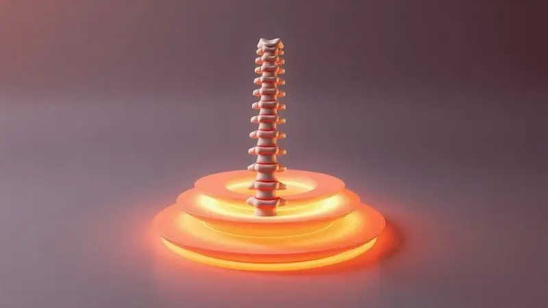
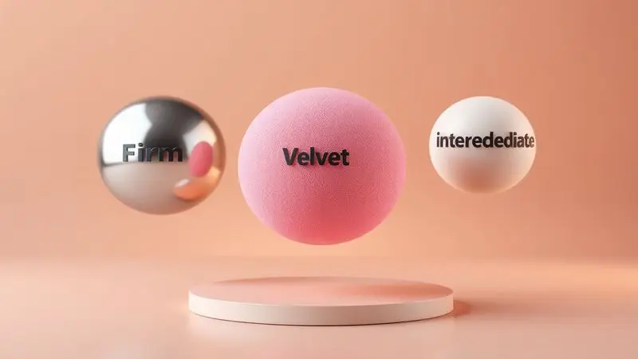

Você já acordou sentindo como se tivesse carregado o mundo nas costas durante a noite? Se essa sensação de peso e cansaço ao despertar lhe é familiar, saiba que não está sozinho.

Uma noite mal dormida tem o poder de transformar tarefas simples em verdadeiros desafios, deixando uma nuvem cinza sobre todo o dia que se inicia. Mas e se o verdadeiro culpado não for apenas o estresse da rotina, mas o lugar onde seu corpo passa um terço da vida?

Ao final deste guia, você terá nas mãos um mapa claro para identificar o colchão que conversa diretamente com sua anatomia e necessidades.

Vamos desvendar juntos desde as especificações técnicas até o que realmente importa, aquela sensação de acordar renovado, livre das dores que acompanham você há tanto tempo.

<SummaryList products={frontmatter.top_products} />

## Por que a escolha do colchão é vital para a saúde da sua coluna?

Imagine sua coluna como o eixo central de uma estrutura complexa. Durante o dia, ela trabalha incessantemente, sustentando movimento e peso. À noite, ela precisa de um terreno perfeito para se reconstruir.

Um colchão inadequado é como tentar descansar em solo irregular, forçando vértebras e músculos a uma batalha silenciosa. Ele não é apenas um móvel.

É o parceiro invisível que determina se você acorda com a postura alinhada ou com aquela dorzinha incômoda na lombar que persiste o dia inteiro.

Investir na escolha certa significa dar à sua coluna o descanso que ela realmente merece, um verdadeiro spa noturno para suas costas.

## 5 Sinais claros de que o seu colchão atual está causando a dor nas costas

Como saber se aquele velho companheiro de quarto é, na verdade, o vilão da sua história? O corpo envia mensagens claras quando algo não vai bem. Se você acorda mais dolorido do que quando se deitou, essa é a primeira bandeira vermelha.

Pontos de pressão que latejam nos ombros ou quadris ao levantar são outro sinal inconfundível. Observe sua cama, colchões com ondulações profundas ou áreas que afundam como uma cratera já entregaram o jogo.

Aquela busca constante por uma posição confortável durante a noite, virando de um lado para o outro, é o seu subconsciente gritando por apoio. E talvez a prova mais definitiva, aquele alívio imediato que sente ao dormir em uma cama de hotel ou na casa de um amigo.

Seu corpo está fazendo uma declaração clara, é hora de ouvi-lo.

## Colchão Firme, Macio ou Intermediário: O que os especialistas recomendam?

Com tantas opções, como escolher entre firme, macio ou intermediário? A resposta está, literalmente, na sua posição de sono.

Especialistas apontam que dormir de costas se beneficia de uma superfície mais firme, que ofereça um suporte consistente para manter a curvatura natural da coluna alinhada.

Já para quem dorme de lado, um toque mais macio é essencial para ceder aos pontos de maior pressão, como ombros e quadris, evitando que eles fiquem comprimidos.

Os modelos intermediários surgem como o herói dos casais, equilibrando preferências distintas em uma única superfície. A regra de ouro? Deite, respire e sinta. Seu corpo saberá dizer em poucos minutos se aquele é o abraço noturno que ele tanto procura.

## Como a sua posição de dormir influencia na escolha do suporte ideal

A forma como você dorme é a bússola mais precisa para encontrar o suporte perfeito. É uma conversa íntima entre seu corpo e o material que o recebe.

### 1. Colchões de Espuma de Alta Densidade (D33, D45)

<ProductBox 
  title={frontmatter.top_products[0].title} 
  image={frontmatter.top_products[0].image} 
  link={frontmatter.top_products[0].link} 
/>

Para quem busca o equilíbrio exato entre abraço e sustentação, as espumas de alta densidade são protagonistas. Pense no modelo D33 (33 kg/m³) como um suporte inteligente.

Ele oferece firmeza suficiente para alinhar sua coluna, mas com uma maciez que acolhe seu corpo, sendo uma escolha segura para quem pesa até 100 kg. Imagine deitar e sentir a superfície cedendo apenas o necessário, como um apoio que entende seus contornos.

O D45 (45 kg/m³) é para quem precisa de uma base mais assertiva. Com maior densidade, ele é a escolha de quem pesa acima de 100 kg ou simplesmente prefere a sensação de firmeza robusta. Ele funciona como um alicerce, mantendo a postura impecável durante toda a noite.

A durabilidade é um ativo de ambos, um investimento que promete anos de descanso consistente, sem surpresas.

### 2. Colchões de Molas Ensacadas (Pocket) para suporte individualizado

<ProductBox 
  title={frontmatter.top_products[1].title} 
  image={frontmatter.top_products[1].image} 
  link={frontmatter.top_products[1].link} 
/>

A revolução para quem divide a cama chegou com as molas ensacadas. Cada mola, envolta em seu próprio casulo de tecido, age independentemente. Isso significa que o movimento do seu parceiro não se transforma em uma onda que atravessa toda a cama.

Você pode se virar à vontade sem o risco de interromper o sono alheio. Mas o benefício vai além da paz conjugal. Essa tecnologia oferece um suporte milimétrico, que mapeia seu corpo e aplica a pressão exata onde cada centímetro precisa, dos ombros à lombar.

Se o conforto segmentado e as noites tranquilas são suas prioridades, você encontrou seu candidato.

### 3. Colchões de Látex: Durabilidade e Alinhamento Ergonômico

<ProductBox 
  title={frontmatter.top_products[2].title} 
  image={frontmatter.top_products[2].image} 
  link={frontmatter.top_products[2].link} 
/>

Falar em colchão de látex é pensar em um companheiro para a próxima década. Com uma vida útil que facilmente alcança 10 a 12 anos (e pode ir além), ele é a definição de investimento a longo prazo.

Sua resiliência natural combate a deformação, garantindo que o apoio de hoje seja o mesmo daqui a cinco anos. E que apoio! O látex possui uma memória gentil, adaptando-se aos seus contornos para aliviar a pressão e manter a coluna em perfeita harmonia.

Sim, ele tem presença. É mais pesado, o que pode tornar a troca de lençóis um pequeno exercício, mas é essa mesma densidade que proporciona o suporte firme e o sono profundamente reparador que seu corpo anseia.

### 4. Colchões de Viscoelástico (Espuma da NASA) para alívio de pressão

<ProductBox 
  title={frontmatter.top_products[3].title} 
  image={frontmatter.top_products[3].image} 
  link={frontmatter.top_products[3].link} 
/>

A famosa 'espuma da NASA' é a materialização do conceito de alívio personalizado. O viscoelástico tem a capacidade única de se moldar com precisão à sua forma, como se fosse feito sob medida para você.

Isso se traduz no desaparecimento dos pontos de pressão em ombros e quadris, uma benção para quem sofre com dores nas costas. A experiência é de afundar em um abraço perfeito, que suporta sem pressionar.

Para casais, a redução na transferência de movimento é um superpoder que garante noites ininterruptas. Alguns podem perceber uma sensação de calor maior, mas os modelos atuais já nascem com tecnologias que dissipam esse efeito, priorizando apenas o frescor e o conforto.

## A Tabela de Densidade do INMETRO: Como escolher o colchão pelo seu peso e altura

Em um mar de opções, a tabela de densidade do INMETRO é o seu farol. Ela existe para transformar dados técnicos em bem-estar garantido. Ao cruzar seu peso e altura com a densidade recomendada, você elimina o chute.

Perfis mais leves encontram conforto ideal em densidades como D28 a D33, enquanto pessoas com maior peso corporal se beneficiam da estrutura robusta de colchões D33 a D45.

Seguir essa diretriz não é apenas sobre seguir uma regra, é sobre usar a ciência para garantir que todas as noites sejam um passo em direção a um corpo livre de dor, e não mais uma causa dela.

## Colchão Ortopédico vs. Colchão Comum: Qual a real diferença?

<ProductBox 
  title={frontmatter.top_products[4].title} 
  image={frontmatter.top_products[4].image} 
  link={frontmatter.top_products[4].link} 
/>

A diferença fundamental está na intenção. Um colchão ortopédico nasce com uma missão, oferecer firmeza e suporte precisos para a coluna e articulações. É a escolha natural para quem sofre com dores ou busca prevenção postural.

Geralmente feito com espumas de alta densidade e molas reforçadas, seu design tem um único objetivo, manter o alinhamento perfeito. Já os colchões comuns têm foco principal no conforto amplo, oferecendo uma gama de sensações de maciez, sem o compromisso ortopédico.

Uma observação crucial, no Brasil o termo 'ortopédico' não é regulamentado, portanto, sua arma mais poderosa é saber ler as especificações e entender como cada material atende às necessidades do seu corpo.

## O papel do travesseiro no alinhamento da coluna cervical

<ProductBox 
  title={frontmatter.top_products[5].title} 
  image={frontmatter.top_products[5].image} 
  link={frontmatter.top_products[5].link} 
/>

Enquanto o colchão cuida do grande eixo, o travesseiro é o guardião do pescoço. Sua função é sagrada, manter a cervical em uma posição neutra, como se flutuasse suavemente.

Um bom travesseiro anatômico se adapta à curvatura natural do pescoço, distribuindo o peso de forma equilibrada e prevenindo aquelas dores de cabeça tensionais que parecem surgir do nada.

A escolha também dança conforme sua posição de sono, travesseiros mais altos para quem dorme de lado, apoios que mantêm a curvatura para quem prefere as costas. Considerar o travesseiro não é um detalhe, é fechar o círculo perfeito do seu ecossistema de descanso.

## Erros comuns ao comprar um colchão novo que você deve evitar

A emoção da compra nova pode levar a deslizes caros. O erro mais clássico? Não testar. Deitar por alguns segundos não conta. Reserve pelo menos 10 minutos na loja, na posição em que realmente dorme, e escute seu corpo. Outra armadilha é a tirania do preço baixo.

Um colchão é um investimento em anos de saúde, economizar aqui pode significar gastar muito mais com fisioterapia lá na frente. Ignorar suas necessidades pessoais em nome de uma tendência ou da opinião alheia também é um caminho para o arrependimento. Seu corpo é único.

O colchão ideal será aquele que celebra essa singularidade, não que tenta padronizá-la.

## FAQ: Perguntas frequentes sobre colchões e dores nas costas

Um colchão pode realmente acabar com minha dor nas costas? Absolutamente sim.

Um colchão adequado fornece o suporte necessário para que sua coluna descanse em alinhamento, permitindo que músculos e articulações se recuperem, o que frequentemente leva a uma redução drástica ou fim da dor.

Qual a firmeza certa para mim?
Não existe 'certa' universal. Existe a certa para VOCÊ, baseada no seu peso, posição de sono e sensibilidade pessoal. A firmeza ideal é aquela que oferece apoio sem pressão desconfortável.

Com que frequência devo trocar de colchão?
A recomendação geral é a cada 7 a 10 anos, mas seus sinais corporais são o melhor indicador. Se você já identificou vários dos '5 sinais' que mencionamos, provavelmente já está na hora, independentemente da idade do colchão.

## Conclusão

Investir em um colchão ideal vai muito além de uma compra para o quarto. É um contrato selado com seu próprio bem-estar. Significa trocar as manhãs de rigidez e dor pelo prazer simples de se espreguiçar, revigorado.

É recuperar a energia que você achava perdida e proteger a saúde da sua coluna para os próximos capítulos da vida. Cada tecnologia, da espuma de alta densidade ao viscoelástico, existe para servir a um único propósito, restaurar você.

O conhecimento que você adquiriu aqui é o poder de fazer uma escolha informada, que honra a anatomia do seu corpo e a qualidade do seu descanso. Não adie mais a transformação. Visite uma loja, deite, sinta e dê o primeiro passo para noites que realmente renovam.

Seu corpo de amanhã agradecerá.