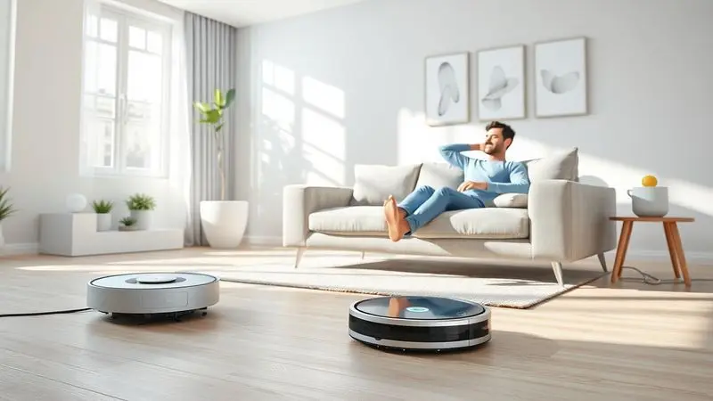
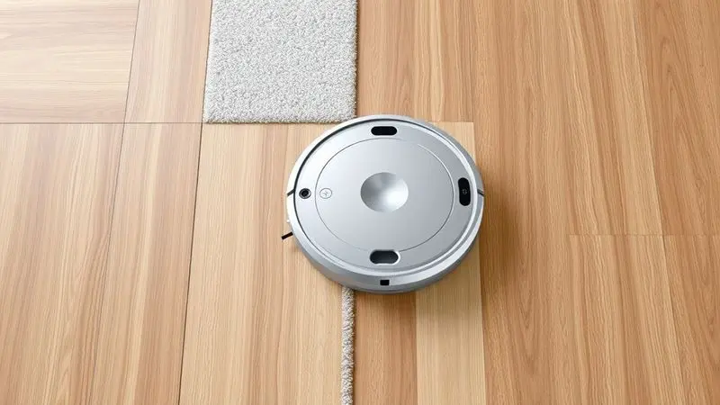

Ter um robô aspirador hoje em dia não é mais luxo, é uma necessidade para quem busca praticidade na rotina doméstica. Imagine acordar sabendo que sua casa já está limpa, sem precisar empurrar um aspirador pesado ou carregar baldes de água.

Se você está de olho no Xiaomi Robot Vacuum S10 ou quer conhecer as melhores alternativas da gigante chinesa, este guia foi feito para você.

A Xiaomi se destaca no mercado por oferecer tecnologia de ponta, como mapeamento a laser e mop integrado, com excelente custo-benefício.

Aqui, vamos mergulhar nos detalhes do S10 e comparar os 4 principais modelos disponíveis, ajudando você a decidir qual robô aspirador se encaixa perfeitamente no ritmo da sua casa em 2025.

<SummaryList products={frontmatter.top_products} />

## Melhores robôs aspiradores da Xiaomi

Quando você pensa em automação doméstica, a Xiaomi é uma das primeiras marcas que vem à mente, e nos robôs aspiradores isso não é diferente.

A linha combina performance eficiente com tecnologia acessível, criando soluções que realmente entendem o que você precisa no dia a dia. Entre os modelos disponíveis, o Xiaomi Robot Vacuum S10 se destaca como ponto de partida perfeito, mas a jornada não para por aí.

### 1. Xiaomi Robot Vacuum S10

<ProductBox 
  title={frontmatter.top_products[0].title} 
  image={frontmatter.top_products[0].image} 
  link={frontmatter.top_products[0].link} 
/>

Começar com o S10 é como dar o primeiro passo em um mundo onde a limpeza deixa de ser uma tarefa para se tornar um sistema. Ele é a escolha ideal para quem quer eficiência sem complicações.

Equipado com navegação a laser, ele mapeia seu ambiente com a precisão de um cartógrafo digital, evitando obstáculos e criando rotas inteligentes que maximizam cada minuto de limpeza.

Com 4000 Pa de potência de sucção, ele lida com sujeira e poeira em diferentes tipos de piso como se tivesse superpoderes, criando aquela sensação de maciez ao caminhar descalço.

O diferencial é sua função mopa integrada, que permite limpar pisos enquanto aspira, oferecendo uma solução completa para quem quer praticidade sem precisar de dois aparelhos separados.

Se a bateria de 3200 mAh parece modesta em comparação, saiba que ela é mais do que suficiente para a maioria dos apartamentos e casas médias, especialmente com o sistema de retorno automático à base.

Ele sabe exatamente quando precisa recarregar e volta sozinho, como um animal de estimação bem treinado.

<CaixaProsContras>

**Prós:**

- Preço competitivo no mercado.

- Alta potência de sucção.

- Navegação inteligente e eficiente.

- Função de mopa integrada.

**Contras:**

- Bateria menor em comparação a modelos similares.

- Reservatório de água pode ser limitado para grandes áreas.

</CaixaProsContras>

### 2. Xiaomi Robot Vacuum E10

<ProductBox 
  title={frontmatter.top_products[1].title} 
  image={frontmatter.top_products[1].image} 
  link={frontmatter.top_products[1].link} 
/>

Se você busca ainda mais acessibilidade sem abrir mão do essencial, o E10 é sua resposta. Ele mantém os impressionantes 4000Pa de sucção do S10, mas com uma abordagem mais direta à navegação.

Em vez do laser, utiliza giroscópio e sensores para mapear seu espaço, funcionando como um navegador experiente que conhece cada canto da sua casa.

Sua bateria de 2600mAh oferece até 110 minutos de funcionamento, tempo suficiente para espaços menores ou limpezas mais frequentes.

O verdadeiro charme está na simplicidade: ele faz exatamente o que promete, aspirando e passando pano simultaneamente, sem complicações desnecessárias.

Para quem está entrando no mundo da limpeza automatizada ou tem um orçamento mais apertado, ele representa o equilíbrio perfeito entre funcionalidade e investimento.

A única ressalva é que, em casas maiores, sua navegação pode ser um pouco mais contemplativa, mas isso raramente é um problema em espaços compactos.

<CaixaProsContras>

**Prós:**

- Potência de sucção eficiente (4000Pa).

- Função de passar pano simultaneamente.

- Boa navegação em espaços pequenos.

- Preço acessível em comparação com outros modelos.

**Contras:**

- Navegação pode ser mais lenta em ambientes grandes.

- Reservatório combinado de água e poeira é limitado.

</CaixaProsContras>

### 3. Xiaomi Robot Vacuum X10 Plus

<ProductBox 
  title={frontmatter.top_products[2].title} 
  image={frontmatter.top_products[2].image} 
  link={frontmatter.top_products[2].link} 
/>

Quando o S10 já impressiona, imagine o que acontece quando você dá um upgrade para o X10 Plus. Este não é apenas um robô aspirador, é um centro de limpeza completo que redefine o conceito de autonomia doméstica.

A estação multifuncional é seu maior diferencial: ela não apenas aspira e passa pano, mas lava e seca os panos automaticamente, eliminando a parte mais tediosa da limpeza.

Com os mesmos impressionantes 4.000 Pa de sucção, ele mantém a potência, mas adiciona inteligência artificial ao processo.

Seus sensores a laser e algoritmos de reconhecimento permitem que ele detecte diferentes superfícies, aumentando a potência automaticamente em carpetes e reduzindo-a em pisos delicados.

A bateria de 5200 mAh proporciona até duas horas de limpeza contínua, tempo suficiente para casas grandes.

Mesmo com a possibilidade ocasional de pelos longos se emaranharem no rolo principal (um problema comum a praticamente todos os robôs), ele oferece funcionalidades que antes só estavam disponíveis em modelos que custavam o dobro.

<CaixaProsContras>

**Prós:**

- Estação multifuncional que lava e seca panos.

- Potência de sucção poderosa de até 4.000 Pa.

- Alta eficiência na navegação e detecção de obstáculos.

- Boa autonomia de bateria para longas sessões de limpeza.

**Contras:**

- Pode ter dificuldades com pelos longos emaranhados.

- O ruído durante o esvaziamento automático pode ser perceptível.

</CaixaProsContras>

### 4. Xiaomi Robot Vacuum S10 Plus

<ProductBox 
  title={frontmatter.top_products[3].title} 
  image={frontmatter.top_products[3].image} 
  link={frontmatter.top_products[3].link} 
/>

Para quem quer o melhor do S10 original, mas com algumas melhorias significativas, o S10 Plus é a evolução natural.

Ele mantém os 4000 Pa de potência que fazem tão bem em lidar com sujeira do dia a dia e pelos de animais, mas eleva a experiência com tecnologia LiDAR que transforma a navegação em algo quase mágico.

A verdadeira revolução está na função esfregão com dois panos rotativos. Enquanto modelos mais básicos apenas arrastam um pano úmido, o S10 Plus realmente esfrega, oferecendo uma limpeza mais profunda em pisos duros.

É a diferença entre limpar superficialmente e realmente renovar o brilho do seu piso.

A conectividade com o app Xiaomi Home permite personalizar padrões de limpeza e agendamento com uma precisão cirúrgica.

Embora tenha algumas limitações em cantos muito apertados ou carpetes de pelo médio, ele representa o ponto ideal entre funcionalidade avançada e preço acessível.

<CaixaProsContras>

**Prós:**

- Alta potência de sucção (4000 Pa)

- Navegação inteligente com LiDAR

- Função mopping eficaz em pisos duros

- Controle via aplicativo Xiaomi Home

**Contras:**

- Dificuldade em limpar cantos e carpetes médios

- Mops podem deixar marcas em superfícies muito sujas

</CaixaProsContras>

## Comprar um robô aspirador vale a pena?

Quando você considera o investimento em um robô aspirador, não está apenas comprando um eletrodoméstico, está adquirindo tempo livre. O verdadeiro valor não está no preço da máquina, mas nas horas que você recupera para si mesmo ou para sua família.

Esses dispositivos transformam a limpeza de uma obrigação diária em um sistema automático que funciona enquanto você trabalha, se exercita ou simplesmente relaxa.

O investimento inicial pode parecer significativo, mas quando você calcula o tempo economizado ao longo dos meses e anos, percebe que está comprando qualidade de vida.

Além disso, com função de mapeamento e programação, você personaliza a limpeza com uma precisão que transforma seu espaço exatamente como deseja, quando deseja.

## Como saber se o robô aspirador é bom?

Identificar um robô aspirador de qualidade vai além das especificações técnicas. Comece imaginando sua rotina: você precisa de potência para lidar com pelos de pets? Precisa que ele navegue por diferentes cômodos sem ficar preso?

A bateria deve durar tempo suficiente para sua casa inteira?

Os recursos que realmente fazem diferença são aqueles que você usa diariamente: mapeamento inteligente que aprende o layout da sua casa, conectividade que permite controlar à distância, e funções de programação que adaptam a limpeza ao seu ritmo.

Mais importante que qualquer número é como ele se integra à sua vida, criando uma experiência tão natural que você quase esquece que ele está trabalhando.

## Como escolher o robô aspirador mais adequado para mim?

Encontrar o robô aspirador perfeito é como escolher um assistente pessoal: ele precisa entender suas necessidades específicas.

Comece observando seu espaço: casas grandes demandam bateria robusta e eficiência de navegação, enquanto apartamentos compactos podem priorizar funcionalidades específicas.

Se você tem pets, procure modelos com sistemas anti-emaranhamento e potência extra para pelos. A conectividade com aplicativos transforma o controle em algo intuitivo, permitindo ajustes com um simples toque no celular.

Pense também no tipo de piso: alguns robôs brilham em carpete, outros são especialistas em porcelanato ou madeira.

O segredo é alinhar não apenas seu orçamento, mas principalmente seu estilo de vida com os recursos oferecidos. Quando você faz essa conexão, o robô deixa de ser um aparelho e se torna parte da sua rotina.

## O que dizem os testes e usuários

Nas avaliações do Xiaomi Robot Vacuum S10, um padrão se repete: surpresa com a eficiência. Usuários que antes passavam horas aspirando relatam como o S10 mantém sua casa impecável com mínima intervenção.

A tecnologia realmente funciona, com sensores que detectam tapetes, evitam quedas e criam rotas inteligentes.

A maior descoberta não está nos relatórios técnicos, mas nos depoimentos de quem recuperou tempo precioso. Alguns mencionam o ruído durante operação, mas a maioria aceita esse pequeno sacrifício pela qualidade de limpeza alcançada.

O consenso é claro: ele entrega exatamente o que promete, transformando a limpeza de um fardo em um sistema confiável.

## Conclusão

O caminho da Xiaomi com seus robôs aspiradores conta uma história de acessibilidade sem concessões.

Começando pelo S10, que oferece tecnologia de ponta a preços razoáveis, passando pelo E10 para orçamentos mais apertados, até chegar no X10 Plus e S10 Plus que rivalizam com modelos premium pelo custo de intermediários.

Escolher entre eles é menos sobre especificações técnicas e mais sobre como cada um se encaixa na sua rotina. Se você busca autonomia quase completa, o X10 Plus com sua estação de lavagem redefine o significado de 'mãos livres'.

Se a prioridade é custo-benefício com performance robusta, o S10 original continua sendo uma das melhores opções do mercado.

O que todos compartilham é a capacidade de transformar tempo gasto em limpeza em tempo vivido.

Independentemente do modelo escolhido, você estará investindo não apenas em um eletrodoméstico, mas em qualidade de vida, em minutos a mais com sua família, em energia para seus hobbies, em paz de espírito ao saber que sua casa se mantém limpa quase por magia.

A pergunta final não é qual modelo comprar, mas quanto do seu tempo você está disposto a recuperar.

## Perguntas Frequentes (FAQ)

Quem está considerando o Xiaomi Robot Vacuum S10 geralmente se questiona sobre aspectos práticos do dia a dia.

A duração da bateria é uma das principais dúvidas, e felizmente ela permite sessões longas o suficiente para a maioria dos espaços, com retorno automático à base quando necessário.

Outra questão comum envolve a navegação: como ele lida com ambientes complexos? A tecnologia de mapeamento cria rotas inteligentes que evoluem conforme ele conhece melhor seu espaço.

A integração com assistentes de voz oferece um controle tão natural quanto pedir para uma pessoa limpar determinado cômodo.

Por fim, muitos querem saber sobre manutenção: o sistema modular facilita a limpeza dos componentes, e os filtros são facilmente substituíveis.

Essas respostas revelam que, mais que um produto, você está adquirindo um sistema que se adapta à sua vida com inteligência e simplicidade.